[TOC]

# 原生题库

## [2. 两数相加](https://leetcode-cn.com/problems/add-two-numbers/)

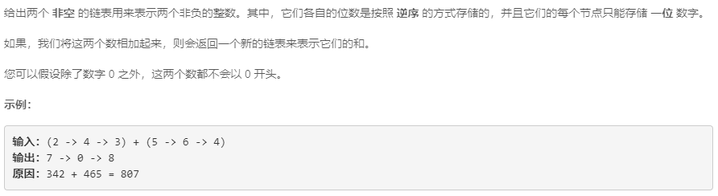

设置一个进位标志，将两个链表的结点值相加，得到的值整除10得到进位值，然后取余作为当前新建结点的值。采用尾插法插入新结点。最后如果还有进位值，将进位值插到链表尾。

```c++
class Solution {
public:
    ListNode* addTwoNumbers(ListNode* l1, ListNode* l2) {
        ListNode* res = new ListNode(0);
        ListNode* r = res;
        
        int z = 0;
        while (l1 != nullptr || l2 != nullptr) {
            int x = (l1 != nullptr) ? l1->val : 0;	// 如果链表不空，那么就取链表值
            int y = (l2 != nullptr) ? l2->val : 0;
            
            int value = x + y + z;		// 相加得到新的值
            z = value / 10;				// 进位值是整除值
            value = value % 10;			// 结点值是余数
            
            r->next = new ListNode(value);		// 尾插法
            r = r->next;
            
            if (l1 != nullptr)
                l1 = l1->next;
            if (l2 != nullptr)
                l2 = l2->next;
        }
        
        if (z)							// 最后有进位插入到最后
            r->next = new ListNode(z);
        
        return res->next;
    }
};
```

## 3. 无重复字符的最长字串

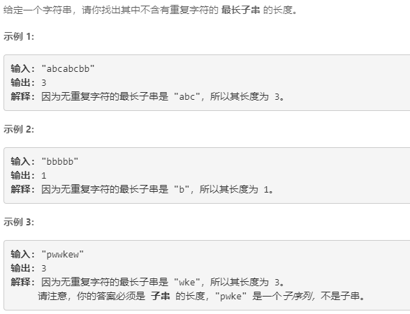

滑动窗口的解法，设置一个集合，两个指针之间不重复的字串。从左到右扫描字符串，如果遇到重复的字符，那么将当前字符从集合中删除，移动指针。如果不重复，就将字符加入集合，计算并更新最大字串长度。

```c++
class Solution {
public:
    int lengthOfLongestSubstring(string s) {
        int subLen = 0;
        set<char> subSet;	// 保存不重复的字符串

        int i = 0, j = 0;
        while (i < s.length() && j < s.length())	// 滑动窗口
        {
            if (subSet.find(s[j]) == subSet.end()) {	// 如果不存在重复字符就加入集合
                subSet.insert(s[j++]);
                subLen = max(subLen, j - i);		// 更新最大子串长
            }
            else {
                subSet.erase(s[i++]);				// 有重复将重复字符删去 
            }
        }
          
        return subLen; 
    }
};
```

时间：$O(n)$，空间：$O(n)$.

## 5. 最长回文子串

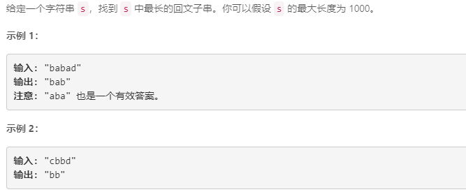

中心扩展法：对于一个回文，有可能有一个中心或两个中心，例如：aba只有一个中心b，abba有两个中心b。所以一个回文只有2n-1个这样的中心。我们在每次循环的过程中，选择一个中心，然后向两边扩展，判断左右字符是否相等，如果相等，继续扩展，直到字符串长度不相等，就得到了一个串长度，取所有串长中最大的那个。

对每个字符：

- 取当前字符为中心，如果后面字符和当前位置相同，那么肯定是回文，将右指针`right`右移。
- 从当前字符开始向两边扩展，如果相等，就将移动左右指针直到不相等
- 更新最大长度和起始位置

```c++
class Solution {
public:
	string longestPalindrome(string s) {
        if (s.empty() || s.length() == 1) 
            return s;
        
        int left = 0, right = 0;
        int start = 0;		// 回文起始位置
        int subLen = 1;		// 最长的回文长度
        
        int i = 0;
        
        while (i < s.length()) {
            left = i;		// 取当前位置为中心
            right = i;
            
            while (right < s.length() - 1 && s[right] == s[right+1])
                ++right;
            
            i = right+1;
            
            while (left > 0 && right < s.length() - 1 && s[left-1] == s[right+1]) {
                --left;
                ++right;
            }
            
            if (right - left + 1 > subLen) {
                subLen = right - left + 1;
                start = left;
            }
        }
        
        return s.substr(start, subLen);
    }
    
};

class Solution {
public:
    string longestPalindrome(string s) {
        if(s.size() <= 1) return s;
        int start = 0, length = 0;
        for(int i=0; i < s.size(); ) {
            if (s.size() - i <= length / 2) break;
            int j = i, k = i;
            // 去除重复数字
            while(k < s.size() - 1 && s[k] == s[k+1]) k++; 
            i = k+1;
            // 扩距离
            while(j > 0 && k < s.size() -1 && s[j-1] == s[k+1]) {
                k++;
                j--;
            }
            // k和j是当前的最左边和最右边的元素
            if(length < k - j + 1) {
                length = k - j + 1;
                start = j;
            }
        }
        return s.substr(start, length);
    }
};
```

## [8. 字符串转换整数 (atoi)](https://leetcode-cn.com/problems/string-to-integer-atoi/)

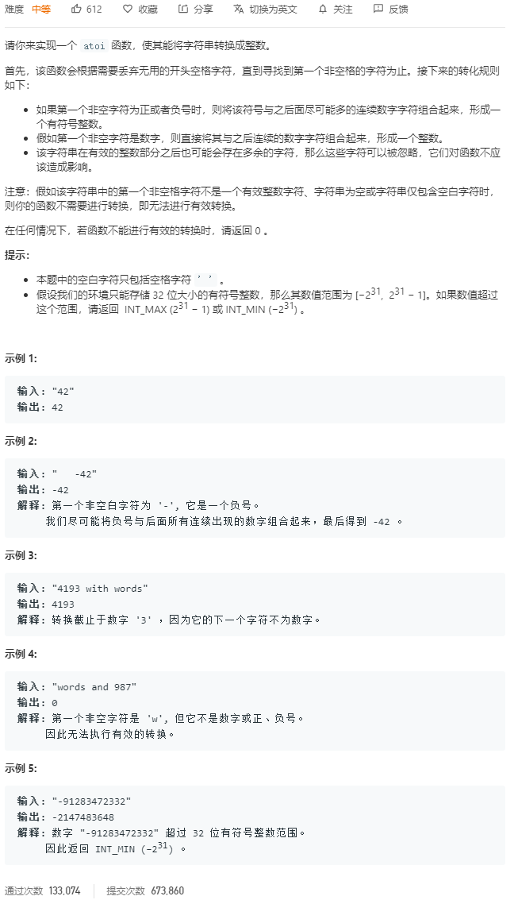

第一步，去掉前面的空格，从非空字符开始：

```c++
for (; i < n && isspace(str[i]); ++i);
```

第二步，设置一个正负号标志位，如果为正就等于1，为负等于-1.

```c++
int flag = 1;
if (str[i] == '+' || str[i] == '-')
    flag = str[i] == '+' ? 1 : -1;
```

第三步，遍历后面所有的字符，只取在连续数字字符，直到不符合条件。这里可以使用ascii码来判断。同时还要对边界条件进行判断，因为我们已经设置了符号，所以只考虑正数最大值。当res的结果大于int最大值除以10（因为下一步还要乘10），还有一种情况就是等于INT_MAX，而且当前要计算的字符大于7（加起来超过了）。

```c++
while (str[i] >= '0' && str[i] <= '9') {
    if (res > INT_MAX / 10 || (res == INT_MAX / 10 && str[i] - '0' > 7))
        return flag == 1 ? INT_MAX : INT_MIN;
   	res = res * 10 + (str[i++] - '0');
}
```

完整代码：

```c++
class Solution {
public:
    int myAtoi(string str) {
        int i = 0;
        int n = str.size();
        int flag = 1;
        int res = 0;
        
        for (; i < n && isspace(str[i]); ++i);
        
        if (str[i] == '+' || str[i] == '-') {
            flag *= str[i++] == '+' ? 1 : -1;
        }
        
        while (str[i] >= '0' && str[i] <= '9') {
    		if (res > INT_MAX / 10 || (res == INT_MAX / 10 && str[i] - '0' > 7))
        		return flag == 1 ? INT_MAX : INT_MIN;
   		res = res * 10 + (str[i++] - '0');
		}
        
        return res * flag;
    }
};
```

## [9. 回文数](https://leetcode-cn.com/problems/palindrome-number/)

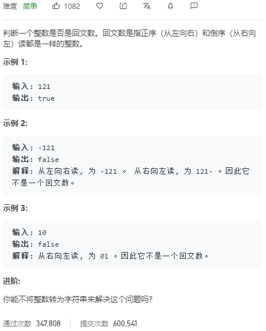

首先，负数不是回文，一个非零数个位为0也不是回文（因为个位数是0，高位必然是0）。对于一个整数，可以通过不断取余的方式得到每位数，为了得到其反转数字，取余后，将余数乘10，然后加上刚刚下一个余数，不断如此就能得到反转数。例如14541，除10取余得到1，再取余得到4，1*10+4=14，就将41反转成了14。

算法流程：

- 输入不为0的时候循环，不断除10取余，然后用余数乘10加上后1位余数得到相反数
- 如果反转数等于输入说明是回文

```c++
class Solution {
public:
    bool isPalindrome(int x) {
        if (x < 0 || (x % 10 == 0 && x != 0)) return false;
        
        long long tmp = x;
        long long reverse = 0;
        while (tmp > 0) {
            int r = tmp % 10;
            tmp /= 10;
            reverse += r * 10;
        }
        return x == reverse;
    }
};
```

这种方法是$O(n)$的。其实判断回文只要除到一半就可以了，那么怎么判断是否到了一半呢，当剩余的数小于反转的数时说明已经到了一半。

```c++
class Solution {
public:
    bool isPalindrome(int x) {
        if (x < 0 || (x % 10 == 0 && x != 0)) return false;
        int reverse = 0;
        while (x > reverse) {
            reverse = reverse * 10 + x % 10;
            x /= 10;
        }
        return x == reverse || x == reverse/10;
    }
};
```


## 15. 三数之和

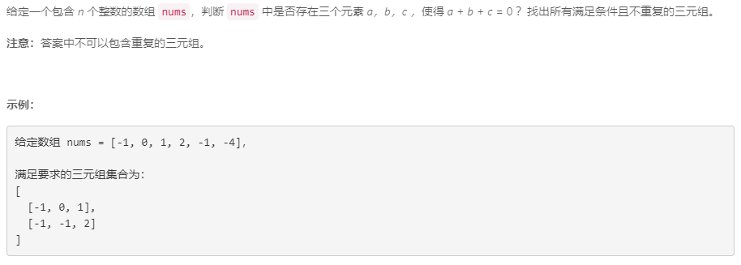

首先排序，这样当扫描到后面大于0时，一定不会出现三数之和为0的情况。设置三个指针，第一个指针指向当前扫描的元素，第二、三个指针分别指向剩余数组的头和尾，相加得到记过判断是否为0.

```c++
class Solution {
public:
    vector<vector<int>> threeSum(vector<int> & nums) {
        vector<vector<int>> result{};
        int len = nums.size();
        
        // 长度小于3，直接返回0,0,0
        if (len < 3)
            return result;
        
        // 先排序，这样在后面二元组的查找中就可以简化成O(1)
        sort(nums.begin(), nums.end());
        
        // 遍历数组，对每个元素，从它往后的所有元素中求二元组的和为它的相反数。
        for (int i = 0; i < len; ++i) {
            // 如果当前的元素大于0，后面的所有元素也大于0，没有继续查找的必要
            if (nums[i] > 0)
                break;
            // 从i开始，设置前后两个指针，相向而行，查找指定元素
            int l = i + 1;
            int r = len - 1;

            while (l < r) {
                int sum = nums[i] + nums[l] + nums[r];
                // 如果三元素和为0，满足条件，保存当前三元组到结果
                // 同时，后面可能有多个相同的元素，要进行去重
                if (sum == 0) {
                    vector<int> tmp {nums[i], nums[l], nums[r]};
                    result.emplace_back(tmp);
                    
                    while (l < r && nums[l] == tmp[1])
                        ++l;
                    while (l < r && nums[r] == tmp[2])
                        --r;
                // 小于0，说明后面二元组太小，要让左指针向右
                } else if (sum < 0) {
                    ++l;
                // 大于0，说明后面二元组太大，要让右指针向左
                } else if (sum > 0) {
                    --r;
                }

            }
            // 由于i位置的元素也有可能和后面的元素重复，那么直接跳过这些元素。
            while (i < len - 2 && nums[i+1] == nums[i])
                ++i;

        }

        return result;
    }
};
```

## [17. 电话号码的字母组合](https://leetcode-cn.com/problems/letter-combinations-of-a-phone-number/)

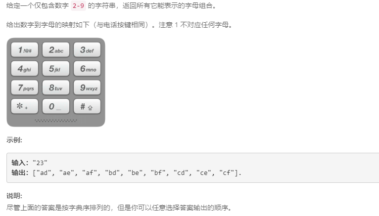

### 深度优先：

建立一个hash表，保存数字和字符串的映射。然后采用深度优先的遍历方法：

```c++
class Solution {
public:
    vector<string> res;
    unordered_map<char, string> strmap {{'0', ""}, {'1', ""},
        {'2', "abc"}, {'3', "def"}, {'4', "ghi"}, {'5', "jkl"},
        {'6', "mno"}, {'7', "pqrs"}, {'8', "tuv"}, {'9', "wxyz"}
    };

    void getString(string tmpstr, string& digits, int k) {
        if (tmpstr.size() == digits.size()) {
            res.push_back(tmpstr);
            return;
        }

        string combine = strmap[digits[k]];
        for (char c : combine) {
            tmpstr += c;
            getString(tmpstr, digits, k+1);
            tmpstr.pop_back();
        }
        return;
    }

    vector<string> letterCombinations(string digits) {
        if (digits == "")
            return res;

        getString("", digits, 0);
        return res;
    }
};
```

### 广度优先：

类似树的层序遍历。初始化一个队列，第一个数字对应的字母分别入队，然后依次出队和下一个数字对应的字母组合后入队，直到遍历完成整个数字字符串。这个过程中需要注意的是，对队列进行遍历时，由于队列的长度是动态变换的，所以要设置一个变量存储队列长度：

```c++
class Solution {
public:
    vector<string> letterCombinations(string digits) {
        unordered_map<char, string> strmap {{'0', ""}, {'1', ""},
        {'2', "abc"}, {'3', "def"}, {'4', "ghi"}, {'5', "jkl"},
        {'6', "mno"}, {'7', "pqrs"}, {'8', "tuv"}, {'9', "wxyz"}
        };				// 建立hash表

        vector<string> res;
        if (digits.length() == 0)
            return res;

        queue<string> qe;
        qe.push("");			// 队列初始化，作为树的根结点，其实不存在

        for (auto c : digits) {			// 对每个数字进行遍历
            int size = qe.size();		// 暂存队列长度
            for (int i = 0; i < size; ++i) {		// 对队列中的每个字母进行遍历
                string tmp = qe.front();		// 类似树的层次遍历的方法
                qe.pop();
                for (auto letter : strmap[c]) 	
                    qe.push(tmp + letter);
            }
        }
        while (!qe.empty()) {					// 将队列的结果转移到数组中
            res.emplace_back(qe.front());
            qe.pop();
        }
        return res;
    }
};
```

## [22. 括号生成](https://leetcode-cn.com/problems/generate-parentheses/)

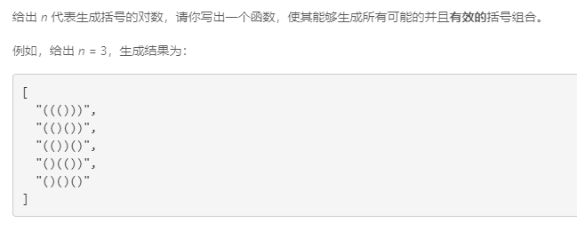

### 回溯：

从题中看出，只有当左右括号均有剩余时，才继续生成新括号。加入左括号的时候，只看是否有左括号可以用（也可以反过来）；加入右括号时，要看右括号是否有剩余，同时要收到左括号的限制，有左括号匹配的时候才能加入：

```c++
class Solution {
public:
    vector<string> generateParenthesis(int n) {
        vector<string> res;
        
        backtrack(res, "", 0, 0, n);
        return res;
    }
    
    void backtrack(vector<string>& res, string cur, int left, int right, int len) {
        if (cur.length() == len * 2) {		// 当前生成的字符串长度达到要求，加入结果
            res.emplace_back(cur);
            return;
        }
        
        if (left < len) 		// 左括号有剩余，直接添加
            backtrack(res, cur + "(", left + 1, right, len);
        if (right < left)		// 右括号由剩余且小于左括号，添加
            backtrack(res, cur + ")", left, right + 1, len);
    }    
};
```

### 动态规划：

- 状态：`dp[i]`指使用`i`对括号生成的组合

- 状态转移方程：第i对在第i-1对的基础上得到，以新添加的左括号开始，但不一定以新添加的右括号结束，所以我们可以枚举所有右括号的位置得到结果：

	`dp[i] = '(' + dp[j] + ')' + 'dp[i-j-1]'`

- 初始状态是0个括号的状态：

```c++
class Solution {
public:
    vector<string> generateParenthesis(int n) {
        vector<string> res;
        
        if (n == 0) 
            res.emplace_back("");
        else {
            for (int i = 0; i < n; ++i)
                for (auto & left : generateParenthesis(i))
                    for (auto & right : generateParenthesis(n - i - 1))
                        res.emplace_back("(" + left + ")" + right);   
        }
        return res;
    }  
};
```

## [42. 接雨水](https://leetcode-cn.com/problems/trapping-rain-water/)

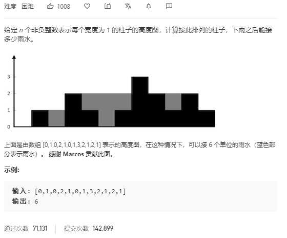

这个题和[11. 盛最多水的容器](https://leetcode-cn.com/problems/container-with-most-water/)有区别，这里柱子是有宽度的。

### 解一：暴力法

在两个柱子之间注水，当前列存水的量可以分成两种情况：

- 当前列是最矮的，那么当前列存水的量等于边界列中较矮的那个减去当前列的高度。
- 当前列的高度大于等于最矮的边界列，那么当前列不会存水。

所以我们要做的就是遍历每一列，然后得到每一列存水的量并累加。遍历的过程中，需要记录每一列左右最高的边界和最矮的边界，然后根据上面的规则计算存水量。

```c++
class Solution {
public:
    int trap(vector<int>& height) {
        int res = 0;
        int len = height.size();
        for (int i = 1; i < len - 1; ++i) {
            // 计算每列左右最大值
            int max_left = 0;
            int max_right = 0;
            for (int j = i; j >= 0; --j)
                // 从当前列开始，向左向右找最大值
                max_left = max(max_left, height[j]);
            for (int j = i; j < len; ++j)
                max_right = max(max_right, height[j]);
            // 累加结果
            res += min(max_left, max_right) - height[i];
        }
        return res;
    }
};
```

但是这个方法会超时。

### 解二：动态规划

暴力法中，为了计算存水量，每次都要向左和向右计算一次最大值，我们可以将这些值存储在数组中，直接查找。

```c++
class Solution {
public:
    int trap(vector<int>& height) {
    	int res = 0;
        int len = height.size();
        if (len == 0)
            return 0;
        // 将上面算法中计算的最大值存储到数组中
        vector<int> left_max(len), right_max(len);
        left_max[0] = height[0];
        right_max[len - 1] = height[len - 1];
        // 从左向右，计算每个柱子左边的最大值
        for (int i = 1; i < len; ++i)
            left_max[i] = max(height[i], left_max[i - 1]);
        // 从右向左，找每个柱子右边的最大值
        for (int i = len - 2; i >= 0; --i) 
            right_max[i] = max(height[i], right_max[i + 1]);
        for (int i = 1; i < len - 1; ++i)
            res += min(left_max[i], right_max[i]) - height[i];
        return res;
    }
};
```

### 解三：双指针

这个方法和另一个版本的接雨水类似。两个指针分别指向开头和结尾，雨水的高度取决于较短的那一端。同时维护两个变量`left_max`，`right_max`，计算当前`left`指针和`left_max`之间的存水量。如果当前`left`的高度大于`left_max`，就更新`left_max`，如果较小，那么就计算当前`left`和`left_max`之间的存水量。这样当左右指针相遇的时候，左右的存水量都累加完毕了。

```c++
class Solution {
public:
    int trap(vector<int>& height) {
    	int res = 0;
        int left_max = 0;
        int right_max = 0;
        int left = 0;
        int right = height.size() - 1;
        while (left < right) {
            // 取两个边界较小的计算存水量，然后移动相应的指针
            if (height[left] < height[right]) {
                if (height[left] > left_max)
                    left_max = height[left];
                else
                    res += left_max - height[left];
                ++left;
            } else {
                if (height[right] > right_max)
                    right_max = height[right];
                else
                    res += right_max - height[right];
                --right;
            }
        }
        return res;
    }
};
```

## [46. 全排列](https://leetcode-cn.com/problems/permutations/)

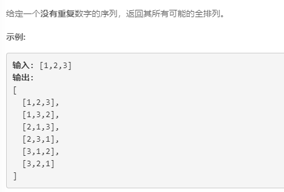

回溯算法，通过构建决策树，将路径加入到栈中，然后判断是否合法，添加到结果后，回撤到上一次的选择路径继续。


- 如果第一个整数有索引`n`，那么意味着当前排列已经完成
- 遍历索引`first`到索引`n-1`的所有整数
	- 在排列中放置第`i`个整数`swap(nums[first], nums[i])`，即不断以不同的数作为排列的开始
	- 继续生成从第`i`个整数开始的所有排列`backtrack(first+1)`
	- 然后回溯，相当于使用栈的时候弹出，再次交换完成回溯`swap(nums[first], nusm[i])`

```c++
class Solution {
public:
    vector<vector<int>> permute(vector<int>& nums) {
        vector<vector<int>> res;
        int len = nums.size();
        
        backtrack(nums, res, 0, len);
        
        return res;
    }
    
    void backtrack(vector<int> nums, vector<vector<int>>& res, int first, int len) {
        if (first == len) {			// 遍历到最后一个整数，开始递归返回
            res.emplace_back(vector<int>(nums));	// 当前nums数组就是生成的全排列
            return;
        }
        for (int i = first; i < len; ++i) {
            swap(nums[first], nums[i]);	// 将不同的数放置到队首，开始在新的树上搜索
            backtrack(nums, res, first+1, len);
            swap(nums[first], nums[i]);	// 回溯，返回路径的起点，开始下一次回溯
        }
    }
};
```


## 49. 字母异位词分组

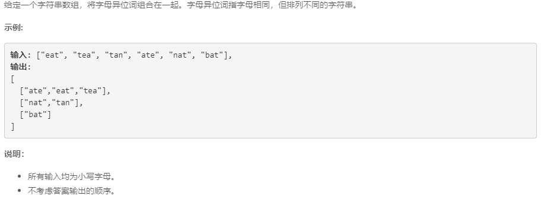

建立哈希表，键是数组中每个字符串排序后的字符串，值是对应原数组中的字符串。然后将哈希表的值加入到结果中即可。

对数组中的每个字符串：

- 排序，然后加入到哈希表中，注意不能改变原有的字符串

对哈希表中的元素：

- 将每对的值加入到结果中

```c++
class Solution {
public:
    vector<vector<string>> groupAnagrams(vector<string>& strs) {
        map<string, vector<string>> tmp;
        vector<vector<string>> res;
        
        for (auto s : strs) {
            string st = s;
            sort(st.begin(), st.end());
            tmp[st].emplace_back(s);
        }
        
        for (auto &pairs : tmp) {
            res.emplace_back(pairs.second);
        }
        return res;
    }
};
```

时间：$O(nk\log n)$，空间：$O(nk)$

## [56. 合并区间](https://leetcode-cn.com/problems/merge-intervals/)

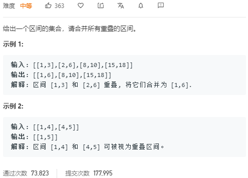

先将所有的区间按照左端点从小到大排序，然后顺序遍历区间列表，可以合并的就更新右端点，不能合并的就直接加入结果列表。

```c++
class Solution {
public:
    vector<vector<int>> merge(vector<vector<int>>& intervals) {
        int len = intervals.size();
        if (!len) return {};
        sort(intervals.begin(), intervals.end());

        vector<vector<int>> res;
        for (int i = 0; i < len; ++i) {
            int left = intervals[i][0];
            int right = intervals[i][1];
            // res.back()返回最后一个元素的引用，res.end()返回的是迭代器
            if (!res.size() || res.back()[1] < left)
                // 如果结果列表的右端点小于下一个要加入的左端点，说明不重叠，直接加入
                res.emplace_back(intervals[i]);
            else 
                // 否则就直接合并区间
                res.back()[1] = max(right, res.back()[1]);
        }
        return res;
    }
};
```

## [63. 不同路径 II](https://leetcode-cn.com/problems/unique-paths-ii/)

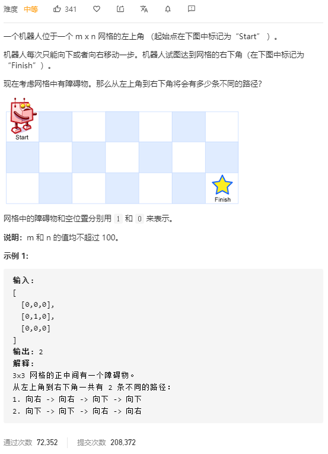

动态规划。使用`dp[i][j]`表示到达`[i,j]`的路径数，由于机器人只能向下或者向右移动，所以`dp[i][j]`只能从`dp[i-1][j]`或`dp[i][j-1]`移动过来。这样可以写出状态转移方程：
$$
dp(i,j) = \begin{cases} 0 & obstacleGrid(i,j)=1 \\
dp(i-1,j) + dp(i, j-1) & obstacleGrid(i, j) = 0
\end{cases}
$$
初始状态：如果`ob[0][0]==1`，那么`dp[0][0]=0`。

```c++
class Solution {
public:
    int uniquePathsWithObstacles(vector<vector<int>>& obstacleGrid) {
		int row = obstacleGrid.size(), col = obstacleGrid[0].size();

        vector<vector<int>> dp(row + 1, vector<int>(col + 1, 0));
        // 空出第0行0列，从(0,1)开始向后遍历，初始化为1
        dp[0][1] = 1;
        for (int i = 1; i <= row; ++i) {
            for (int j = 1; j <= col; ++j) {
                if (obstacleGrid[i-1][j-1] == 1) 
                    dp[i][j] == 0;
                else
                    dp[i][j] = dp[i-1][j] + dp[i][j-1];
                
            }
        }
        return dp[row][col];
    }
};
```

空间可以进一步优化，在循环的过程中状态转移只用到了左边的元素和上边的元素。我们可以使用一个一维数组来累加行循环中每列拥有的最大路径数，相当于对每层外循环`dp`数组保存第`i`行中对应每列可以达到的最大路径和。在更新`dp[j]`之前，它是上一行的路径数，也就是`dp[i-1][j]`，而左边的`dp[j-1]`就是`dp[i][j-1]`：

```c++
class Solution {
public:
    int uniquePathsWithObstacles(vector<vector<int>>& obstacleGrid) {
		int row = obstacleGrid.size(), col = obstacleGrid[0].size();

        vector<int> dp(col);
        // 空出第0行0列，从(0,1)开始向后遍历，初始化为1
        dp[0] = (obstacleGrid[0][0] == 0);
        for (int i = 0; i < row; ++i) {
            for (int j = 0; j < col; ++j) {
				if (obstacleGrid[i][j] == 1) {
                    dp[j] = 0;
                    continue;
                }
                if (j - 1 >= 0 && obstacleGrid[i][j-1] == 0)
                    dp[j] += dp[j-1];
            }
        }
        return dp.back();
    }
};
```


## [72. 编辑距离](https://leetcode-cn.com/problems/edit-distance/)


将A转成B，A和B各有3种 操作，加起来是6种。但是因为是相互转换，所以从A删除的单词到了B中，也就是A的删除操作对应了B的插入，反过来也是。A的替换操作也对应了B的替换，例如当A是`bat`，B是`cat`，修改A的第一个字母`b`，等价于修改B的第一个字母`c`。所以总共就有三种操作：

- 在A中插入一个字符
- 在B中插入一个字符
- 在A中修改一个字符

对于两个单词`word1`和`word2`，假设`word1[0, i)`到`word2[0, j)`的距离是a，那么根据上面三种情况：

- 在`word1`中插入一个字符：当前距离是a，那么插入一个字符后编辑距离不会超过a+1；
- 在`word2`中插入一个字符：同上；
- 在`word1`中修改一个字符：同上。

这里能看出，这是一个动态规划问题。状态就是`word1[0, i)`和`word2[0, j)`之间的编辑距离`dp[i][j]`。

- 初始状态：`dp[0][0]=0`，`dp[1][0]=1`，`dp[0][1]=1`，`dp[1][1]=1`，显然`dp[i][0]=i,dp[0][j]=j`，而且如果有空串，直接返回另一个字符串长度即可；
- 状态转移方程：`dp[i][j] = min(dp[i -1][j-1], dp[i-1][j], dp[i][j-1]) + 1`

这就可以写出代码了：

```c++
class Solution {
public:
    int minDistance(string word1, string word2) {
        int len1 = word1.length();
        int len2 = word2.length();
        // 初始状态
        // 包含空字符串
        if (len1 * len2 == 0) return len1 + len2;
		// 要包含空字符串的长度，所以初始化到len+1
        int dp[len1 + 1][len2 + 1];
        // 初始条件
        for (int i = 0; i < len1 + 1; ++i)
            dp[i][0] = i;
        for (int j = 0; j < len2 + 1; ++j)
            dp[0][j] = j;
        
        for (int i = 1; i < len1 + 1; ++i) {
            for (int j = 1; j < len2 + 1; ++j) {
                int case1 = dp[i-1][j] + 1;
                int case2 = dp[i][j-1] + 1;
                // 如果word1,word2在前一个位置字符不相等，显然还要再加一的编辑距离
                int case3 = word1[i-1] == word2[j-1] ? dp[i-1][j-1] : dp[i-1][j-1]+1;
                dp[i][j] = min(min(case1, case2), case3);
            }
        }
        return dp[len1][len2];
    }
};
```

## 73. 矩阵置零

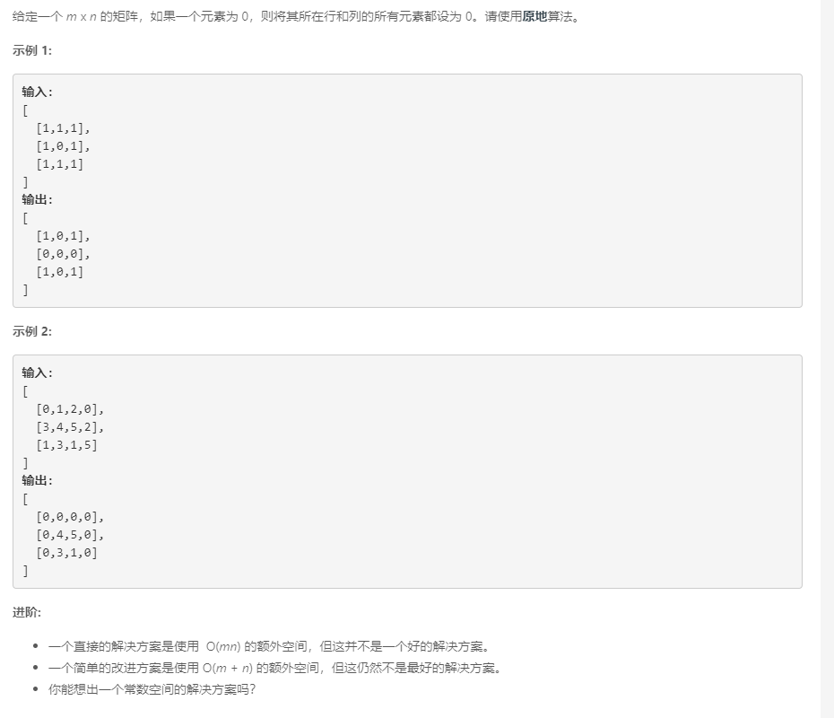

- 方法一：采用两个数组保存0元素所在的行和列，然后对原矩阵置对应位置置零

	```c++
	class Solution {
	public:
	    void setZeroes(vector<vector<int>>& matrix) {
	        int row = matrix.size();
	        int col = matrix[0].size();
	        
	        set<int> r;			// 使用set保存存在0元素的行和列
	        set<int> c;
	        
	        for (int i = 0; i < row; ++i) {
	            for (int j = 0; j < col; ++j) {
	                if (matrix[i][j] == 0) {
	                    r.emplace(i);
	                    c.emplace(j);
	                }
	            }
	        }
	        for (int i = 0; i < row; ++i) 
	            for (int j = 0; j < col; ++j) {
	                if (r.find(i) != r.end() || c.find(j) != c.end())
	                    matrix[i][j] = 0;
	            }
	    }
	};
	```

	时间：$O(mn)$，空间：$O(m+n)$

- 方法二：采用第一行和第一列保存存在0元素的行和列，如果某一行存在0元素，那么该行要被置0，可以在第一行进行标记。对于列也是一样。

	```c++
	class Solution {
	public:
	    void setZeroes(vector<vector<int>>& matrix) {
	        int row = matrix.size();
	        int col = matrix[0].size();
	        
	        bool isRow = false;			// 设置变量记录第一行和第一列是否有0
	        bool isCol = false;
	        
	        for (int i = 0; i < row; ++i) {
	            for (int j = 0; j < col; ++j) {
	                if (matrix[i][j] == 0) {		// 如果有0，记录行号和列号
	                    if (i == 0)
	                        isCol = true;
	                    if (j == 0)
	                        isRow = true;
	                    
	                    matrix[0][j] = 0;
	                    matrix[i][0] = 0;
	                }
	            }
	        }
	        
	        for (int i = 1; i < row; ++i) {
	            for (int j = 1; j < col; ++j) {
	                if (matrix[0][j] == 0 || matrix[i][0] == 0)
	                    matrix[i][j] = 0;
	            }
	        }
	        
	        if (isRow) {					// 第一行和第一列有0，将第一行和第一列置零
	            for (int i = 0; i < row; ++i)
	                matrix[i][0] = 0;
	        }
	        if (isCol) {
	            for (int i = 0; i < col; ++i)
	                matrix[0][i] = 0;
	        }
	    }
	};
	```

## [78. 子集](https://leetcode-cn.com/problems/subsets/)

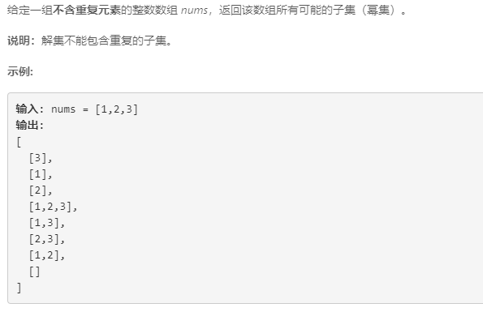

构造搜索树：

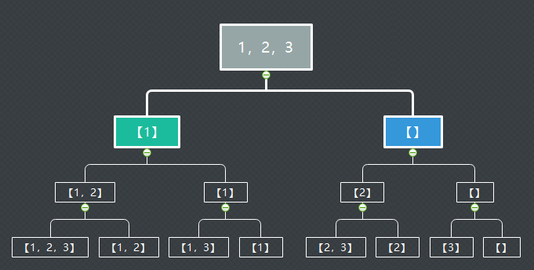

### 回溯：

每一层代表一个数，从第一层开始，左分支代表选择当前的数，右分支代表不选。构造完成后发现，最底层的所有叶结点就是我们要找的答案。递归终止条件：当层数到达最底层结束，即树的高度（元素个数）。递归内容：按照树的遍历方式，一直向左，走到最底层，将叶结点加入。然后叶结点弹出一个元素（1，2，3弹出3）回到上一层，向右走，将上一层结点（也是结果之一）加入到最终的结果中。

```c++
class Solution {
public:
    vector<vector<int>> subsets(vector<int>& nums) {
        vector<vector<int>> res;
        vector<int> tmp;				// 暂存每一轮的结果
        backtrack(nums, tmp, res, 0);

        return res;
    }

    void backtrack(vector<int>& nums, vector<int>& tmp, vector<vector<int>>& res, int level) {
        if (level == nums.size()) {		// 当到达最底层的时候返回并更新结果
            res.emplace_back(tmp);
            return;
        }

        tmp.emplace_back(nums[level]);			// 先向存在该元素的方向走
        backtrack(nums, tmp, res, level+1);		// 递归遍历
        tmp.pop_back();							// 返回上一层
        
        backtrack(nums, tmp, res, level+1);		// 向不存在该元素的方向走
    }
};
```

### 位运算：

对于数组`[1,2,3]`，每个子集可以看成存在该元素，或不存在该元素，用二进制的位表示：`[1]->100; [2]->010; [3]->001; [1,2]->110; [1,3]->101; [2,3]->011; [1,2,3]->111; []->000`。正好是3位二进制能表示的所有数，我们只要遍历这些数，并将对应的数组加入到结果中就可以了。外层循环的次数是2的数组长度次幂，内层循环时，将i对应的二进制代表的数加入到结果中：

```c++
class Solution {
public:
    vector<vector<int>> subsets(vector<int>& nums) {
        vector<vector<int>> res;
        int len = nums.size();
        int n = 1 << len;					// 外层循环的总次数是对应结果的长度

        for (int i = 0; i < n; ++i) {		// i对应了所有子集的二进制数
            vector<int> tmp;
            for (int j = 0; j < len; ++j) {		// 将每个数加入到i对应的结果中
                if (i & (1 << j))			// 
                    tmp.emplace_back(nums[j]);
            }
            res.emplace_back(tmp);
        }
        return res;
    }
};
```

其中`i & (1 << j)`比较难理解。`(1 << j)`是起到了掩码的作用，从0-8的二进制码分别和1(001)，2(010)，4(100)的二进制码做与运算，就能提取到0-8中每一位是否有数字的信息。例如011和它们分别做与运算，就可以得到000，010，001。这样就把每一位的信息提取了出来，进一步就可以组成对应的数组。

## [84. 柱状图中最大的矩形](https://leetcode-cn.com/problems/largest-rectangle-in-histogram/)

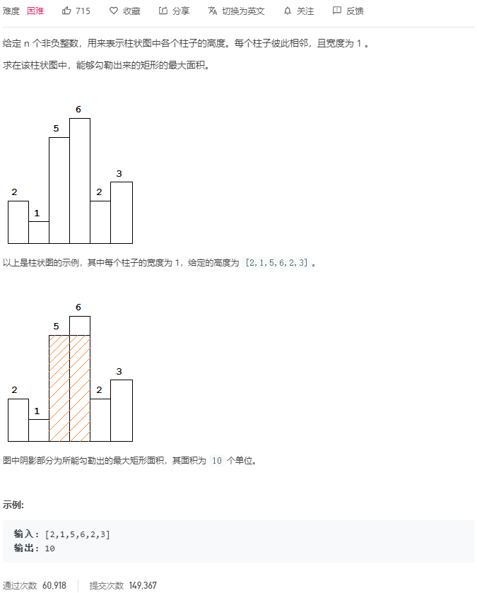

首先是暴力的方法，最大矩形的面积取决于较矮的矩形高度以及矩形之间的距离。那么我们可以对每个高度分别向左向右遍历，直到找到小于当前高度的矩形，然后计算矩形的面积并更新就行了：

```c++
class Solution {
public:
    int largestRectangleArea(vector<int>& heights) {
        int len = heights.size();
        int res = 0;
        // 对每个高度进行遍历
        for (int mid = 0; mid < len; ++mid) {
			// 当前遍历的高度
            int h = heights[mid];
            int left = mid, right = mid;
            // 向左右扩展，直到严格小于当前高度停止
            while (left - 1 >= 0 && heights[left - 1] >= h) --left;
            while (right + 1 < len && heights[right + 1] >= h) ++right;
            // 更新最大面积
            res = max(res, (right - left + 1) * h);
        }
        return res;
    }
};
```

时间复杂度是$O(n^2)$的。不符合要求。

采用单调栈进行优化。所谓单调栈就是栈中序列是有序的，也就是出栈序列是有序的。以题目的序列模拟单调递增栈为例，

## [94. 二叉树的中序遍历](https://leetcode-cn.com/problems/binary-tree-inorder-traversal/)

### 递归：

需要设置一个辅助函数帮助递归：

```c++
class Solution {
public:
    vector<int> inorderTraversal(TreeNode* root) {
        vector<int> res;
        _inOrder(root, res);
        return res;
    }
    
    void _inOrder(TreeNode* root, vector<int>& res) {
        if (root) {
            _inOrder(root->left, res);
            res.emplace_back(root->val);
            _inOrder(root->right, res);
        }
    }
};
```

### 迭代：

使用辅助栈，栈不空或结点不空循环。如果当前结点不空，就入栈并往左子树走。否则，出栈，将结点值加入遍历序列，然后往右子树走：

```c++
class Solution {
public:
    vector<int> inorderTraversal(TreeNode* root) {
        vector<int> res;
        stack<TreeNode*> st;
        TreeNode* p = root;
        
        while (p || !st.empty()) {
            if (p) {
                st.push(p);
                p = p->left;
            } else {
                p = st.top();
                res.emplace_back(p->val);
                st.pop();
                p = p->right;
            }
        }
        return res;
    }
};
```

## [101. 对称二叉树](https://leetcode-cn.com/problems/symmetric-tree/)

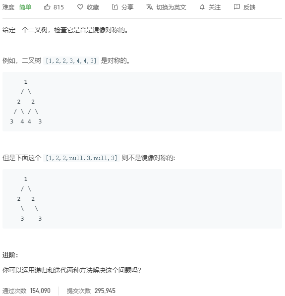

如果二叉树的左右子树是镜像对称的，那么这个树就是镜像对称的。如果满足：

- 两个根节点具有相同的值
- 每个树的右子树都和另一个树的左子树镜像对称

那么这两棵树是镜像对称的。


可以采用递归和迭代两种方法：

- 递归：使用两个指针`p,q`同时指向树的根节点，然后`p`指针向左，`q`指针向右，`p`指针向右，`q`指针向左，比较两个值是否相等。

  递归体：循环判断`p`和`q`的值是否相等，并且判断左右结点的关系是否满足上述条件

  终止条件：`p,q`同时为空返回`true`，有一个不空，另一个为空，说明不是镜像。

  ```c++
  /**
   * Definition for a binary tree node.
   * struct TreeNode {
   *     int val;
   *     TreeNode *left;
   *     TreeNode *right;
   *     TreeNode(int x) : val(x), left(NULL), right(NULL) {}
   * };
   */
  class Solution {
  public:
      bool isSymmetric(TreeNode* root) {
          return check(root, root);
      }
      
      bool check(TreeNode* p, TreeNode* q) {
      	if (!p && !q) return true;
          if (!p || !q) return false;
          return p->val == q->val && check(p->left, q->right) && check(p->right, q->left);
      }
  };
  ```

- 迭代：

  将根节点入队两次，然后每次出队两个比较其值。如果两个结点都不空继续。如果只有一个为空或两个结点值不相等，则不是镜像：

  ```c++
  /**
   * Definition for a binary tree node.
   * struct TreeNode {
   *     int val;
   *     TreeNode *left;
   *     TreeNode *right;
   *     TreeNode(int x) : val(x), left(NULL), right(NULL) {}
   * };
   */
  class Solution {
  public:
      bool isSymmetric(TreeNode* root) {
          return check(root, root);
      }
      
      bool check(TreeNode* p, TreeNode* q) {
      	queue<TreeNode*> que;
          que.push(p);
          que.push(q);
          while (!que.empty()) {
              p = que.front(); que.pop();
              q = que.front(); que.pop();
              if (!p && !q) continue;
              if ((!p || !q) || (p->val != q->val)) return false;
              
              que.push(p->left);
              que.push(q->right);
              
              que.push(p->right);
              que.push(q->left);
          }
          return true;
      }
  };
  ```

  

## [103. 二叉树的锯齿形层次遍历](https://leetcode-cn.com/problems/binary-tree-zigzag-level-order-traversal/)

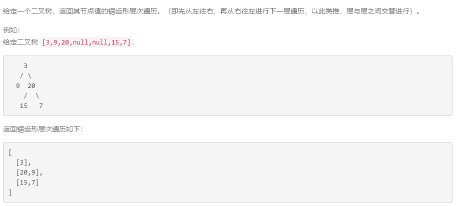

正常层次遍历，偶数行逆序压入遍历数组。也可以采用双端队列。

 ```c++
class Solution {
public:
    vector<vector<int>> zigzagLevelOrder(TreeNode* root) {
        queue<TreeNode*> qe;
        vector<vector<int>> res;
        if (root == nullptr)
            return res;
        
        TreeNode* p = root;
        int x = 0;			// 判断是否为偶数行，偶数行就反转
        qe.push(p);
        
        while (!qe.empty()) {			// 层次遍历
            int lsize = qe.size();
            vector<int> tmp;
            while (lsize) {				// 队列中的元素就是当前层的所有结点
                p = qe.front();
                qe.pop();
                lsize--;
                
                tmp.emplace_back(p->val);
                if (p->left)
                    qe.push(p->left);
                if (p->right)
                    qe.push(p->right);
            }
            x++;
            if (x % 2 == 0)			// 偶数行，反着加入
                res.emplace_back(tmp.rbegin(), tmp.rend());
            else
                res.emplace_back(tmp);
        }
        
        return res;
    }
};
 ```

采用双端队列：

```c++
class Solution {
public:
    vector<vector<int>> zigzagLevelOrder(TreeNode* root) {
        deque<TreeNode*> de;
        vector<vector<int>> res;
        if (root == nullptr)
            return res;
        
        bool zig = true;
        TreeNode* p = root;
        de.push_back(p);
        
        while (!de.empty()) {
            int lsize = de.size();
            vector<int> tmp;
            
            while (lsize) {
                if (zig) {				// 如果是奇数行，正常遍历，先左后右
                    p = de.front();
                    de.pop_front();
                    if (p->left) de.push_back(p->left);
                    if (p->right) de.push_back(p->right);
                } else {		// 偶数行，反向弹出，入队顺序也要相反，保证下一行正确
                    p = de.back();
                    de.pop_back();
                    if (p->right) de.push_front(p->right);
                    if (p->left) de.push_front(p->left);
                    
                }
                tmp.emplace_back(p->val);
                --lsize;
            }
            zig = !zig;
            res.emplace_back(tmp);
        }
        return res;
    }
};
```

## [105. 从前序与中序遍历序列构造二叉树](https://leetcode-cn.com/problems/construct-binary-tree-from-preorder-and-inorder-traversal/)

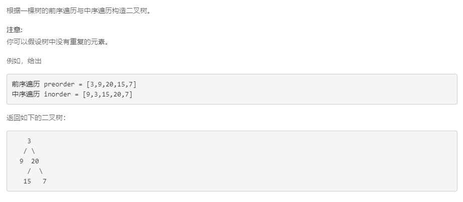

采用递归的方法，在中序序列中根据前序定位根结点的位置，根结点左边是左子树，右边是右子树，然后分别对两边进行递归。终止条件是左子树为空或右子树为空：

```c++
class Solution {
public:
    TreeNode* buildTree(vector<int>& preorder, vector<int>& inorder) {
        map<int, int> m;
        for (int i = 0; i < inorder.size(); ++i)
            m[inorder[i]] = i;			// 使用map存储中序序列中结点对应的索引
  
        return build(preorder, 0, preorder.size(), inorder, 0, inorder.size(), m);
    }

    TreeNode* build(vector<int>& preorder, int p_start, 
                    int p_end, vector<int>& inorder, int i_start, int i_end, map<int, int>& mp) {
        if (p_start == p_end)
            return nullptr;
        int value = preorder[p_start];
        TreeNode* root = new TreeNode(value);

        int root_index = mp[value];		// 获得根结点的索引

        int left = root_index - i_start;	// left左子树长度
        root->left = build(preorder, p_start + 1, p_start + left + 1, inorder, i_start, root_index, mp);		// 递归生成左子树
        root->right = build(preorder, p_start + left + 1, p_end, inorder, root_index + 1, i_end, mp);		// 递归生成右子树
        return root;
    }
};
```

## [106. 从中序与后序遍历序列构造二叉树](https://leetcode-cn.com/problems/construct-binary-tree-from-inorder-and-postorder-traversal/)

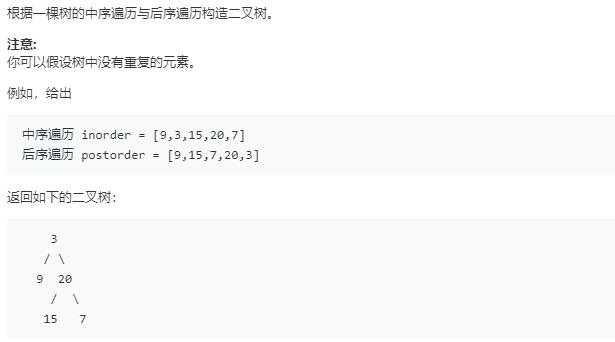

和105题类似，递归的方法，后序的最后一个位置是根结点，定位其在中序中的位置，左边是左子树，右边是右子树：

```c++
class Solution {
public:
    TreeNode* buildTree(vector<int>& inorder, vector<int>& postorder) {
        map<int, int> m;
        for (int i = 0; i < inorder.size(); ++i) 
            m[inorder[i]] =i;
        return build(inorder, 0, inorder.size()-1, postorder, 0, postorder.size()-1, m);
    }

    TreeNode* build(vector<int>& inorder, int i_start, int i_end, vector<int>& postorder, int p_start, int p_end, map<int, int>& mp) {
        if (p_start > p_end || i_start > i_end)
            return nullptr;

        int value = postorder[p_end];
        TreeNode* root = new TreeNode(value);

        int root_idx = mp[value];
        int left = root_idx - i_start;

        root->left = build(inorder, i_start, root_idx, postorder, p_start, p_start + left - 1, mp);
        root->right = build(inorder, root_idx + 1, i_end, postorder, p_start + left, p_end - 1, mp);
        return root;
    }
};
```

## [116. 填充每个节点的下一个右侧节点指针](https://leetcode-cn.com/problems/populating-next-right-pointers-in-each-node/)

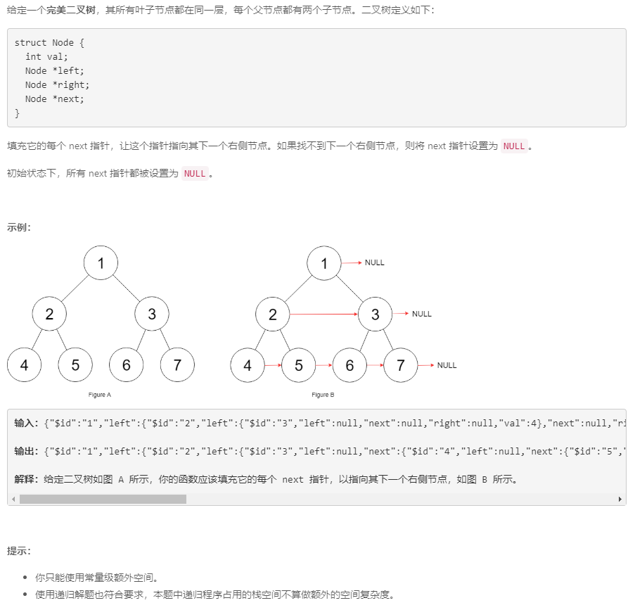

### 层序遍历：

遍历每层时，每弹出一个结点就将其next指针指向队首元素：

```c++
/*
// Definition for a Node.
class Node {
public:
    int val;
    Node* left;
    Node* right;
    Node* next;

    Node() : val(0), left(NULL), right(NULL), next(NULL) {}

    Node(int _val) : val(_val), left(NULL), right(NULL), next(NULL) {}

    Node(int _val, Node* _left, Node* _right, Node* _next)
        : val(_val), left(_left), right(_right), next(_next) {}
};
*/
class Solution {
public:
    Node* connect(Node* root) {
        if (root == nullptr)
            return root;
        queue<Node*> qe;
        
        Node* p = root;
        qe.push(p);
        
        while (!qe.empty()) {
            int lsize = qe.size();
            while (lsize) {
                lsize--;
                p = qe.front();
                qe.pop();
                if (lsize > 0)		// 如果是当前层的最后一个结点，就不需要指向下一个了
                    p->next = qe.front();
                if (p->left)
                    qe.push(p->left);
                if (p->right)
                    qe.push(p->right);
            }
        }
        return root;
    }
};
```

### 使用已经建立的next指针：

第0层不需要建立next指针，第一层的next指针可以通过`node->left->next = node->right`来建立。第二层的分为两种情况，一种和上面相同，是兄弟结点；另一种情况是为表兄弟结点，可以通过`node->right->next = node->next->left`连接。

```c++
class Solution {
public:
    Node* connect(Node* root) {
        if (root == nullptr)
            return root;
        
        Node* l = root;				// 从每层的最左结点开始
        
        // 最左结点为空，说明走到了最后一层，最后一层在上一层就已经处理完成，跳出循环
        while (l->left) {			
            Node* p = l;			
            
            while (p) {				// 连接当前层的下一层
                p->left->next = p->right;	// 第一种情况，兄弟结点
                if (p->next) 		// 第二种情况，表兄弟结点
                    p->right->next = p->next->left;
                
                p = p->next;		// p为空，说明当前层结束，开始下一层
            }
            l = l->left;
        }
        return root;
    }
};
```

时间：$O(n)$，空间：$O(1)$

## [126. 单词接龙 II](https://leetcode-cn.com/problems/word-ladder-ii/)(未完成)

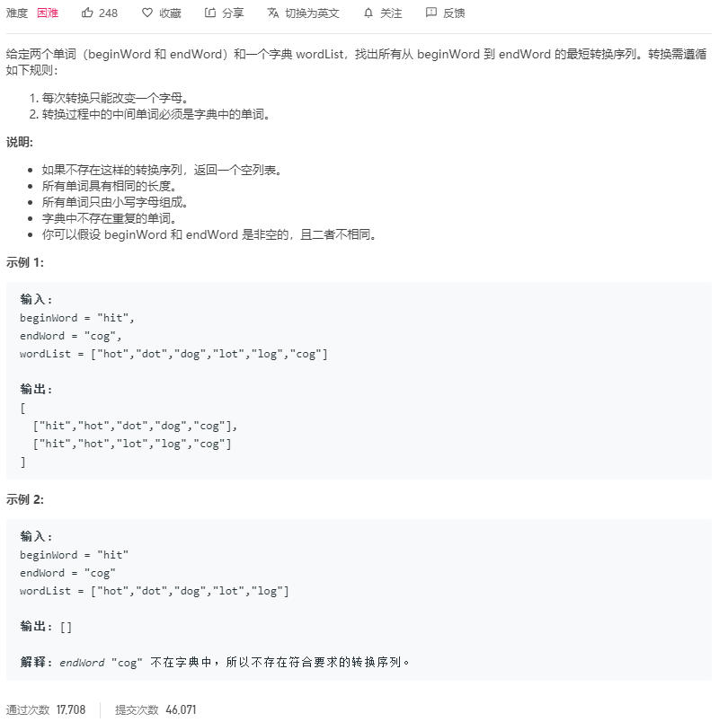


```c++
class Solution {
public:
    vector<vector<string>> findLadders(string beginWord, string endWord, vector<string>& wordList) {

    }
};
```

## [128. 最长连续序列](https://leetcode-cn.com/problems/longest-consecutive-sequence/)

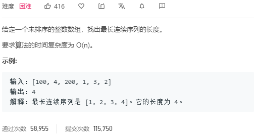

暴力的方法，对数组中的每个数$x$，以其为起点不断匹配$x+1,x+2...$，然后不断更新最大匹配到的长度。匹配的过程中，每次都要检查$x+1,x+2,...$，这需要$O(n)$的复杂度，使用哈希表的话可以达到$O(1)$的复杂度。但是整体的复杂度依然是$O(n^2)$的，因为嵌套了两层循环，一层是遍历数组，另外一层是查找$x+1,x+2,...$。

这个过程包括了一些重复的枚举，例如对于一个已知的连续序列$x,x+1,x+2,...x+y$，如果我们继续从$x+1$开始枚举，结果肯定不会比之前好，因此在外层遍历数组的时候，遇到这种情况可以直接跳过。具体来说，就是如果当前遍历的元素是$x$，那么我们检查数组中是否有$x-1$，有的话以当前为起点的匹配结果肯定不会优于$x-1$。

算法过程：

- 首先使用集合来进行去重，然后遍历数组
- 对每个数$x$，检查是否存在$x-1$，如果没有，那么从当前数开始枚举连续序列，并更新最大长度。

```c++
class Solution {
public:
    int longestConsecutive(vector<int>& nums) {
		unordered_set<int> numset;
        int longStreak = 0;
        for (const int& num : nums)
            numset.insert(num);
        
        for (auto & num : nums) {
            // 如果不存在num-1，就从当前位置开始计算最大长度
            if (!numset.count(num - 1)) {
                int curNum = num;
                int curStreak = 1;
                // 利用集合的特点来不断累加连续序列长度
                while (numset.count(curNum + 1)) {
                    curNum++;
                    curStreak++;
                }
                longStreak = longStreak > curStreak ? longStreak : curStreak;
            }
        }
        return longStreak;
    }
};
```


## [142. 环形链表 II](https://leetcode-cn.com/problems/linked-list-cycle-ii/)(未完成)

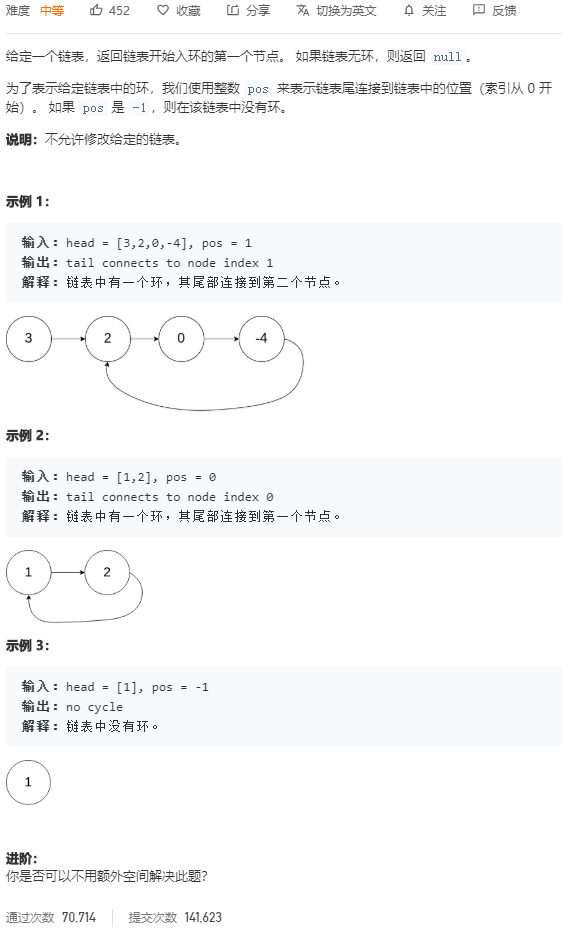


## [146. LRU缓存机制](https://leetcode-cn.com/problems/lru-cache/)

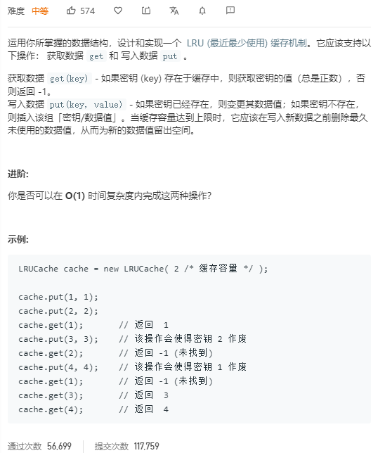

采用Hash表加双向链表（头尾访问元素最快）的方式实现。Hash表存放键值映射，用来管理缓存内容，包括添加和删除。双向链表用来决定要删除的内容和记录最近访问的键值：

- `put`方法，添加时，将键（值可以通过键索引）放入双向链表的头部，代表已经访问。后面每访问一次元素，就将其移动到头部。这样尾部自然就是最久没有访问的。当cache满的时候，直接从尾部删除元素，然后删除缓存，存入新元素即可。
- `get`方法，如果hash表中不存在对应的元素，直接返回-1。否则，首先记录对应的值，然后将对应的键值对在双向链表中移动到链表头部

从上面可以看出，这里包含两个关键的部分：

- 删除双向尾部元素
- 将链表中访问过的元素移动到链表头部

因此，新增加三个方法：

- `addToHead()`，在表头新添加元素
- `moveToHead()`，将最近访问过的元素移动到表头
- `removeNode()`删除结点

```c++
class Dlinked {
public:
	int key, value;
    Dlinked * prev;
    Dlinked * next;
    Dlinked() : key(0), value(0), prev(nullptr), next(nullptr) {}
    Dlinked(int _key, int _value) : key(_key), value(_value), prev(nullptr), next(nullptr) {}
};

class LRUCache {
private:
    unordered_map<int, Dlinked*> cache;
    Dlinked* head;
    Dlinked* tail;
    int size;
    int capacity;

public:
    LRUCache(int _capacity): capacity(_capacity), size(0) {
        // 使用伪头部和伪尾部节点
        head = new Dlinked();
        tail = new Dlinked();
        head->next = tail;
        tail->prev = head;
    }
    
    int get(int key) {
        if (!cache.count(key)) {
            return -1;
        }
        // 如果 key 存在，先通过哈希表定位，再移到头部
        Dlinked* node = cache[key];
        moveToHead(node);
        return node->value;
    }
    
    void put(int key, int value) {
        if (!cache.count(key)) {
            // 如果 key 不存在，创建一个新的节点
            Dlinked* node = new Dlinked(key, value);
            // 添加进哈希表
            cache[key] = node;
            // 添加至双向链表的头部
            addToHead(node);
            ++size;
            if (size > capacity) {
                // 如果超出容量，删除双向链表的尾部节点
                Dlinked* removed = removeTail();
                // 删除哈希表中对应的项
                cache.erase(removed->key);
                // 防止内存泄漏
                delete removed;
                --size;
            }
        }
        else {
            // 如果 key 存在，先通过哈希表定位，再修改 value，并移到头部
            Dlinked* node = cache[key];
            node->value = value;
            moveToHead(node);
        }
    }

    void addToHead(Dlinked* node) {
        node->prev = head;
        node->next = head->next;
        head->next->prev = node;
        head->next = node;
    }
    
    void removeNode(Dlinked* node) {
        node->prev->next = node->next;
        node->next->prev = node->prev;
    }

    void moveToHead(Dlinked* node) {
        // 从原来的位置删除后添加到头部
        removeNode(node);
        addToHead(node);
    }

    Dlinked* removeTail() {
        // 删除尾部结点，返回删除的结点指针
        Dlinked* node = tail->prev;
        removeNode(node);
        return node;
    }
};

/**
 * Your LRUCache object will be instantiated and called as such:
 * LRUCache* obj = new LRUCache(capacity);
 * int param_1 = obj->get(key);
 * obj->put(key,value);
 */
```


## [151. 翻转字符串里的单词](https://leetcode-cn.com/problems/reverse-words-in-a-string/)

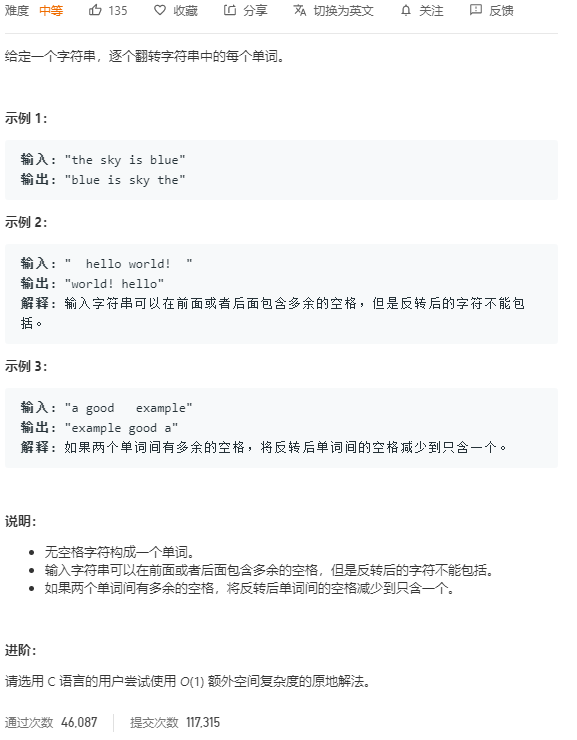


## [160. 相交链表](https://leetcode-cn.com/problems/intersection-of-two-linked-lists/)

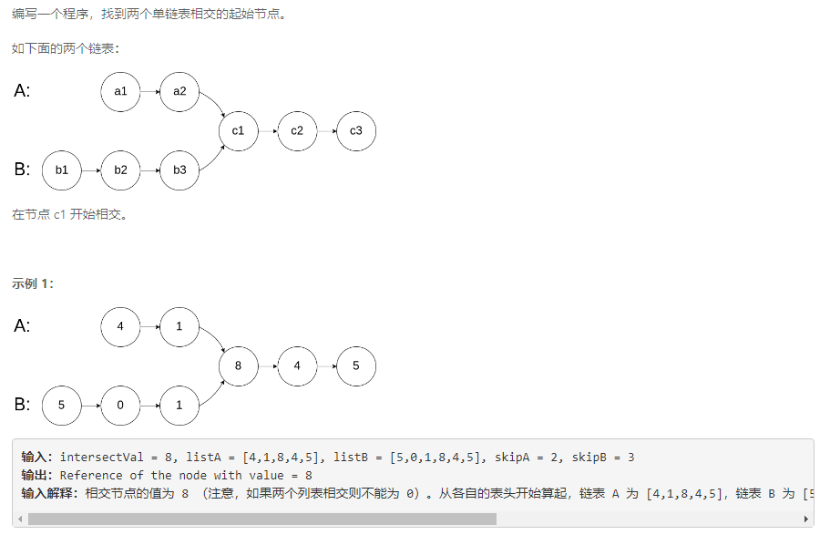

两个链表相交时，从相交的位置开始，后面所有结点相同。所以只要找到相交结点。采用双指针法，链表长度不同时，需要消除长度差，让两个指针最终指向相交的位置。设置两个指针，`pa`指向`headA`，`pb`指向`headB`，分别遍历两个链表，当`pa`走到表尾时，让其指向`headB`的表头，遍历B，`pb`也是一样。假设相交后面的部分链表长度为c，那么两个在相遇时走过的长度都是$a+b+c$：

```c++
class Solution {
public:
    ListNode *getIntersectionNode(ListNode *headA, ListNode *headB) {
        auto A = headA;
        auto B = headB;
        
        while (A != B) {
            A = A ? A->next : headB;
            B = B ? B->next : headA;
        }
        return A;
    }
};
```

## [200. 岛屿数量](https://leetcode-cn.com/problems/number-of-islands/)

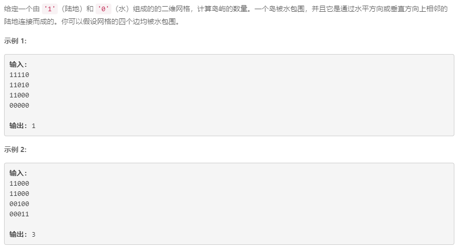

使用DFS的方法，对每个格子如果是1，就进行深度优先遍历，遍历完成标记为一个岛屿，并设置已访问标记。然后从未进行访问，并且为1的格子继续，直到遍历完成整个数组。

```c++
class Solution {
public:
    void dfs(vector<vector<char>>& grid, int r, int c) {
        int row = grid.size();
        int col = grid[0].size();

        grid[r][c] = '0';       // 设置已访问标记
        // 向上下左右四个方向遍历，就像是走迷宫
        if (r - 1 >= 0 && grid[r-1][c] == '1') dfs(grid, r-1, c);
        if (r + 1 < row && grid[r+1][c] == '1') dfs(grid, r+1, c);
        if (c - 1 >= 0 && grid[r][c-1] == '1') dfs(grid, r, c-1);
        if (c + 1 < col && grid[r][c+1] == '1') dfs(grid, r, c+1);
    }


    int numIslands(vector<vector<char>>& grid) {
        int row = grid.size();
        if (row == 0) 
            return 0;
        int col = grid[0].size();

        int num_island = 0;
        for (int i = 0; i < row; ++i) {
            for (int j = 0; j < col; ++j) {
                if (grid[i][j] == '1') {
                    ++num_island;
                    dfs(grid, i, j);
                }
            }
        }

        return num_island;
    }
};
```

## [230. 二叉搜索树中第K小的元素](https://leetcode-cn.com/problems/kth-smallest-element-in-a-bst/)

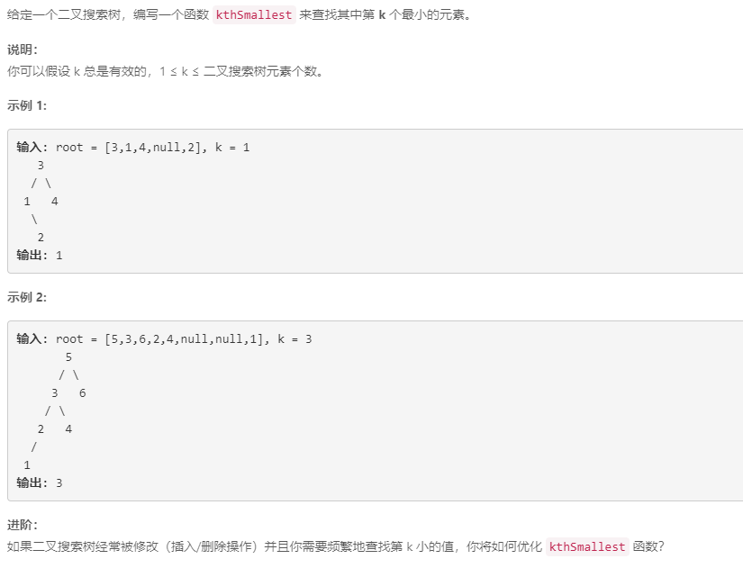

非递归中序遍历，并进行计数，直到第k个：

```c++
class Solution {
public:
    int kthSmallest(TreeNode* root, int k) {
        if (!root) 
            return 0;
        stack<TreeNode*> st;

        TreeNode* p = root;
        int cnt = 0;

        while (p != nullptr || !st.empty()) {
            if (p) {
                st.push(p);
                p = p->left;
            } else {
                cnt++;
                p = st.top();
                st.pop();
                if (cnt == k)
                    break;
                
                p = p->right;
            }
        }
        return p->val;
    }
};
```

## [287. 寻找重复数](https://leetcode-cn.com/problems/find-the-duplicate-number/)

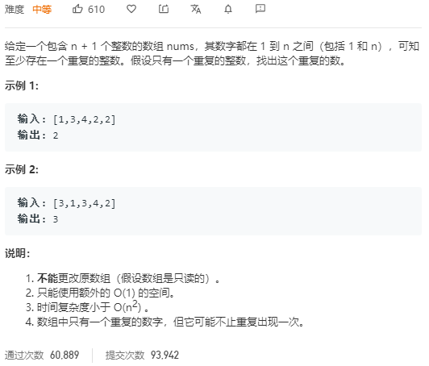

不要求$O(1)$的话可以使用哈希表。要求$O(1)$，有三种方法：

- 二进制：
- 二分查找：题目中的数字范围是`1~n`，并且数组大小是`n+1`。我们要找`1~n`中的一个数，这个数在`nums`中出现了至少两次。采用二分查找的方法，首先确定`1~n`的中位数`mid`，然后比较`nums`中所有的数和`mid`的大小，如果小于或等于`nums`，那么计数器增加。统计完整个数组后，得到的计数器的值如果大于`mid`，说明`nums`中重复的数一定在`1~n`的前半部分，继续在前半部分查找。否则在后半部分，更新区间，继续查找。
  - `left < right`时循环：
    - 更新`mid`的值为`(left + right) >> 1`
    - 对每个数组元素，比较和`mid`的大小：小于`mid`则计数器加一
    - 若计数器大于`mid`，说明前半部分存在重复，更新右边界为`right = mid`
    - 否则更新左边界为`left = mid+1`
- 快慢指针： 和链表判环类似。设置快慢指针，将`nums`数组看成静态链表，数组元素代表下一个索引的位置，如果一个数重复出现了两次或以上，那么可以将其看成链表环的入口。快指针一次走两步，慢指针一次走一步，两个指针第一次相遇的时候，可能是在环里，然后将慢指针放到开头，两个指针同步，再次相遇的位置就是重复数字的位置。

```c++
class Solution {
public:
    // 二分查找
    int findDuplicate(vector<int>& nums) {
        int len = nums.size();
        int left = 0;
        int right = len - 1;
        
        while (left < right) {
            int mid = (left + right) >> 1;
            int cnt = 0;
            for (auto num : nums) {
                if (num <= mid)
                    cnt++;
            }
            if (cnt > mid)
                right = mid;
            else
                left = mid + 1;
        }
        return left;
    }
};

class Solution {
public:
    // 快慢指针
    int findDuplicate(vector<int>& nums) {
        // 因为while循环的特性，在第一步就要开始走，否则
        int slow = nums[slow];
        int fast = nums[nums[fast]];
        
        while (slow != fast) {
            slow = nums[slow];
            fast = nums[nums[fast]];
        }
        slow = nums[slow];
        fast = nums[nums[fast]];
        slow = 0;
        while (slow != fast) {
            slow = nums[slow];
            fast = nums[fast];
        }
        return slow;
    }
};
```

## [328. 奇偶链表](https://leetcode-cn.com/problems/odd-even-linked-list/)

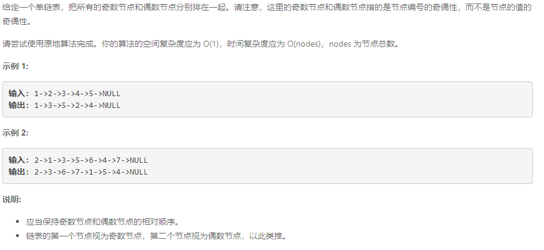

分别用两个指针指向奇偶结点，然后让奇结点指向偶结点的后面，然后偶结点指向奇结点的后面，最后将两个链表拼起来：

```c++
class Solution {
public:
    ListNode* oddEvenList(ListNode* head) {
        if (head == nullptr)
            return head;		// 边界条件
        ListNode* odd = head;
        ListNode* even = head->next;
        ListNode* tmp = even;	// 暂存第一个偶结点，后面用于拼接
        
        while (odd->next && even->next) {		// 指针域不空循环
            odd->next = even->next;				// 奇结点指向偶节点的后面
            odd = odd->next;
            
            even->next = odd->next;				// 偶结点指向奇结点的后面
            even = even->next;
        }
        odd->next = tmp;						// 拼接链表并返回
        
        return head;
    }
};
```

时间：$O(n)$，空间：$O(1)$

## [334. 递增的三元子序列](https://leetcode-cn.com/problems/increasing-triplet-subsequence/)

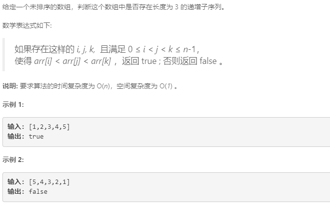

- 双指针法：两个指针分别指向较小的两个元素，如果遇到较大的，则返回true。为什么替换最小的呢。因为如果不替换最小的，那么就会漏掉以最小的`small`为中间元素的序列。

	```c++
	class Solution {
	public:
	    bool increasingTriplet(vector<int>& nums) {
	        int small = INT_MAX;
	        int mid = INT_MAX;
	        
	        for (auto c : nums) {
	            if (small >= c)			// 如果比最小的小，就替换最小的
	                small = c;
	            else if (mid >= c)		// 比最小的大，比大的小，替换大的
	                mid = c;
	            else
	                return true;		// 比两个都大，说明找到了，返回
	        }
	        return false;
	    }
	};
	```

## [355. 设计推特](https://leetcode-cn.com/problems/design-twitter/)

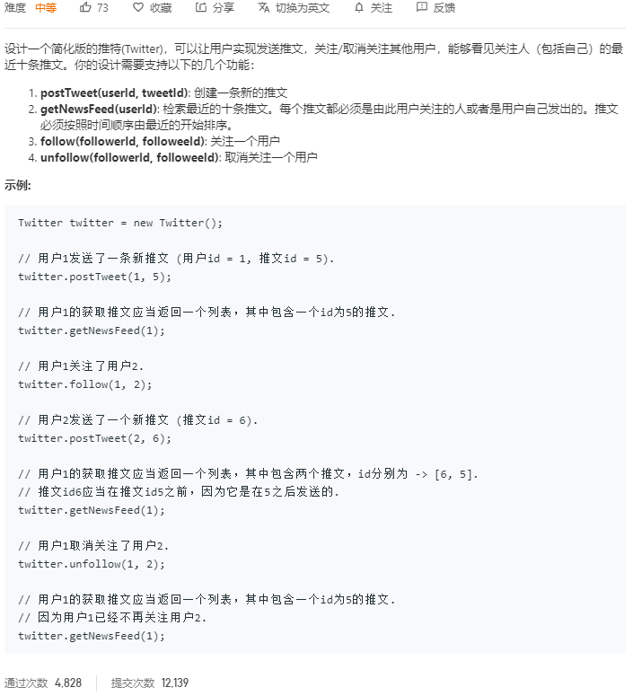

需求3和4说明我们需要一个我关注人的ID列表，需要经常删除和添加，可以采用哈希表。即键是用户ID，值是用户关注的人的ID，`unordered_map<int, set<int>> following`。

需求2中要求根据用户ID返回他关注的人包括他自己发的最近10条推文。这关系到推文的组织方式，可以将每个用户推文使用单链表组织在一起，在头部进行插入和删除，这样头部一直是最近发布的推文。用户ID和他们的推文可以采用哈希表存储，方便查找和删除`unordered_map<int, Tweet> twitter`，其中`Tweet`是用户推文链表的结点，包括推文ID和时间戳。

总结一下，有两个哈希表：

- 第一个哈希表用来存储用户ID和他们推文`twitter`
- 第二个哈希表存储用户ID和其关注人的列表`following`

下面来实现需求：

- 需求1：查找对应`twitter`，找到对应用户ID，在对应链表头部插入一个新的推文结点
- 需求2：首先在`following`中找到用户ID，然后根据他关注的用户列表（包括他自己）返回链表前10的结点，可以用多路归并的方法，合并K个有序链表，可以采用优先队列（大顶堆）的方式，根据时间戳排序。
- 需求3和4，在`following`中查表，删除对应用户的关注即可。

```c++
// 设计的推文结构，作为容器list的结点内容
struct Tweet {
        int tweetId;
        int timepost;
};
// 要使用优先队列，不想自己写，需要重载一下运算符
bool operator<(const Tweet& a, const Tweet& b) { return a.timepost < b.timepost; }

class Twitter {
private:
        
    int timestamp;
    // 用户关注的列表。用户ID：关注的人的集合
    unordered_map<int, set<int>> following;
    // 用户推文列表。用户ID：用户推文链表
    unordered_map<int, list<Tweet>> twitter;
    
public:
    /** Initialize your data structure here. */
    Twitter() {
        timestamp = 0;
    }
    
    /** Compose a new tweet. */
    void postTweet(int userId, int tweetId) {
        // 发布推文，时间戳增加
        timestamp++;
        // 如果用户存在，那么直接在链表头部插入新的推文
        if (twitter.find(userId) != twitter.end()) {
            twitter[userId].emplace_front(Tweet{tweetId, timestamp});
        } else {
            // 否则将用户和发布的推文一起插入
            list<Tweet> tmp(1, Tweet{tweetId, timestamp});
            twitter.insert(pair<int, list<Tweet>> (userId, tmp));
        }
    }
    
/** Retrieve the 10 most recent tweet ids in the user's news feed. Each item in the news feed must be posted by users who the user followed or by the user herself. Tweets must be ordered from most recent to least recent. */
    vector<int> getNewsFeed(int userId) {
        vector<int> res;
		// 设置优先队列，也就是大顶堆。将时间戳较大的放在堆顶，直接取出即可
        priority_queue<Tweet> max;
        // 将用户自己的ID也加入到队列中
        following[userId].insert(userId);
		// 遍历用户关注的所有人（包括自己）
        for (auto followee : following[userId]) {
            // 将所有推文加入队列
            for (auto& tweet : twitter[followee]) {
                max.push(tweet);
            }
        }
        // 取队列前十的元素，作为结果输出
        while (!max.empty() && res.size() < 10) {
            res.emplace_back(max.top().tweetId);
            max.pop();
        }

        return res;
    }
    
    /** Follower follows a followee. If the operation is invalid, it should be a no-op. */
    void follow(int followerId, int followeeId) {
        following[followerId].insert(followeeId);
    }
    
    /** Follower unfollows a followee. If the operation is invalid, it should be a no-op. */
    void unfollow(int followerId, int followeeId) {
        following[followerId].erase(followeeId);
    }
};
```

## [394. 字符串解码](https://leetcode-cn.com/problems/decode-string/)

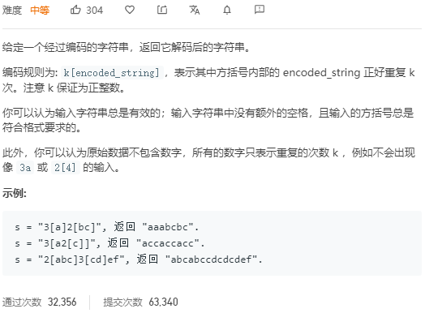

采用递归的方法，不断解析方括号里面的字符串，当遇到右方括号`]`时，说明达到了递归终止条件，开始返回。

- 递归内容：解析字符串。首先解析数字，可能包含多位数。然后如果碰到了`[`，开始递归。如果碰到了`]`，返回`[]`之间的字符串，然后重复`num`次累加到结果`res`上。
- 终止条件：碰到`]`，返回括号内的字符串`res`。或者达到字符串结尾。

`idx`字符串索引要传引用，否则每次`idx`要重新计算为0得不到正确的结果。

```c++
class Solution {
public:
    string decodeString(string s) {
        // 传引用的时候必须初始化
        int idx = 0;
        return decode(s, idx);
    }

    string decode(string s, int& idx) {
        string res;
        // 这里没必要事先声明tmp
        string tmp;
        int num = 0;

        while (idx < s.size()) {
            // 如果是数字，就累加数字得到一个重复次数
            if (isdigit(s[idx]))
                num = 10 * num + (s[idx] - '0');
            // 如果是[，进行递归，递归返回后得到括号内的字符串，重复num次加到结果上
            else if (s[idx] == '[') {
                tmp = decode(s, ++idx);
                while (num-- > 0) res += tmp;
                num = 0;
            // 如果是]，返回
            } else if (s[idx] == ']') break;
            // 累加得到方括号内的字符串
            else
                res += s[idx];
            ++idx;
        }
        return res;
    }
};
```


## [445. 两数相加 II](https://leetcode-cn.com/problems/add-two-numbers-ii/)

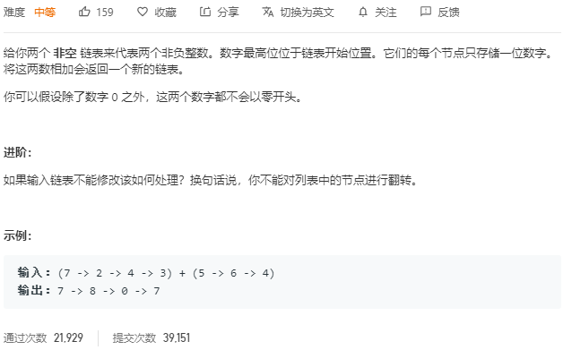

要求不反转链表，那就直接遍历两个链表，将数逐个取出放在数组中，然后将数组中的数组成十进制数相加。得到结果后，用头插法逐个插入新的链表。

- 遍历`l1,l2`，将结点中的数字放到`vec1, vec2`中。
- 对`vec1, vec2`中的数字：
  - `num1 += vec1[i] * pow(10, len - i - 1)`，计算出第一个数。同理得到第二个数
- `res = num1+num2`
- 对于`res`，每次除10的余数作为结点值插入链表，商作为下一轮循环的被除数。

这种方法有个弊端，就是对长整数不适用。由于`l1,l2`的方向和相加的方向是相反的，所以我们可以借助栈来实现逆序相加。

- 将`l1,l2`的数字逐个入栈，这样就得到了正确顺序的数字
- 当至少有一个栈不空或进位大于0的时候循环：
  - `sum = carry`，加上上一次的进位
  - 从两个栈中取出数加到`sum`上
  - 新建结点`ListNode(sum % 10)`，加入到新的链表
  - 计算进位`carry = sum / 10`

```c++
/**
 * Definition for singly-linked list.
 * struct ListNode {
 *     int val;
 *     ListNode *next;
 *     ListNode(int x) : val(x), next(NULL) {}
 * };
 */
class Solution {
public:
    ListNode* addTwoNumbers(ListNode* l1, ListNode* l2) {
        stack<int> st1;
        stack<int> st2;

        while (l1 != nullptr) {
            st1.push(l1->val);
            l1 = l1->next;
        }
        while (l2 != nullptr) {
            st2.push(l2->val);
            l2 = l2->next;
        }

        ListNode* head = new ListNode(0);
        int carry = 0;
        while (!st1.empty() || !st2.empty() || carry > 0) {
            int sum = carry;
            sum += st1.empty() ? 0 : st1.top();
            sum += st2.empty() ? 0 : st2.top();
            if (!st1.empty()) st1.pop();		// 栈要非空才能弹出
            if (!st2.empty()) st2.pop();
            ListNode* p = new ListNode(sum % 10);
            p->next = head->next;
            head->next = p;
            carry = sum / 10;
        }
        return head->next;
    }
};
```

## [542. 01 矩阵](https://leetcode-cn.com/problems/01-matrix/)

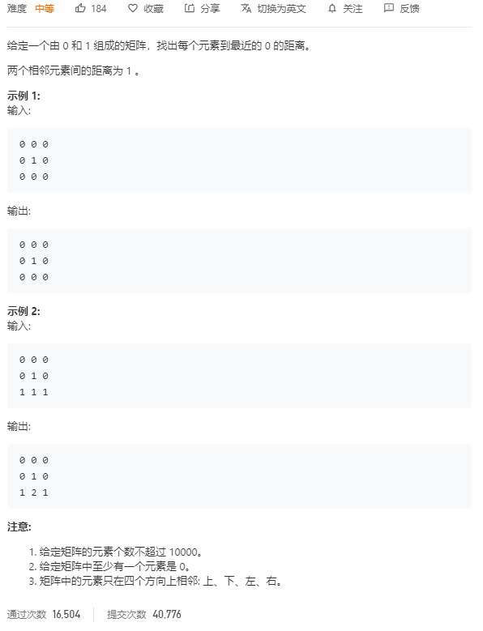


## [739. 每日温度](https://leetcode-cn.com/problems/daily-temperatures/)

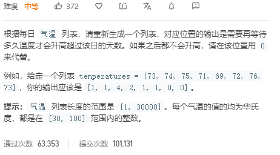

题目的意思是，对于今天的温度，还要经过几天，才能超过今天的温度。以题目中的例子，今天是73，经过1天到74，74经过1天到75，75经过4天到76，以此类推。

### 暴力法

对每个温度`T[i]`，要找到最小的下标`j`，使`i < j && T[i] < T[j]`。流程如下：

- 遍历数组，当前位置是`i`
  - 从当前位置向右遍历，下标是`j`，直到遇到一个比`T[i]`大的数`T[j]`，记录距离`j-i`到结果

```c++
class Solution {
public:
    vector<int> dailyTemperatures(vector<int>& T) {		
        int len = T.size();
        vector<int> res(len);

        for (int i = 0; i < len; ++i) {
            for (int j = i + 1; j < len; ++j) {
                if (T[i] < T[j]) {
                    res[i] = j - i;
                    break;
                }                    
            }
        }
        return res;
    }
};
```

直接超时没商量。

### 单调栈

维护一个从栈底到栈顶递减的栈，遍历到当前温度的时候和栈顶元素进行比较，如果比栈顶元素小直接入栈，如果当前数字大于栈顶元素，说明找到了栈顶元素对应的第一个大于它的数，将栈顶元素出栈计算两者距离，然后新元素入栈。

- 遍历数组，第一个元素直接入栈，对于后面的元素
  - 当栈不空，且栈顶元素小于当前元素时，栈顶元素出栈，计算下标距离加入到结果直到不满足循环条件

```C++
class Solution {
public:
    vector<int> dailyTemperatures(vector<int>& T) {		
        int len = T.size();
        vector<int> res(len);
        stack<int> st;
        
        for (int i = 0; i < len; ++i) {
            while (!st.empty() && T[i] > T[st.top()]) {
                auto t = st.top();
                st.pop();
                res[t] = i - t;
            }
            st.push(i);
        }
        return res;
    }
};
```


## [837. 新21点](https://leetcode-cn.com/problems/new-21-game/)

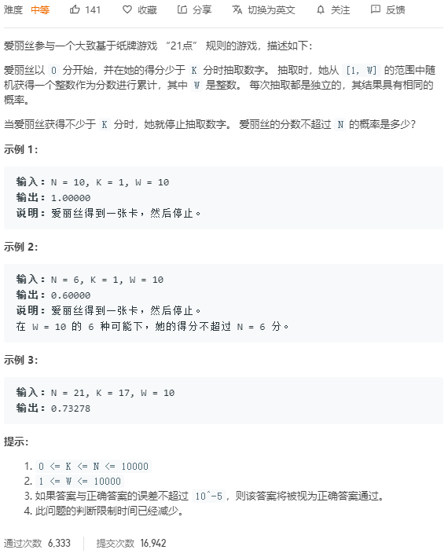


```c++
class Solution {
public:
    double new21Game(int N, int K, int W) {

    }
};
```


## [912. 排序数组](https://leetcode-cn.com/problems/sort-an-array/)

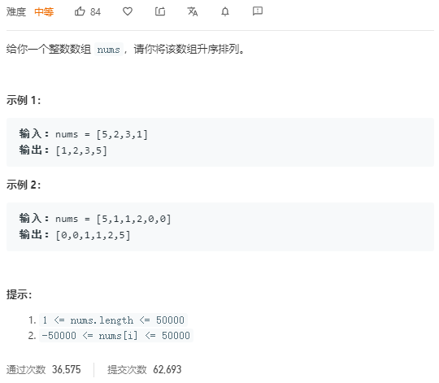

简单快排：

```c++
class Solution {
public:
    vector<int> sortArray(vector<int>& nums) {
        int len = nums.size();
        _qsort(nums, 0, len - 1);
        return nums;
    }
    
    void _qsort(vector<int>& nums, int left, int right) {
        if (left < right) {
            int pos = _partition(nums, left, right);
            _qsort(nums, left, pos - 1);
            _qsort(nums, pos + 1, right);
        }
    }
    int _partition(vector<int>& nums, int left, int right) {
        int pivot = nums[left];
        while (left < right) {
            while (left < right && nums[right] >= pivot) --right;
            nums[left] = nums[right];
            while (left < right && nums[left] < pivot) ++left;
            nums[right] = nums[left];
        }
        nums[left] = pivot;
        return left;
    }
}；
```

带随机化的快排：

```c++
class Solution {
public:
    vector<int> sortArray(vector<int>& nums) {
        int len = nums.size();
        _qsort(nums, 0, len - 1);
        return nums;
    }
    void _qsort(vector<int>& nums, int left, int right) {
        if (left < right) {
            int pos = _partition(nums, left, right);
            _qsort(nums, left, pos - 1);
            _qsort(nums, pos + 1, right);
        }
    }
    
    int _partition(vector<int>& nums, int left, int right) {
        int randIdx = left + rand() % (right - left + 1);
        swap(nums[left], nums[randIdx]);
        int pivot = nums[left];
        int i = left;
        for (int j = i + 1; j <= right; ++j) {
            if (nums[j] < pivot)
                swap(nums[++i], nums[j]);
        }
        swap(nums[i], nums[left]);
        return i;
    }
};
```

## [974. 和可被 K 整除的子数组](https://leetcode-cn.com/problems/subarray-sums-divisible-by-k/)

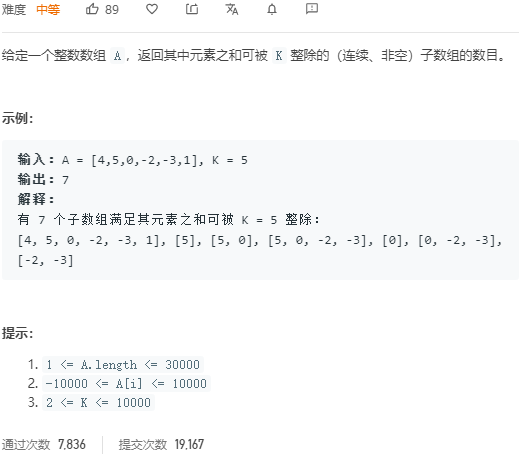

暴力法，先得到所有子数组，然后相加看是否能被K整除。还可以采用前缀和的方法，前缀和是一个数组`pre`，`pre[i]`表示原数组从第0项到第i项的和。

- `a[i] = pre[i] - pre[i-1]`
- `a[i] + ... + a[j] = pre[j] - pre[i-1]`

判断子数组能否被K整除就相当于判断`(pre[j] - pre[i-1]) mod K == 0`，即只要保证`pre[j] mod K == pre[i-1] mod K`就可以了。这样可以用一个两层的循环遍历`pre`，然后得到对应的子数组。

```c++
class Solution {
public:
    int subarraysDivByK(vector<int>& A, int K) {
        int res = 0;
        int len = A.size();
        vector<int> pre;
        // a[0] = pre[1] - pre[0]，pre[0]赋值为0，这样就不用考虑边界条件了
        pre.emplace_back(0);
        int sum = 0;
        for (auto a : A) {
            sum += a;
            pre.emplace_back(sum);
        }

        for (int i = 1; i < len + 1; ++i) {
            for (int j = i; j < len + 1; ++j) {
                if (!((pre[j] - pre[i-1]) % K))
                    res++;
            }
        }
        return res;
    }
};
```

上述方法虽然可行，但是达不到时间复杂度要求，会超时，超时的测试用例为全0的长数组。

我们可以使用哈希表存储`pre[i] % K`的值。哈希表的键表示前缀和模K的值，值表示这个值具体出现的次数。所有第一次出现的值不计入结果，否则说明之前出现过，并且和当前的`pre[i] % K`相同，也就满足了上面的条件，就将这个出现次数进行累加。

```c++
class Solution {
public:
    int subarraysDivByK(vector<int>& A, int K) {
        int res = 0;
        int sum = 0;
        int len = A.size();
        // 用数组代替哈希表
        vector<int> record(K, 0);
        // 和前面类似，pre[0] = 0，第0项的前缀和为0，取模为0等于1
        record[0] = 1;
        
        for (auto a : A) {
            sum += a;
            // 注意C++取模的特殊性，当被除数为负数时取模结果为负数，需要纠正
            int mod = (sum % K + K) % K;
            // 如果之前出现过模的值，要进行累加，算是出现了一个子数组
            if (record[mod])
                res += record[mod];
            record[mod]++;
        }
        return res;
    }
};
```

## [990. 等式方程的可满足性](https://leetcode-cn.com/problems/satisfiability-of-equality-equations/)

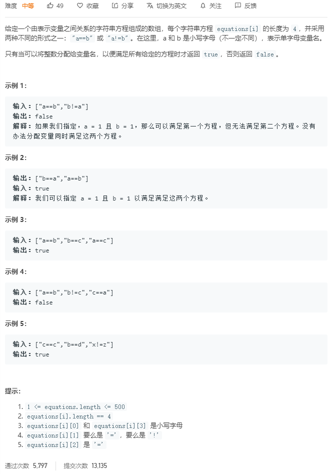

这题考察的是并查集，并查集中把相同类别的元素放在一个集合中。这里我们可以将不同的变量看成图的结点，具有相等关系`==`的结点之间具有边。这样所有相等的变量都是连通的，也就是一个连通分量。

首先遍历所有的等式，构建并查集，然后遍历所有不等式，同一不等式的两个变量不能同属于一个连通分量。总共分成三步：

- 初始化集合
- 构建并查集
- 测试不等式的变量是否在一个连通分量中

```c++
class UnionFind {
private:
    vector<int> parent;
public:
    UnionFind() {
        parent.resize(26);
        // 对parent赋初值0，使parent[i] = i，0代表从0递增
        iota(parent.begin(), parent.end(), 0);
    }
    
    int find(int idx) {
        // idx == parent[idx]说明是孤立点直接返回
        if (idx == parent[idx])
            return idx;
        
        parent[idx] = find(parent[idx]);
        return parent[idx];
    }
    
    void unite(int idx1, int idx2) {
        parent[find(idx1)] = find(idx2);
    }
};
class Solution {
public:
    bool equationsPossible(vector<string>& equations) {
        UnionFind uf;
		if (equations.empty()) return true;
        
        // 构建并查集
        for (const string& s : equations) {
            if (s[1] == '=') {
                int idx1 = s[0] - 'a';
                int idx2 = s[3] - 'a';
                uf.unite(idx1, idx2);
            }
        }
        // 测试不等式
        for (const string& s : equations) {
            if (s[1] == '!') {
                int idx1 = s[0] - 'a';
                int idx2 = s[3] - 'a';
                if (uf.find(idx1) == uf.find(idx2)) return false;
            }
        }
        return true;
    }
};
```


## [1111. 有效括号的嵌套深度](https://leetcode-cn.com/problems/maximum-nesting-depth-of-two-valid-parentheses-strings/)

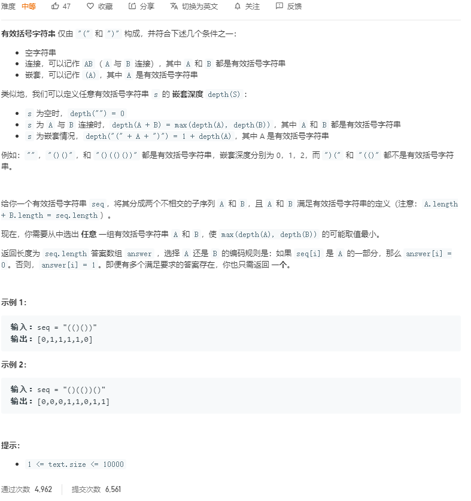

如果`max(depth(A), depth(B))`最小的话，就是`A`和`B`两者长度最接近的时候，因为`A.len+B.len=s.len`。题目的输出是A，B两个子序列对应s中的位置。

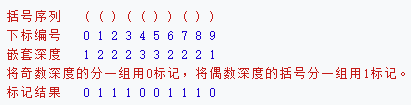

设置一个栈，遍历`seq`，遇到`(`入栈，`)`出栈，这样栈的长度就是就是当前的嵌套深度，将偶数深度和奇数深度分开标记。

```c++
class Solution {
public:
    vector<int> maxDepthAfterSplit(string seq) {
        // 用depth模拟栈即可，不需要真正使用栈
    	int depth = 0;
        vector<int> res;
        for (auto c : seq) {
            if (c == '(') {
                // 先入栈，然后标记栈长度是偶还是奇
                ++depth;
                res.emplace_back( depth % 2);
            } else {
                // 先标记栈长，然后再出栈，因为遇到)，肯定是和前面的(匹配上的，算在一个子序列中
                res.emplace_back( depth % 2);
                --depth;
            }
        }
        return res;
    }
};
```


## [1162. 地图分析](https://leetcode-cn.com/problems/as-far-from-land-as-possible/)

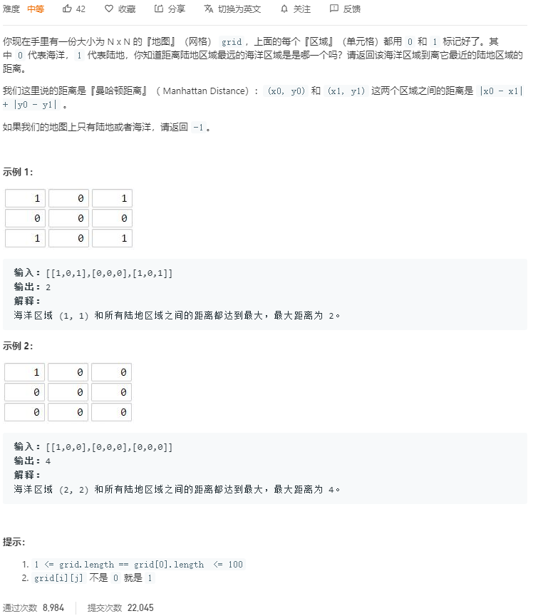

### 1. BFS广度优先

求出每个海洋区域的最近的陆地距离，然后取一个最大值。可以看成单源最短路径问题。海洋区域可以有多个，这变成了多源的BFS。但是依旧可以想象一个虚拟的点，从这个点开始进行单源的BFS。

首先，进行BFS的第一步，将虚拟结点的子结点（是陆地的点）入队。然后从这些子结点开始进一步进行BFS。直接修改原数组，下一个结点如果是海洋，距离为1，那么将数组内容改成2；距离是2，就改成3。直到遍历完所有的陆地，最终得到的就是最远距离：

```c++
class Solution {
public:
    int maxDistance(vector<vector<int>>& grid) {
        queue<pair<int, int>> qe;
        int n = grid.size();
        // 虚拟结点的第一层遍历
        for (int i = 0; i < n; ++i) {
            for (int j = 0; j < n; ++j) {
                if (!grid[i][j]) continue;
                qe.push({i, j});
            }
        }
        // 边界条件
        if (qe.empty() || qe.size() == n*n)
            return -1;
        
        int res = 0;
        // dir是路径向量，右左下上
        vector<vector<int>> dir = {{0, 1}, {0, -1}, {1, 0}, {-1, 0}};
        while (!qe.empty()) {
            auto p = qe.front();
            qe.pop();
			// res表示当前的距离
            res = grid[p.first][p.second];
            // 往四个方向走
            for (auto d : dir) {
				// 走的距离是上一步的基础上，累积的最大值
                int dx = p.first + d[0];
                int dy = p.second + d[1];

                if (dx < 0 || dx >= n) continue;
                if (dy < 0 || dy >= n) continue;
                if (grid[dx][dy] != 0) continue;
                grid[dx][dy] = res + 1;
                qe.push({dx, dy});
            }
        }
        return res - 1;
    }
};
```

### 2. 动态规划

状态：当前位置`[i,j]`到陆地的最大距离。

状态转移：这里有两个状态表示：从左上到右下，从右下到左上：

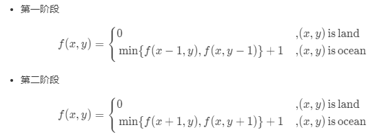

```c++
class Solution {
public:
    int maxDistance(vector<vector<int>>& grid) {
        int n = grid.size();
        int res = -1;
        int f[110][110];
        const int INF = int(1E6);

        vector<vector<int>>& a = grid;
        for (int i = 0; i < n; ++i) {
            for (int j = 0; j < n; ++j) {
                f[i][j] = a[i][j] ? 0 : INF;
            }
        }

        for (int i = 0; i < n; ++i) {
            for (int j = 0; j < n; ++j) {
                if (a[i][j]) continue;
                if (i - 1 >= 0)
                    f[i][j] = min(f[i][j], f[i-1][j] + 1);
                if (j - 1 >= 0)
                    f[i][j] = min(f[i][j], f[i][j-1] + 1);
            }
        }
        for (int i = n-1; i >= 0; --i) {
            for (int j = n-1; j >= 0; --j) {
                if (a[i][j]) continue;
                if (i + 1 < n)
                    f[i][j] = min(f[i][j], f[i+1][j] + 1);
                if (j + 1 < n)
                    f[i][j] = min(f[i][j], f[i][j+1] + 1);
            }
        }

        for (int i = 0; i < n; ++i) 
            for (int j = 0; j < n; ++j) {
                if (!a[i][j]) 
                    res = max(res, f[i][j]);
            }

        return res == INF ? -1 : res;
    }
};
```

## [1371. 每个元音包含偶数次的最长子字符串](https://leetcode-cn.com/problems/find-the-longest-substring-containing-vowels-in-even-counts/)

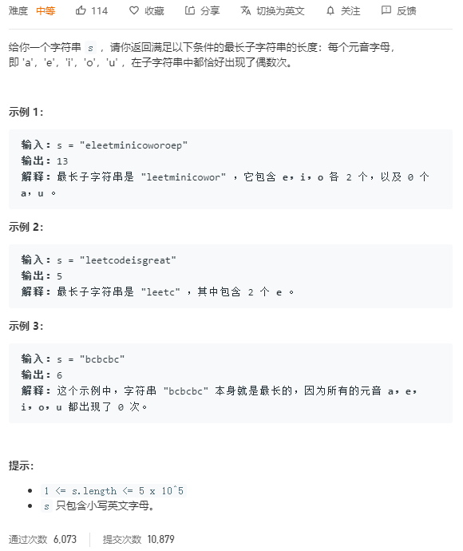


```c++
class Solution {
public:
    int findTheLongestSubstring(string s) {
        
    }
};
```

## [1431. 拥有最多糖果的孩子](https://leetcode-cn.com/problems/kids-with-the-greatest-number-of-candies/)

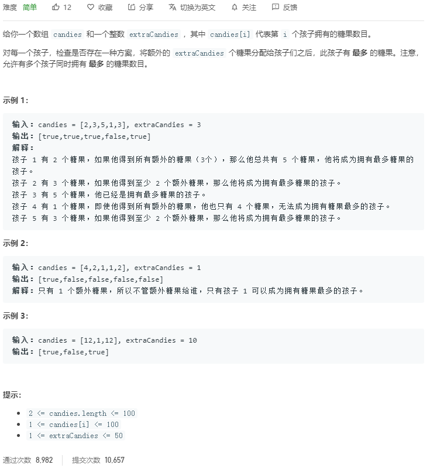

暴力解法，将所有的糖果分给一个小朋友，然后遍历剩余的小朋友看看当前的小朋友是否拥有最多糖果：

```c++
class Solution {
public:
    vector<bool> kidsWithCandies(vector<int>& candies, int extraCandies) {
		int len = candies.size();
        vector<bool> res(len);
        for (int i = 0; i < len; ++i) {
            int cur = candies[i] + extraCandies;
            
            int maxCan = 0;
            for (int j = 0; j < len; ++j) {
                maxCan = max(candies[j], maxCan);
            }
            if (cur >= maxCan)
                res[i] = true;
        }
        return res;
    }
};
```

对于每个小朋友，如果他拥有的糖果数加上额外糖果数能够大于等于所有小朋友拥有糖果数的最大值，他就可以拥有最多的糖果。假设某个小朋友拥有糖果$x$，额外糖果为$e$，最多的糖果数为$y$，那么当且仅当$x+e \geq y$即可保证这个小朋友拥有最多的糖果。由于$x+e\geq x$显然，所以只要$x+e\geq \max(x, y)$即可。而$\max(x,y)$就是所有小朋友拥有的最多糖果数。

```c++
class Solution {
public:
    vector<bool> kidsWithCandies(vector<int>& candies, int extraCandies) {
        int len = candies.size();
        // max_element返回的是迭代器，需要解引用
        int maxCandies = *max_element(candies.begin(), candies.end());
		vector<bool> res;
        for (int i = 0; i < len; ++i) {
            res.emplace_back(candies[i] + extraCandies >= maxCandies);
        }
        return res;
    }
};
```


# 面试题

## [面试题 01.07. 旋转矩阵](https://leetcode-cn.com/problems/rotate-matrix-lcci/)

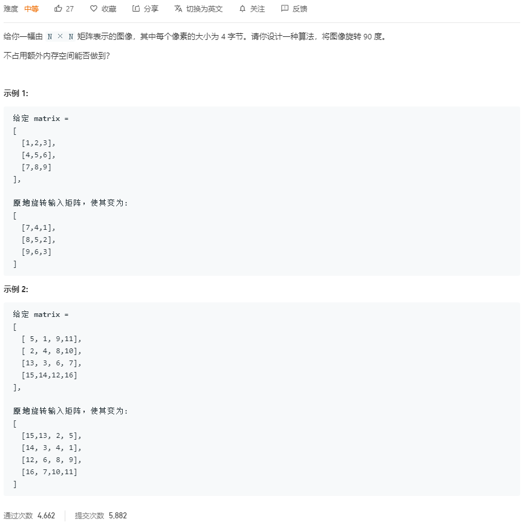

第一种，先水平翻转，然后转置：

```c++
class Solution {
public:
    void rotate(vector<vector<int>>& matrix) {
		int n = matrix.size();
        if (!n)	return;
        // 先转置
        for (int i = 0; i < n; ++i) {
            for (int j = i; j < n; ++j) {
                swap(matrix[i][j], matrix[j][i]);
            }
        }
        // 水平翻转。因为水平翻转只涉及前一半列，所以j的取值为0到n/2
        for (int i = 0; i < n; ++i) {
            for (int j = 0; j < n >> 1; ++j) {
                swap(matrix[i][j], matrix[i][n-j-1]);
            }
        }
    }
};
```

第二种，如下图，颜色相同的互换位置，只需要处理左上角的像素即可。1位置的坐标是`[i,j]`，那么2位置的就是`[j, n-i-1]`，3位置的是`[n-i-1, n-j-1]`，4位置是`[n-j-1, i]`。

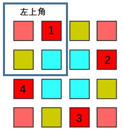

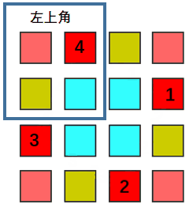

综上，对于一个位置`[i, j]`，要交换3次，1换2，2换3，3换4，就可以将上面的图换成下面。

```c++
class Solution {
public:
    void rotate(vector<vector<int>>& matrix) {
		int n = matrix.size();
        if (!n)	return;
        int row = (n-1) >> 1;
        int col = (n >> 1) - 1;
        for (int i = 0; i <= row; ++i) {
            for (int j = 0; j <= col; ++j) {
                swap(matrix[i][j], matrix[j][n-i-1]);
                swap(matrix[i][j], matrix[n-i-1][n-j-1]);
                swap(matrix[i][j], matrix[n-j-1][i]);
            }
        }
    }
};
```

## [面试题 08.11. 硬币](https://leetcode-cn.com/problems/coin-lcci/)

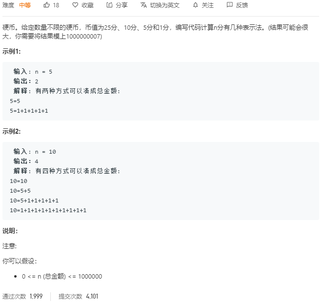


## [面试题13. 机器人的运动范围](https://leetcode-cn.com/problems/ji-qi-ren-de-yun-dong-fan-wei-lcof/)

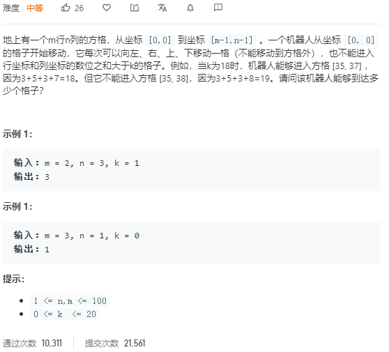

采用回溯算法，每次从当前位置触发，向四个方向试探（除了已访问的位置），更新最大值。为此，需要设置一个数组记录当前位置是否访问过。采用递归的方法：

- 终止条件：各个位之和大于k；当前点已访问；超出边界；
- 递归体：向右和向下继续寻找

```c++
class Solution {
public:
    int movingCount(int m, int n, int k) {
		bool visited[m][n];
        
        return backtrack(m, n, visited, 0, 0, k);
    }
    int backtrack(int m, int n, bool visited[][], int i, int j, int k) {
        if (i >= m || j >= n || (i%10 + i/10 + j%10 + j/10) > k || visited[i][j] == true)	return 0;
        visited[i][j] = true;
        return 1 + backtrack(m, n, visited, i+1, j, k) + backtrack(m, n, visited, i, j+1, k);
    }
}; 
```

## [面试题29. 顺时针打印矩阵](https://leetcode-cn.com/problems/shun-shi-zhen-da-yin-ju-zhen-lcof/)

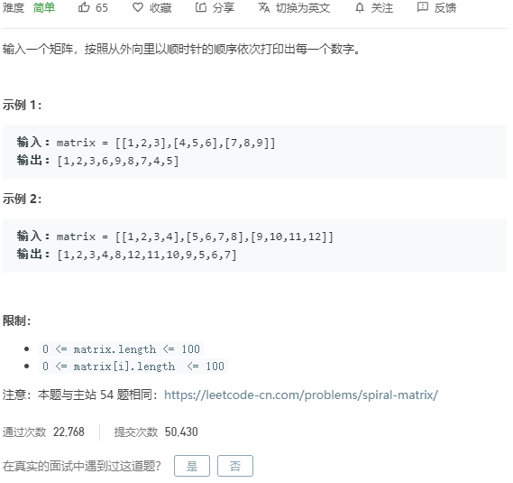

打印的顺序是从左到右、从上到下、从右到左、从下到上不断循环。可以设定4个边界，走到对应边界时，边界缩减，然后向另一个方向继续遍历。

算法流程：

- 若矩阵为空，或只有一行，直接返回矩阵
- 初始化4个边界：`left, right, top, bottom`，用于标定打印的边界
- 在循环过程中，按照上述的顺序，先到达右边界`right`，再到达下边界`bottom`，再到达左边界`left`，最后到达上边界`top`。直到遍历所有的数为止。

```c++
class Solution {
public:
    vector<int> spiralOrder(vector<vector<int>>& matrix) {
		if (matrix.size() == 0 || matrix[0].size() == 0)
            return {};
        vector<int> res;
        int left = 0, right = matrix[0].size()-1, top = 0, bottom = matrix.size()-1;

        while (true) {
            for (int i = left; i <= right; ++i) res.emplace_back(matrix[top][i]);
            // 走到最右，向下加一层，判断是否到达边界。下同
            if (++top > bottom) break;
            for (int i = top; i <= bottom; ++i) res.emplace_back(matrix[i][right]);
            if (left > --right) break;
            for (int i = right; i >= left; --i) res.emplace_back(matrix[bottom][i]);
            if (top > --bottom) break;
            for (int i = bottom; i >= top; --i) res.emplace_back(matrix[i][left]);
            if (++left > right) break;
        }
        return res;
    }
}
```

## [面试题46. 把数字翻译成字符串](https://leetcode-cn.com/problems/ba-shu-zi-fan-yi-cheng-zi-fu-chuan-lcof/)

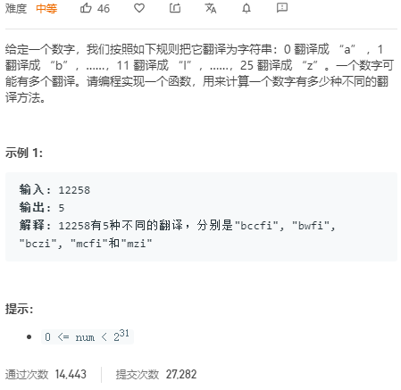

假设$f(i)$是字符串中以索引$i$为结尾的数字能够组成字符串的种类。如果第$i$位和$i-1$位数字组成的数不在10-25的范围内，那么$f(i) = f(i-1)$；如果组成的数字在10-25的范围，那么这个数可以被翻译成字母，那么$f(i) = f(i+1) + f(i-2)$.所以可以列出状态转移方程：
$$
f(i) = \begin{cases} f(i-1)
\\f(i-1) + f(i-2), & i-1 \geq 0, 10 \leq x\leq 25
\end{cases}
$$
边界条件是$f(-1) = 0,f(0)=1$。

```c++
class Solution {
public:
    int translateNum(int num) {
		string tmp = to_string(num);
        int len = tmp.size();
        vector<int> dp(len+1, 0);
        dp[0] = 1;	// 统一递推式
        dp[1] = 1;	// 只有1个字母的情况

        for (int i = 2; i < len+1; ++i) {
            dp[i] = dp[i-1];
            // 只有i-2的位置为1或者2，才能和i-1位组成转换字母的数
            if (tmp[i-2] != '1' && tmp[i-2] != '2') continue;
            // i-2是2，i-1大于5也不能转换，直接使用第一个方程
            if (tmp[i-2] == '2' && tmp[i-1] > '5') continue;
            dp[i] = dp[i-1] + dp[i-2];
        }
        return dp[len];
    }
};
```

当前位置的数之和前面两位有关，可以对空间进行压缩，设置三个变量保存`i-2,i-1,i`：

```c++
class Solution {
public:
    int translateNum(int num) {
		string tmp = to_string(num);
        int p = 0, q = 0, r = 1;
        for (int i = 0; i < tmp.size(); ++i) {
            p = q;
            q = r;
            r = 0;
            r = r + q;	// f[i] = f[i-1]
            if (i == 0) continue;	// 第一个直接跳过
            string pre = tmp.substr(i-1, 2);	// 从i-1的位置开始截取2个字符
            if (pre <= "25" && pre >= "10") r = r + p;
        }
        return r;
    }
};
```


## [面试题56 - I. 数组中数字出现的次数](https://leetcode-cn.com/problems/shu-zu-zhong-shu-zi-chu-xian-de-ci-shu-lcof/)

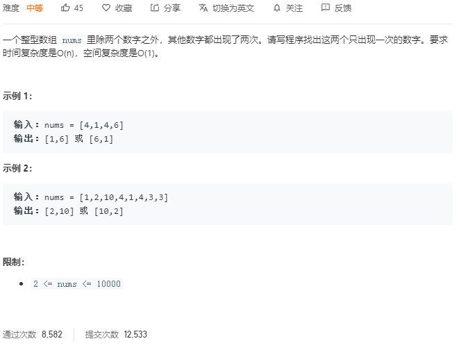


```c++
class Solution {
public:
    vector<int> singleNumbers(vector<int>& nums) {

    }
};
```


## [面试题62. 圆圈中最后剩下的数字](https://leetcode-cn.com/problems/yuan-quan-zhong-zui-hou-sheng-xia-de-shu-zi-lcof/)

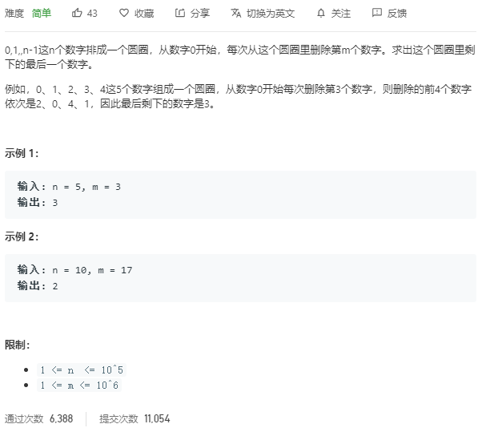

要删除`0 ~ n`个数字的第`m`个数，我们只需要知道删除`0 ~ n-1`个数中的第`m`个数即可。每次删除都可以看成在前一次删除完成后基础上的新的操作，所以可以用递归来解决：

- 递归内容：删除`0 ~ n-1`数字中第`m`个数，长度为`n`的序列会先删除第`m % n`个元素。长度为`n`的序列删除到最后一个元素时，是从`m % n`开始的第`x`个数字，所以`del(n-1, m) = (m % n + x) %n = (m+x) % n`
- 终止条件：序列只剩一个数字

```c++
class Solution {
public:
    int del(int n, int m) {
        if (n == 1)			// 终止条件
            return 0;
        // 递归体
        int x = del(n - 1, m);
        return (m + x) % n;
    }
    
    int lastRemaining(int n, int m) {
		return del(n, m);
    }
};
```

迭代的方法：

```c++
class Solution {
public:
    int lastRemaining(int n, int m) {
		int f = 0;
        for (int i = 2; i <= n; ++i) 
            f = (m + f) % i;
        return f;
    }
};
```

## [面试题64. 求1+2+…+n](https://leetcode-cn.com/problems/qiu-12n-lcof/)

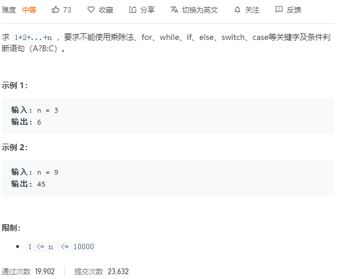

递归的方法，每次返回前一项和当前项的和。终止条件是`n==0`

```c++
class Solution {
public:
    int sumNums(int n) {
		return n == 0 ? n + sumNums(n-1);
    }
};
```

然而题目有一些限制。观察一下，在递归出口要判断n是否为0。对于`A && B`，如果`A`为`False`，那么不会继续判断B。可以将`n`放在前面判0，然后根据n的结果来决定是否执行后面的表达式。

```c++
class Solution {
public:
    int sumNums(int n) {
		n && (n += sumNums(n-1));
        return n;
    }
};
```

