[TOC]

# 链表

## [19. 删除链表的倒数第N个节点](https://leetcode-cn.com/problems/remove-nth-node-from-end-of-list/)

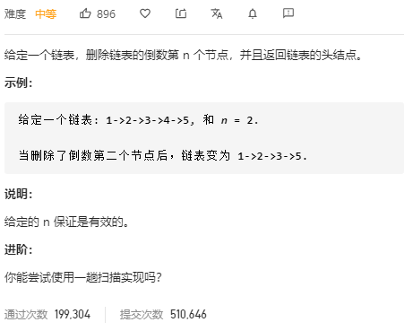

关键在于如何确定倒数第n个结点，可以采用快慢指针，快指针先走n步，然后慢指针走，当快指针到表尾时，慢指针指向的就是倒数第n个结点，直接删除即可。

```c++
/**
 * Definition for singly-linked list.
 * struct ListNode {
 *     int val;
 *     ListNode *next;
 *     ListNode(int x) : val(x), next(NULL) {}
 * };
 */
class Solution {
public:
    ListNode* removeNthFromEnd(ListNode* head, int n) {
        if (head->next == nullptr) 
            return nullptr;
        
        ListNode *fast = head;
        ListNode *slow = head;
        
        while (n-- > 0)
            fast = fast->next;
        
        if (fast == nullptr) 
            return head->next;
        // 这里是fast->next，因为这是无头结点的单链表，可以在开头加入一个伪头结点
        while (fast->next != nullptr) {
            fast = fast->next;
            slow = slow->next;
        }
        
        ListNode *tmp = slow->next;
        slow->next = tmp->next;
        
        return head;
    }
};
```

## [21. 合并两个有序链表](https://leetcode-cn.com/problems/merge-two-sorted-lists/)

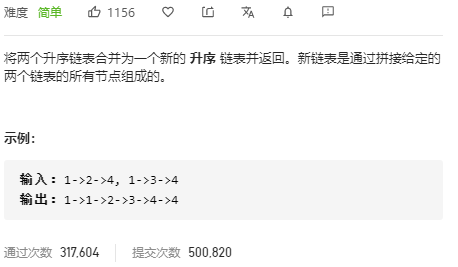

新建一个头结点，然后比较两个链表中的元素，小的加入新链表，直到其中一个链表为空，最后将不空的链表接入尾部。

```c++
/**
 * Definition for singly-linked list.
 * struct ListNode {
 *     int val;
 *     ListNode *next;
 *     ListNode(int x) : val(x), next(NULL) {}
 * };
 */
class Solution {
public:
    ListNode* mergeTwoLists(ListNode* l1, ListNode* l2) {
        ListNode* head = new ListNode(-1);
        ListNode* q1 = l1;
        ListNode* q2 = l2;

        ListNode* p = head;
        while (q1 && q2) {
            if (q1->val <= q2->val) {
                p->next = q1;
                q1 = q1->next;
            } else {
                p->next = q2;
                q2 = q2->next;
            }
            p = p->next;
        }
        p->next = q1 ? q1 : q2;

        return head->next;
    }
};
```

也可以采用递归的方法：
$$
\begin{cases}
list1[0] + merge(list1[1:], list2) & list1[0] < list2[0] \\
list2[0] + merge(list1, list2[1:]) & Otherwise
\end{cases}
$$

```c++
class Solution {
public:
    ListNode* mergeTwoLists(ListNode* l1, ListNode* l2) {
        if (l1 == nullptr)
            return l2;
        else if (l2 == nullptr)
            return l1;
        else if (l1->val < l2->val) {
            l1->next = mergeTwoLists(l1->next, l2);
            return l1;
        } else {
            l2->next = mergeTwoLists(l1, l2->next);
            return l2;
        }
    }
};
```

## [23. 合并K个排序链表](https://leetcode-cn.com/problems/merge-k-sorted-lists/)

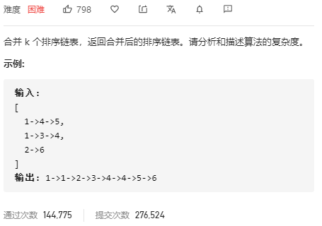

维护一个结果链表res，然后依次将k个链表和res进行两个链表的合并。

```c++
class Solution {
public:
    ListNode* mergeKLists(vector<ListNode*>& lists) {
        ListNode* res = nullptr;
        
        int len = lists.size();
        for (int i = 0; i < len; ++i) {
            res = mergeTwo(res, lists[i]);
        }
        return res;
    }
    ListNode* mergeTwo(ListNode* l1, ListNode* l2) {

        ListNode *res = new ListNode(-1);
        ListNode* q1 = l1;
        ListNode* q2 = l2;
        
        ListNode* p = res;
        while (q1 && q2) {
            if (q1->val <= q2->val) {
                p->next = q1;
                q1 = q1->next;
            } else {
                p->next = q2;
                q2 = q2->next;
            }
            p = p->next;
        }
        p->next = q1 ? q1 : q2;
        
        return res->next;
    }
};
```

时间复杂度：最长链表的长度为$n$，第一合并后`res`的长度是$n$；第二次合并后，`res`长度为$2\times n$，第$i$次后为$i\times n$，那么第$i$次的代价是$O(n+(i-1) \times n) = O(i\times n)$，总的复杂度就是$O(\sum_{i=1}^k(i\times n))=O(k^2n)$

还可以将链表元素取出放在一起排序，然后再插入到新的链表中，时间复杂度是$O(kn\log kn)$依赖于排序算法

## [24. 两两交换链表中的节点](https://leetcode-cn.com/problems/swap-nodes-in-pairs/)

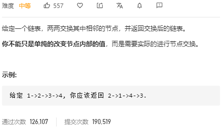

首先看交换4个结点的过程：`1->2->3->4`，从头到尾`1->next=2->next;2->next=1; 1->next=4; 3->next=4->next;4->next=3;`，可以看出如果反过来从尾到头的话，后面的可以看成已经反转好的链表，重复的步骤就是`1->next=2->next;2->next=1`。可以采用递归的方法：

- 终止条件：当走到链表尾部，或者链表尾部只剩一个结点的时候返回
- 递归内容：由`tmp`和`head`表示要交换的两个结点，交换了结点后返回`tmp`，因为它是交换完成后部分链表的头部

```c++
class Solution {
public:
    ListNode* swapPairs(ListNode* head) {
    	if (head == nullptr || head->next == nullptr)
            return head;
        ListNode* tmp = head->next;
        head->next = swapPairs(tmp->next);
        tmp->next = head;
        return tmp;
    }
};
```

也可以用迭代的方法，这里需要设置一个伪头部用来记录交换时的前驱结点。

- 首先定义`first,second`表示待交换结点。然后定义一个`prev`表示待交换结点的前驱。
- 交换结点：`first->next = second->next; second->next = first;`
- 更新`prev`指向交换后的头部结点：`prev->next = second;`

```c++
class Solution {
public:
    ListNode* swapPairs(ListNode* head) {
    	ListNode* dumy = new ListNode(-1);
        dumy->next = head;
        ListNode* prev = dumy;
        
        while (head && head->next) {
            ListNode* first = head;
            ListNode* second = head->next;
            // 交换结点
            prev->next = second;
            first->next = second->next;
            second->next = first;
            // 让prev指向交换后的第二个结点（也就是之前的第一个结点），第二个结点变成dumy，继续遍历
            prev = first;
            head = first->next;
        }
        return dumy->next;
    }
};
```

## [25. K 个一组翻转链表](https://leetcode-cn.com/problems/reverse-nodes-in-k-group/)

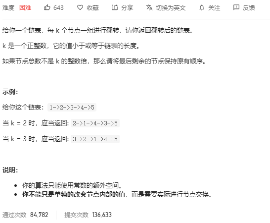

翻转k长度的链表可以看成一个单独的问题，那么原题就可以理解成如果k个一组进行翻转

```c++
class Solution {
public:
    
    
    ListNode* reverseKGroup(ListNode* head, int k) {
        
    }
};
```

## [61. 旋转链表](https://leetcode-cn.com/problems/rotate-list/)

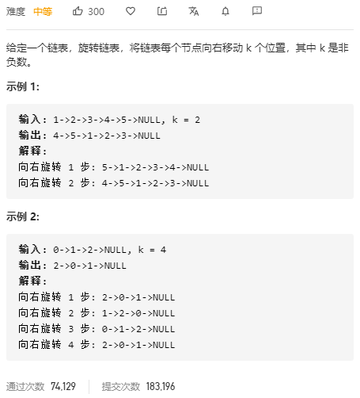

由于k可能大于链表长度n，所以只要取模就可以了`k = k % n`。然后将尾指针指向头部，头部指针向后走`n-k`步指向新链表的头，并断开前面结点的连接即可。

- 遍历到链表尾部，得到链表长度`len`，然后将尾部指向头部，形成环形链表
- 尾部指针和头部指针同时向后走`len - k`步，头部指针指向新头部，尾指针指向新尾部
- 断开尾指针，返回头部。

```c++
class Solution {
public:
    ListNode* rotateRight(ListNode* head, int k) {
        // 边界条件，顺序不能错，如果head为空，且先判断head->next的话会触发错误
        if (head == nullptr || head->next == nullptr) return head;
        ListNode* cur = head;
        ListNode* tail = head;
        // 当前指针已经指向了head，说明长度至少为1
        int len = 1;
        // 计算长度，并找到尾结点
        while (tail->next) {
            tail = tail->next;
            len++;
        }
        // 形成环
        tail->next = head;
        k = k % len;            // 取模得到头结点距离原尾结点的长度
        
        int step = len - k;     // 得到头结点应该走的步数
        while (step > 0) {
            cur = cur->next;    // 两个结点一起走
            tail = tail->next;
            step--;
        }
        tail->next = nullptr;   // 找到头部后断链，返回头部
        return cur;
    }
};
```

## [82. 删除排序链表中的重复元素 II](https://leetcode-cn.com/problems/remove-duplicates-from-sorted-list-ii/)

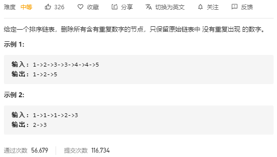

采用快慢指针的方法，如果快指针等于慢指针，慢指针停住，让快指针走，直到两者不相等。然后快指针的前驱直接指向慢指针。

- 声明3个指针，`pre`快指针前面的，用于删除快指针指向的重复结点，初始化为`dumy`；`fast`快指针，初始化指向头部；`slow`慢指针，初始化指向第二个结点。
- 3个指针同步移动，如果`fast->val == slow->val`，那么循环判断`fast`的值是否等于`value`，移动`fast`直到不相等。然后逐个删除并释放结点。让`slow=fast`，如果`fast`后面还有结点，那么要将其向后移。否则三个结点同步移动。
- 终止循环的条件是：`fast == nullptr`

```c++
class Solution {
public:
    ListNode* deleteDuplicates(ListNode* head) {
        if (head == nullptr || head->next == nullptr) return head;
        ListNode* dumy = new ListNode(-1);
        dumy->next = head;
        ListNode* pre = dumy;
        ListNode* slow = head;
        ListNode* fast = head->next;
        
        while (fast) {
            if (fast->val == slow->val) {		// 相等就要移动fast到不相等的位置
                int value = slow->val;
                // fast不空且相等的时候移动
                while (fast && fast->val == value) {
                    fast = fast->next;
                }
                // 此时fast位于第一个和前面序列不相等的位置，开始删除slow到fast的结点
                while (pre->next != fast) {
                    ListNode* tmp = pre->next;
                    pre->next = tmp->next;
                    delete tmp;
                }
                // pre->next = fast;
                // 删除完毕，slow变成了fast
                slow = fast;
                // 如果fast为空，那么说明到了表尾要结束循环了
                if (fast)
                    fast = fast->next;
            }
            else {
                pre = pre->next;
                slow = slow->next;
                fast = fast->next;
            }
        }
        return dumy->next;
    }
};
```

## [83. 删除排序链表中的重复元素](https://leetcode-cn.com/problems/remove-duplicates-from-sorted-list/)

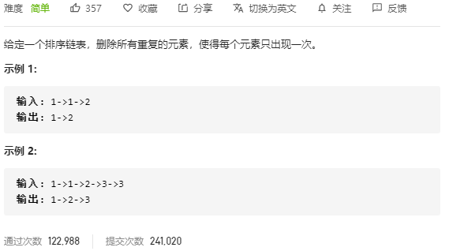

和上一题类似，不过这里要保留重复的元素。双指针即可，一个慢指针`slow`，一个快指针`fast`，开始遍历，如果两个结点值相同，`fast`后移，当不相等的时候，删除中间结点，继续遍历。

- `slow`指向`head`，`fast`指向`head->next`，`fast`不空循环。如果`slow->val == fast->val`，那么开启子循环直到两者不相等，删除中间结点，继续遍历
- 如果两者不相等，直接下一步
- 最后返回`head`.

```c++
class Solution {
public:
    ListNode* deleteDuplicates(ListNode* head) {
        if (head == nullptr || head->next == nullptr) return head;
        ListNode* slow = head;
        ListNode* fast = head->next;
        
        while (fast) {
            if (slow->val == fast->val) {
                int value = slow->val;
                while (fast && fast->val == value) {
                    fast = fast->next;
                }
                while (slow->next != fast) {
                    ListNode* tmp = slow->next;
                    slow->next = tmp->next;
                    delete tmp;
                }
            }
            slow = slow->next;
            if (fast)
                fast = fast->next;
        }
        return head;
    }
};
```

## [141. 环形链表](https://leetcode-cn.com/problems/linked-list-cycle/)

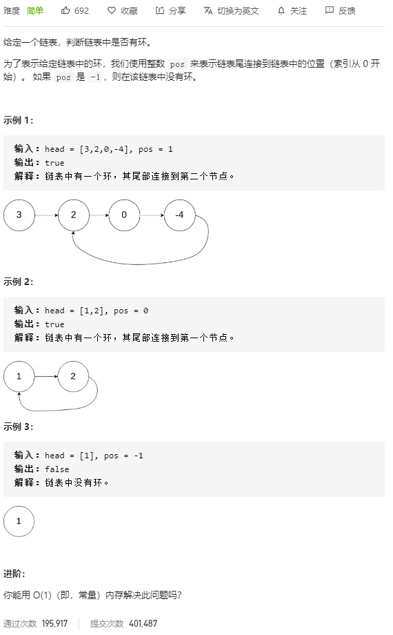

快慢指针，快指针走两步，慢指针走一步，如果有环，两个指针肯定会相遇。就像两个速度不一样的运动员绕圈跑，快的可以套圈一样。

```c++
class Solution {
public:
    bool hasCycle(ListNode *head) {
        if (head == nullptr || head->next == nullptr)
            return false;
        
        ListNode *fast = head->next;
        ListNode *slow = head;
        
        while (fast && fast->next) {
            fast = fast->next->next;
            slow = slow->next;
            
            if (fast == slow)
                return true;
        }
        return false;
    }
};
```

## [143. 重排链表](https://leetcode-cn.com/problems/reorder-list/)

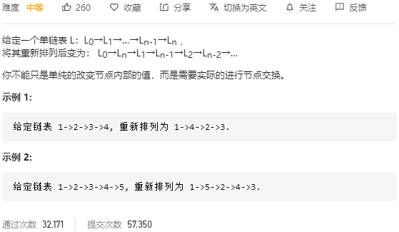

链表从中间折半，前半段正序，后半段逆序。先找到中间结点，然后从中间断开，后半段逆置，新建一个头部结点，然后用尾插法依次插入正序链表和逆序链表。

- 设置两个指针，`fast, slow`，`slow`一次走一步，`fast`一次走两步，当`fast`到末尾时，`slow`刚好到达链表中间，指向的是后半段的首结点。

```C++
class Solution {
public:
    void reorderList(ListNode* head) {
        if (!head || !head->next) return;
        // 定位链表中部结点
        ListNode* slow = head;
        ListNode* fast = head->next;
        while (fast && fast->next) {
            slow = slow->next;
            fast = fast->next->next;
        }
        // 翻转后面半部分链表
        ListNode* newHead = slow->next;
        slow->next = nullptr;
        newHead = reverseList(newHead);

        ListNode* p = head;
        ListNode* q = newHead;
		// 将后半部分逐个结点插入到原链表中
        while (q) {
            // 两个指针暂存指向两个链表头部的下一个结点，防止断链
            ListNode* tmp1 = p->next;
            ListNode* tmp2 = q->next;
            p->next = q;
            q->next = tmp1;
            p = tmp1;
            q = tmp2;
        }
    }
    ListNode* reverseList(ListNode* head) {
        ListNode* dumy = new ListNode(-1);
        ListNode* cur = head;
        
        while (cur) {
            ListNode* tmp = cur->next;
            cur->next = dumy->next;
            dumy->next = cur;
            cur = tmp;
        }
        return dumy->next;
    }
};
```

## [147. 对链表进行插入排序](https://leetcode-cn.com/problems/insertion-sort-list/)


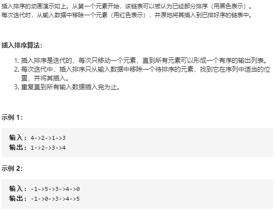

建立一个新结点，然后将链表里面的结点按序插入到新的链表中。新建结点`dumy`指向已排序部分，用`cur`指向`head`代表未排序部分。将未排序部分依次插入，为了找到合适的插入位置，不能从后向前遍历，而是要从`dumy`开始，向后遍历，找到合适的插入位置，为此还要维护一个`pre`结点指向待插入结点前一个结点。

- 初始化新结点`dumy`，`cur`指向`head`，`pre`指向`dumy`，`cur`不空循环
- 第一个结点直接插入到`dumy`后面，后面的结点和表尾结点进行比较，如果比表尾结点大，那么直接插入表尾，否则从`dumy`开始向后遍历查找可以插入的位置，同时维护`pre`，方便插入。

```c++
class Solution {
public:
    ListNode* insertionSortList(ListNode* head) {
        if (head == nullptr || head->next == nullptr) return head;
		// 伪头部，用来简化操作
        ListNode* dumy = new ListNode(-1);
        dumy->next = head;
        // cur指向未排序序列
        ListNode* cur = head->next;
        // pre用来插入结点
        ListNode* pre = dumy;
        // tail指向已排序序列的最大值
        ListNode* tail = dumy->next;
        tail->next = nullptr;

        while (cur) {
            // 当前值大于已排序序列的最大值，直接插入到链表尾部
            if (cur->val >= tail->val) {
                ListNode* tmp = cur->next;
                tail->next = cur;
                tail = cur;
                cur->next = nullptr;
                cur = tmp;
            } else {
                // 否则寻找插入位置
                while (pre->next->val < cur->val) {
                    pre = pre->next;
                }
                // 插入结点
                ListNode* tmp = cur->next;
                cur->next = pre->next;
                pre->next = cur;
                cur = tmp;
                pre = dumy;		// pre重新指向dumy，方便下一次插入
            }
        }
        return dumy->next;
    }
};
```

## [148. 排序链表](https://leetcode-cn.com/problems/sort-list/)

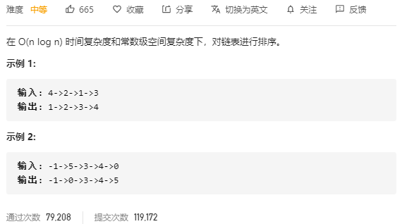

上一题中的插入排序时间复杂度为$O(n^2)$，空间复杂度是$O(1)$。题目要求$O(n\log n)$，那么可以采用归并排序的方法。首先是递归的方法，递归的空间复杂度不满足要求，但是可以比较清晰的展示解决问题的步骤：

- 首先找到链表的中点，然后从中点断开成两个链表，直到链表只剩下一个结点。
- 合并链表，这一步按照合并两个有序链表的步骤进行。

```c++
class Solution {
public:
    ListNode* sortList(ListNode* head) {
        if(!head || !head->next) return head;
        ListNode* fast = head->next, *slow = head;
        // 找到中点断链
        while (fast && fast->next) {
            fast = fast->next->next;
            slow = slow->next;
        }
        ListNode* tmp = slow->next;
        slow->next = nullptr;
        // 递归分割左右两个链表
        ListNode* left = sortList(head);
        ListNode* right = sortList(tmp);

        ListNode* dumy = new ListNode(-1);
        ListNode* res = dumy;
        // 合并两个有序链表
        while (left && right) {
            if (left->val < right->val) {
                dumy->next = left;
                left = left->next;
            } else {
                dumy->next = right;
                right = right->next;
            }
            dumy = dumy->next;
        }
        dumy->next = left ? left : right;
        return res->next;
    }
};
```

递归算法的空间复杂度是$O(n)$的，因为我们是采用递归的方式将链表分割成由单个结点组成的链表然后再合并的。

## [203. 移除链表元素](https://leetcode-cn.com/problems/remove-linked-list-elements/)

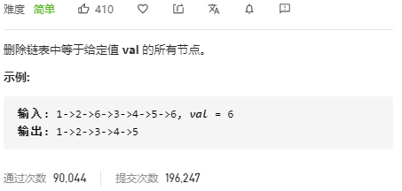

遍历链表找到指定的结点，这时要保存一个前驱结点，便于删除。中间的结点很好删除，但是头部结点如果也是待删除结点的话会比较复杂，所以可以给链表加一个伪头部。

```c++
class Solution {
public:
    ListNode* removeElements(ListNode* head, int val) {
		ListNode* dumy = new ListNode(-1);
        dumy->next = head;
        ListNode* pre = dumy;
        ListNode* cur = head;
        
        while (cur) {
            if (cur->val == val) {
            	pre->next = cur->next;
            } else 
                pre = cur; 
            cur = cur->next;
            
        }
        ListNode* res = dumy->next;
        delete dumy;
        return res;
    }
};
```

## [206. 反转链表](https://leetcode-cn.com/problems/reverse-linked-list/)

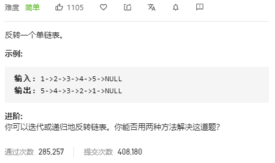

### 迭代:

两种方法，一种是建立一个`dumy`结点，然后按照头插法的顺序将单链表结点插入到新的链表，然后返回`dumy->next`。另一种方法是遍历时翻转。

```c++
class Solution {
public:
    ListNode* reverseList(ListNode* head) {
		ListNode* dumy = new ListNode(-1);        
        ListNode* p = head;
        
        while (p) {
            // 暂存下一个结点，避免原链表断链
            ListNode* tmp = p->next;
            p->next = dumy->next;		// 头插法
            dumy->next = p;
            p = tmp;
        }
        return dumy->next;
    }
};
```

遍历时翻转：

三个结点一个单位进行翻转，`pre`指向待翻转的前一个结点，`cur`和`tmp`指向两个待翻转结点，翻转的过程是：`tmp=cur->next; cur->next=pre; pre=cur; cur=tmp;`


```c++
class Solution {
public:
    ListNode* reverseList(ListNode* head) {
		ListNode* pre = nullptr;
        ListNode* cur = head;
        
        while (cur) {
            ListNode* tmp = cur->next;	// 类似头插法，暂存下一个结点防止断链
            cur->next = pre;
            pre = cur;
            cur = tmp;
        }
        return pre;
    }
};
```

### 递归:

从尾到头递归翻转，假设后面都是已翻转的，前面的是未翻转的。从后面返回的就是已翻转链表的表头。

- 终止条件：遍历到链表尾部，`head==nullptr || head->next==nullptr`
- 递归内容：和上面迭代方法类似，只不过`tmp`初始化时是后面已翻转的链表的表头，然后让当前节点`head`的下一个结点的下一个结点指向head，就完成了基本的翻转。

```c++
class Solution {
public:
    ListNode* reverseList(ListNode* head) {
		if (head == nullptr || head->next == nullptr) return head;
        ListNode* tmp = reverseList(head->next);
        head->next->next = head;
        head->next = nullptr;
        return tmp;
    }
};
```

## [237. 删除链表中的节点](https://leetcode-cn.com/problems/delete-node-in-a-linked-list/)

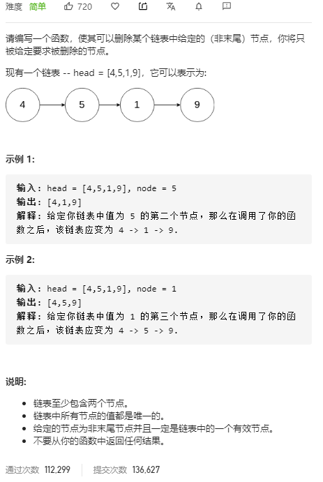

找到结点删除即可，但是删除的时候要使用前一个结点才能删除当前结点，可以和后一个结点交换，这样就能直接删除了。

```c++
class Solution {
public:
    void deleteNode(ListNode* node) {
        node->val = node->next->val;
        node->next = node->next->next;
    }
};
```

# 数组

## [3. 无重复字符的最长子串](https://leetcode-cn.com/problems/longest-substring-without-repeating-characters/)

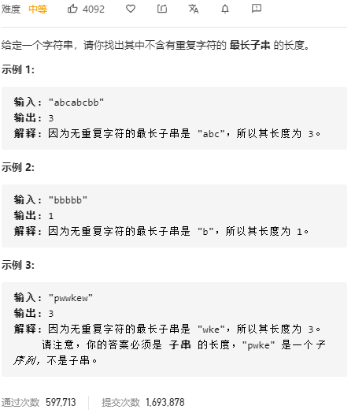

设置一个集合set，里面保存不重复的子串。设置两个指针记录不重复子串的长度。遍历字符串，当前遍历的字符在集合中时，说明和之前的字符重复了，将当前字符从集合中删除，继续向后遍历。否则将当前字符加入集合中，更新不重复子串长度。

- 设置两个指针`i,j`，两个指针都未到串尾时循环
- 如果`i`指向的当前遍历字符未在`substr`中，那么将当前字符加入集合`substr`，更新子串长度。如果在集合中，那么将当前字符从集合中删除，指针后移。

```c++
class Solution {
public:
    int lengthOfLongestSubstring(string s) {
        int len = s.length();
		int sublen = 0;
        set<string> substr;
        
        int i = 0, j = 0;
        while (i < len && j < len) {
            if (substr.find(s[i]) == substr.end()) {
                substr.insert(s[i++]);
                sublen = sublen > i - j ? sublen : i - j;
            } else {
                substr.earse(s[j++]);
            }
        }
        return sublen;
    }
};
```

## [11. 盛最多水的容器](https://leetcode-cn.com/problems/container-with-most-water/)

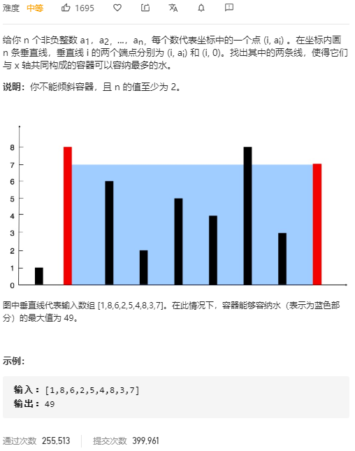

最多的盛水量仅由两端的高度决定，而且仅由较矮的那个决定。采用双指针法，头尾各一个。保存一个当前水量值和最大值，如果当前左右指针指向的高度可以存储更多的水就更新。更新完成后，如果左边较矮，左指针右移；右边较矮，右指针左移。

- 初始化两个指针：`left,right`，分别指向数组两端。初始化`cur,max`，一个是当前存水量，一个是最大存水量。
- 当`left < right`时循环，如果当前的水量`(right-left) * (higher - lower)`较大，就更新最大值。
- 因为存水量是由较矮的决定，所以如果左边较矮，就要想办法找较高的，左指针右移，右指针也类似。

```c++
class Solution {
public:
    int maxArea(vector<int>& height) {
        int cur = 0;
        int max = 0;
        int left = 0, right = height.size() - 1;
        
        while (left < right) {
            cur = height[left] < height[right] ? (right - left) * height[left] : (right - left) * height[right];
            max = cur > max ? cur : max;
            if (height[left] < height[right]) 
                left++;
            else
                right--;
        }
        return max;
    }
};
```

## [26. 删除排序数组中的重复项](https://leetcode-cn.com/problems/remove-duplicates-from-sorted-array/)


因为是排序链表，所以重复的元素肯定在一起。采用快慢指针法，慢指针指向重复部分的开头，快指针指向重复部分结尾的下一个数，然后将快指针的数填充到慢指针的下一个位置。因为返回的是最后不重复数组的长度，所以慢指针可以用长度直接代替。

- 数组为空，返回0。初始化结果`res`，开始遍历数组
- 如果`nums[res] != nums[i]`，说明当前不重复，`res++`。如果重复了那就把`nums[i]`放到`nums[res]`的位置，然后`i`自增。

```c++
class Solution {
public:
    int removeDuplicates(vector<int>& nums) {
        if (nums.empty()) return 0;
    	int res = 0;
        
        for(int i = 1; i < nums.size(); ++i) {
            if (nums[res] != nums[i])
                res++;
            nums[res] = nums[i];
        }
        return res+1;
    }
};
```

## [27. 移除元素](https://leetcode-cn.com/problems/remove-element/)

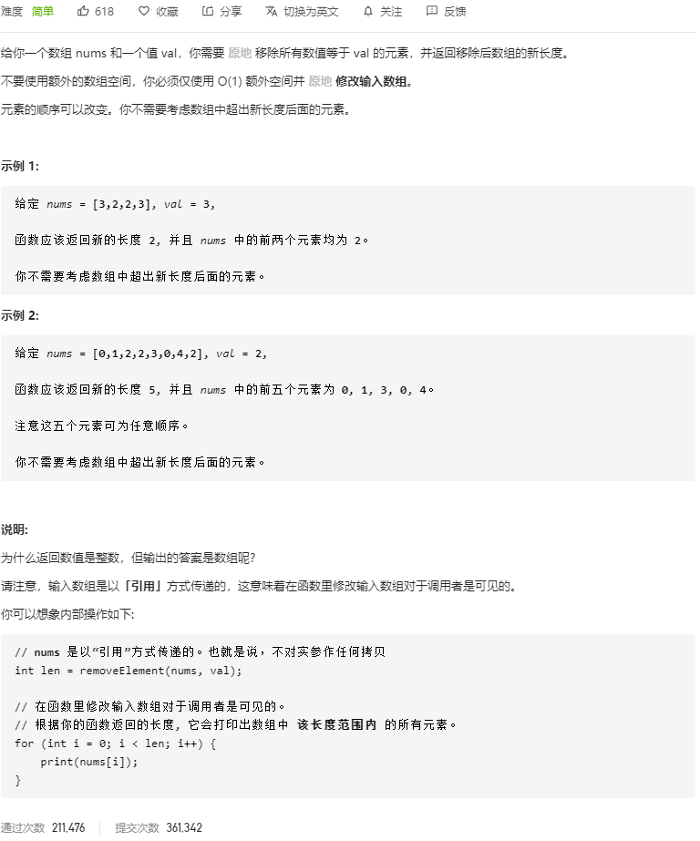

最终的结果是将所有不是要删除的元素放到数组的前面，然后返回索引长度。所以我们在遍历的时候就可以维护一个数组长度`len`，如果当前元素不是待删除的，就将其放到前面结果数组的尾部，尾部索引也就是数组长度`len`。

```c++
class Solution {
public:
    int removeElement(vector<int>& nums, int val) {
		int len = 0;
        
        for (int i = 0; i < nums.size(); ++i) {
            if (nums[i] != val) {
                // 将不删除的元素放到结果的尾部，长度+1
                nums[len] = nums[i];
                ++len;
            }
        }
        return len;
    }
};
```

## [75. 颜色分类](https://leetcode-cn.com/problems/sort-colors/)

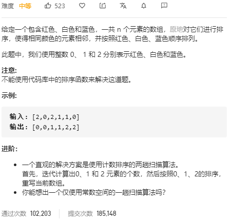

可以使用快速排序的分区算法，对数组进行划分。如果是0，放在左边，是2放在右边。先采用以前用的快排的分区算法，初始化两个指针，头尾各一：

```c++
class Solution {
public:
    void sortColors(vector<int>& nums) {
        int left = 0;
        int right = nums.size() - 1;

        while (left < right) {
            while (left < right && nums[right] == 2) --right;
            swap(nums[left], nums[right]);
            --right;
            while (left < right && nums[left] == 0) ++left;
            swap(nums[left], nums[right]);
            ++left;
        }
    }
};
```

这个方法边界条件不严格，当`right == 0`的时候会越界。如果再加上限制条件会变得较为复杂。

可以采用三指针的方法，一左一右，加上当前正在遍历的元素。如果当前遍历的元素是0，那么左指针和当前指针一起移动；如果是1，交换左指针和当前指针的元素；如果是2，那么交换当前指针和右指针的元素。

- 初始化左右指针，`left,right`，当前指针`cur`
- 当`cur != right`的时候循环，如果`nums[cur] == 0`，交换`nums[cur], nums[left]`，`left++`；如果`nums[cur] == 1`，`cur++`；如果`nums[cur] == 2`，交换`nums[cur], numc[right]`，`right--`。

```c++
class Solution {
public:
    void sortColors(vector<int>& nums) {
        int left = 0;
        int right = nums.size() - 1;
		int cur = 0;
        // 小于等于是防止cur相遇时，两个指针指向的都是0，还需要一次判断处理
        while (cur <= right) {
            if (nums[cur] == 0)
                swap(nums[cur++], nums[left++]);
            else if (nums[cur] == 1)
                cur++;
           	else
                // 是2时，cur不能向前走，因为cur指向的的元素向前走后可能是0，但是又和right相遇了
                swap(nums[cur], nums[right--]);
        }
    }
};
```

## [76. 最小覆盖子串](https://leetcode-cn.com/problems/minimum-window-substring/)

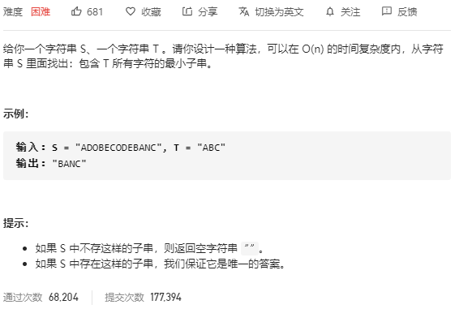


```c++
class Solution {
public:
    string minWindow(string s, string t) {
        
    }
};
```

## [80. 删除排序数组中的重复项 II](https://leetcode-cn.com/problems/remove-duplicates-from-sorted-array-ii/)

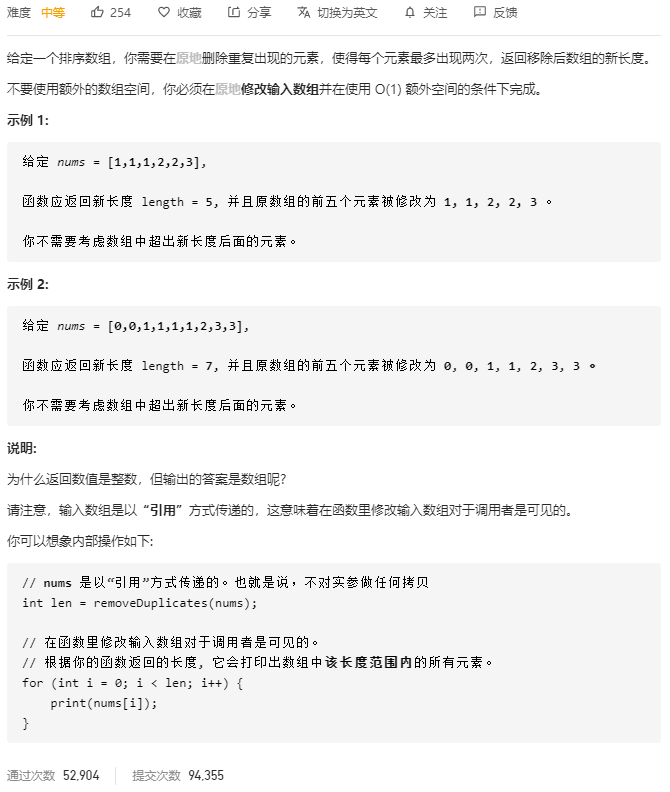

双指针法，和之前不同，这里要保留两个重复数，所以需要三个指针，因为是有序的，覆盖位置在重复序列的第二个位置。设置快指针`fast`，初始指向`nums[2]`，慢指针`low`指向`nums[1]`，用`low-1`标识`nums[0]`。

- 当快指针未到末尾时循环。如果`nums[fast]`不等于`nums[slow-1]`，说明在当前在重复数字的交界处，`slow`后移一位，然后将`fast`覆盖到`slow`的位置上，继续寻找超过三的重复数字序列
- 如果`nums[fast] == nums[slow-1]`说明三个指针位于超过3的重复序列，`fast`后移，直到不相等，然后将`fast`指向的位置覆盖到`slow`。

```c++
class Solution {
public:
    int removeDuplicates(vector<int>& nums) {
        int len = nums.size();
        if (len <= 2) 
            return len;

        int low = 1;
        for (int fast = 2; fast < len; ++fast) {
            if (nums[low-1] != nums[fast]) 
                nums[++low] = nums[fast];
        }
        return low+1;
    }
};
```

## [88. 合并两个有序数组](https://leetcode-cn.com/problems/merge-sorted-array/)

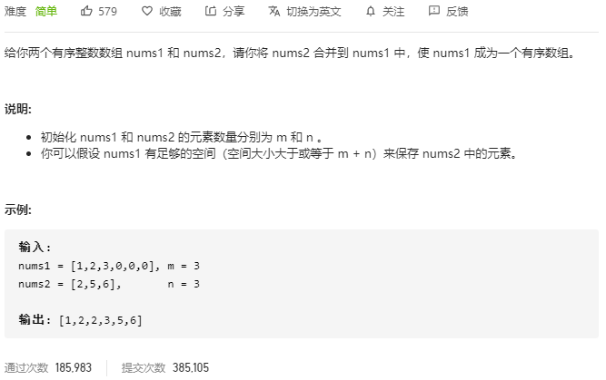

### 完成一半的插入排序

第一种方法，可以将`nums1`看成完成了一半的插入排序，开始时两个指针分别指向第一个数组的结尾和第二个数组的开始，然后将第二个数组不断插入到第一个序列中。

- 循环变量`i = m, j = 0`，然后定位插入范围`left = i - m, right = i - 1`。在这个范围内这般查找插入位置。因为`nums2`是有序的，当前面的数插入后，`[0,i-m]`这个范围肯定是最后的数字，不会改变，因为`nums2`中没有更小的数插入到这个范围了。
- 找到插入位置后将`nums2`的数字插入，直到`j >= n`。

```c++
class Solution {
public:
    void merge(vector<int>& nums1, int m, vector<int>& nums2, int n) {

        for (int i = m, j = 0; i < m + n, j < n; ++i, ++j) {
            int left = i - m;
            int right = i - 1;

            while (left <= right) {
                int mid = (left + right) >> 1;

                if (nums1[mid] > nums2[j])
                    right = mid - 1;
                else 
                    left = mid + 1;
            }
            for (int k = i - 1; k >= right+1; --k)
                nums1[k+1] = nums1[k];
            nums1[right+1] = nums2[j];
        }
    }
};
```

### 合并后排序

```c++
class Solution {
public:
    void merge(vector<int>& nums1, int m, vector<int>& nums2, int n) {
        nums1.insert(nums1.begin() + m, nums2.begin(), nums2.begin() + n);
        sort(nums1.begin(), nums1.begin() + m + n);
        nums1.resize(m + n);
    }
};
```

### 双指针从后向前

设置两个指针指向`nums1,nums2`的尾部，然后活动指针指在`m+n-1`的位置，比较`nums1,nums2`尾部数字的大小，将较大的插入到活动指针的位置。最后将剩余不空数组的数字插入到尾部。

- 数组指针`p1, p2`指向两个数组的尾部，活动指针`p`指向最终数组的尾部。当`p1 >= 0 && p2 >= 0`的时候循环。
- 如果`nums1[p1] < nums2[p2]`就在`nums1[p]`的位置放入`nums2[p2]`，然后对应指针左移。
- 如果最后`p1 < 0`了，说明`nums2`中还有剩余数字，直接接到尾部。

```c++
class Solution {
public:
    void merge(vector<int>& nums1, int m, vector<int>& nums2, int n) {
        int p1 = m-1, p2 = n-1, p = m+n-1;
        
        while (p1 >= 0 && p2 >= 0) {
            nums1[p--] = nums1[p1] < nums2[p2] ? nums2[p2--] : nums1[p1--];
        }
        if (p1 < 0) {
            while (p2 >= 0)
                nums1[p--] = nums2[p2--];
        }
    }
};
```

## [125. 验证回文串](https://leetcode-cn.com/problems/valid-palindrome/)

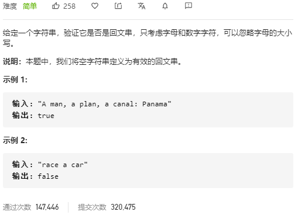

用例中除了字母和数字以外都是非法字符，不计入结果，所以要将其过滤掉。设置左右两个指针，分别从头尾开始扫描。在过滤掉非法字符后，比较两个指针字符是否相等，如果相等，那么移动指针，否则返回`false`。

```c++
class Solution {
public:
    bool isPalindrome(string s) {
        int len = s.length();
        int left = 0;
        int right = len - 1;

        while (left < right) {
            while (left < right && !(isdigit(s[left]) || isalpha(s[left])))
                left++;
            while (left < right && !(isdigit(s[right]) || isalpha(s[right])))
                right--;
            if (tolower(s[left]) != tolower(s[right]))
                return false;
            left++;
            right--;
        }
        return true;
    }
};
```

## [167. 两数之和 II - 输入有序数组](https://leetcode-cn.com/problems/two-sum-ii-input-array-is-sorted/)

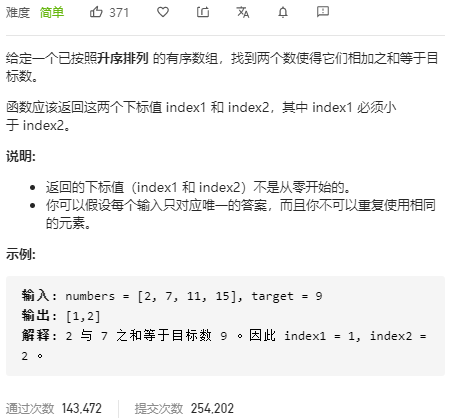

首先可以使用暴力法，对于数组中的每个数`num1`，在其后的数字里面寻找`num2 = target - num1`，找到后返回两者的索引。考虑到数组是有序的，采用双指针法，如果左右指针之和小于`target`，移动左指针，让数增大；否则移动右指针，让数减小。

```c++
class Solution {
public:
    vector<int> twoSum(vector<int>& numbers, int target) {
        vector<int> res;
        int left = 0;
        int right = numbers.size() - 1;

        while (left < right) {
            if (numbers[left] + numbers[right] < target)
                left++;
            else if (numbers[left] + numbers[right] > target)
                right--;
            else
                break;
        }
        res.emplace_back(left + 1);
        res.emplace_back(right + 1);
        return res;
    }
};
```

## [209. 长度最小的子数组](https://leetcode-cn.com/problems/minimum-size-subarray-sum/)

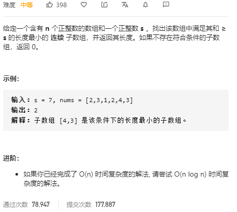

### 暴力法

首先想到了暴力法，对每个数，从当前位置开始向后累加，直到和大于等于`s`，然后计算长度并更新。时间复杂度是$O(n^2)$。

```c++
class Solution {
public:
    int minSubArrayLen(int s, vector<int>& nums) {
        int len = nums.size();
        if (len == 0) return 0;
        int minlen = INT_MAX;

        for (int left = 0; left < len; ++left) {
            int sum = 0;
            for (int right = left; right < len; ++right) {
                sum += nums[right];
                if (sum >= s) {
                    minlen = min(minlen, right - left + 1);
                    break;
                }
            }
        }
        // 为了避免长度超出整数范围
        return minlen == INT_MAX ? 0 : minlen;
    }
};
```

### 双指针

从题目要求返回最小长度，以及是连续字数组看出应该可以使用双指针法。设置两个指针，对于每个以当前数字为结尾的子数组，不断减小子数组长度并判断是否满足大于`s`的条件，在这个过程中更新最小长度。

- 设置左右指针`left,right`。当`right< len`的时候循环。
- 每一轮迭代，将`sum += nums[right]`，如果`sum >= s`，那么更新最小长度，并且将左指针右移，`sum-nums[left]`，直到`sum < s`。
- 循环的末尾右移一次右指针

```c++
class Solution {
public:
    int minSubArrayLen(int s, vector<int>& nums) {
        int left = 0, right = 0;
        int len = nums.size();
        if (len == 0) return 0;

        int minlen = INT_MAX;
        int sum = 0;
        while (right < len) {
          // 每轮开始，首先累加上右端点
            sum += nums[right];
            while (sum >= s) { // 循环直到不满足条件，这时的minlen一定是当前状态下最小的
                minlen = min(minlen, right - left + 1);
                sum -= nums[left];
                left++;
            } // 右指针右移，增大查找范围
            right++;
        }
        return minlen == INT_MAX ? 0 : minlen;
    }
};
```

## [215. 数组中的第K个最大元素](https://leetcode-cn.com/problems/kth-largest-element-in-an-array/)

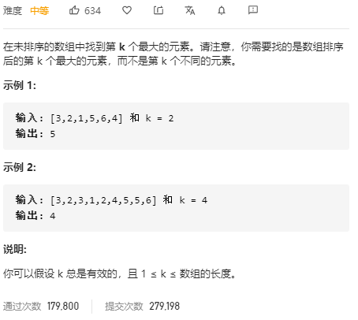

## [283. 移动零](https://leetcode-cn.com/problems/move-zeroes/)

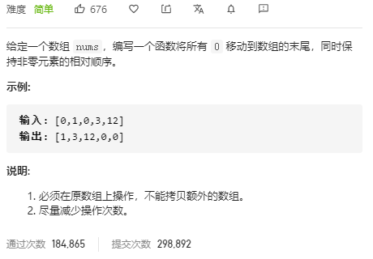

## [344. 反转字符串](https://leetcode-cn.com/problems/reverse-string/)


## [345. 反转字符串中的元音字母](https://leetcode-cn.com/problems/reverse-vowels-of-a-string/)

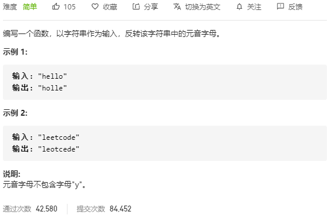

## [438. 找到字符串中所有字母异位词](https://leetcode-cn.com/problems/find-all-anagrams-in-a-string/)


# 查找

## [1. 两数之和](https://leetcode-cn.com/problems/two-sum/)

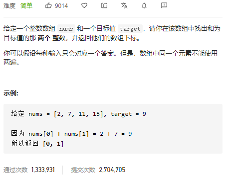


## [15. 三数之和](https://leetcode-cn.com/problems/3sum/)

## [16. 最接近的三数之和](https://leetcode-cn.com/problems/3sum-closest/)

## [18. 四数之和](https://leetcode-cn.com/problems/4sum/)

## [49. 字母异位词分组](https://leetcode-cn.com/problems/group-anagrams/)

## [149. 直线上最多的点数](https://leetcode-cn.com/problems/max-points-on-a-line/)

## [202. 快乐数](https://leetcode-cn.com/problems/happy-number/)

## [205. 同构字符串](https://leetcode-cn.com/problems/isomorphic-strings/)

## [217. 存在重复元素](https://leetcode-cn.com/problems/contains-duplicate/)

## [219. 存在重复元素 II](https://leetcode-cn.com/problems/contains-duplicate-ii/)

## [220. 存在重复元素 III](https://leetcode-cn.com/problems/contains-duplicate-iii/)

## [242. 有效的字母异位词](https://leetcode-cn.com/problems/valid-anagram/)

## [290. 单词规律](https://leetcode-cn.com/problems/word-pattern/)

## [349. 两个数组的交集](https://leetcode-cn.com/problems/intersection-of-two-arrays/)

## [350. 两个数组的交集 II](https://leetcode-cn.com/problems/intersection-of-two-arrays-ii/)

## [447. 回旋镖的数量](https://leetcode-cn.com/problems/number-of-boomerangs/)

## [451. 根据字符出现频率排序](https://leetcode-cn.com/problems/sort-characters-by-frequency/)

## [454. 四数相加 II](https://leetcode-cn.com/problems/4sum-ii/)

- #### **349  简单  两个数组的交集（必做）**

- #### **350  简单  两个数组的交集 II （必做）**

- #### **1     简单  两数之和（必做）**

- #### **219  简单  存在重复元素 II （必做）**

- #### **447  简单  回旋镖的数量（必做）**

- #### **454  中等  四数相加 II（必做）**

- #### 242  简单  有效的字母异位词 （选做）

- #### 202  简单  快乐数 （选做）

- #### 290  简单  单词规律（选做）

- #### 205  简单  同构字符串（选做）

- #### 217  简单  存在重复元素（选做）

- #### 451  中等  根据字符出现频率排序（选做）

- #### 15   中等  三数之和（选做）

- #### 18   中等  四数之和（选做）

- #### 16   中等  最接近的三数之和 （选做）

- #### 49   中等  字母异位词分组（选做）

- #### 220  中等  存在重复元素 III（选做）

- #### 149  困难  直线上最多的点数（选做）

# 树

- #### **226  简单  翻转二叉树（必做）**

- #### **101  简单  对称二叉树（必做）**

- **112  简单  路径总和（必做）**

- **257  简单  二叉树的所有路径（必做）**

- **437  简单 路径总和 III（必做）**

- **235  简单 二叉搜索树的最近公共祖先（必做）**

- #### 100  简单  相同的树（选做）

- #### 222  中等  完全二叉树的节点个数（选做）

- #### 110   简单  平衡二叉树（选做）

- 111   简单  二叉树的最小深度（选做）

- 404  简单  左叶子之和（选做）

- 113  中等  路径总和 II（选做）

- 129  中等  求根到叶子节点数字之和（选做）

- 98   中等 验证二叉搜索树（选做）

- 450  中等 删除二叉搜索树中的节点（选做）

- 108  简单 将有序数组转换为二叉搜索树（选做）

- 230  中等 二叉搜索树中第K小的元素（选做）

- 236  中等 二叉树的最近公共祖先（选做）

# 栈和队列

- #### **20   简单  有效的括号（必做）**

- **279  中等  完全平方数（必做）**

- **144  中等  二叉树的前序遍历（必做）**

- #### **102  中等  二叉树的层序遍历（必做 ）**

- **347  中等  前 K 个高频元素（必做）**

- #### 150   中等  逆波兰表达式求值（选做）

- #### 71    中等  简化路径（选做）

- #### 341   中等  扁平化嵌套列表迭代器

- 103  中等  二叉树的锯齿形层次遍历（选做）

- 199  中等  二叉树的右视图（选做）

- #### 127   中等  单词接龙（选做）

- #### 126   困难  单词接龙 II（选做）

- #### 23    困难  合并K个排序链表（选做）

# 递归与回溯

- **17    中等  电话号码的字母组合（必做）**
- **46  中等  全排列（必做）**
- **77   中等  组合（必做）**
- **79   中等  单词搜索（必做）**
- **200 中等  岛屿数量（必做）**
- **51   困难  N皇后（必做）**
- 93  中等  复原IP地址（选做）
- 131  中等  分割回文串（选做）
- 46  中等  全排列 II（选做）
- 39   中等  组合总和（选做）
- 40  中等  组合总和 II（选做）
- 216 中等  组合总和 III（选做）
- 78  中等  子集（选做）
- 90  中等  子集 II（选做）
- 401 简单  二进制手表（选做）
- 130 中等  被围绕的区域（选做）
- 417 中等  太平洋大西洋水流问题（选做）
- 52  困难  N皇后 II（选做）
- 37   困难  解数独（选做）

# 动态规划

- **70   简单  爬楼梯（必做）**
- **343 中等  整数拆分（必做）**
- **198  简单  打家劫舍（必做）**
- **416  中等  分割等和子集（必做）**
- **300  中等  最长上升子序列（必做）**
- 120  中等  三角形最小路径和（选做）
- 64   中等  最小路径和（选做）
- 279  中等  完全平方数（选做）
- 91   中等  解码方法（选做）
- 62   中等  不同路径（选做）
- 63   中等  不同路径 II（选做）
- 213   中等 打家劫舍 II（选做）
- 337   中等 打家劫舍 III（选做）
- 309  中等 最佳买卖股票时机含冷冻期（选做）
- 322  中等 零钱兑换（选做）
- 377  中等  组合总和 Ⅳ（选做）
- 474  中等  一和零（选做）
- 139   中等  单词拆分（选做）
- 494  中等  目标和（选做）
- 376   中等  摆动序列（选做）

# 贪心算法

- #### **455  简单  分发饼干（必做）**

- #### **435  中等  无重叠区间（必做）**

- #### **134   中等  加油站（必做）**

- #### **135   困难  分发糖果（必做）**

- #### **376   中等  摆动序列（必做）**

- #### 402  中等  移掉K位数字（选做）

- #### 55    中等  跳跃游戏（选做）

- #### 392   简单  判断子序列（选做）

- #### 279   中等  完全平方数（选做）

- #### 45    困难  跳跃游戏 II（选做）

- #### 452   中等  用最少数量的箭引爆气球（选做）