[TOC]

# 数组

## [1. 两数之和](https://leetcode-cn.com/problems/two-sum/)


最简单的是暴力法，不多说。采用哈希表可以将时间复杂度降到$O(n)$。

### 一遍哈希：

两遍哈希可以合在一起，边往hash中加入数据，边检查是否存在满足条件的键值：

```c++
class Solution {
public:
    vector<int> twoSum(vector<int>& nums, int target) {
        unordered_map<int, int> hash;

        for (int i = 0; i < nums.size(); ++i) {
            if (hash.find(target - nums[i]) != hash.end() && hash[target - nums[i]] != i)
                return {hash[target - nums[i]], i};
            hash[nums[i]] = i;
        }
        return {};
    }
};
```

### 两遍哈希：

首先遍历数组，记录每个数和对应的索引。然后再次遍历数组，查看每个数组元素在对应hash表中是否有相加为`target`的数，以及对应索引，成功则返回：

```c++
class Solution {
public:
    vector<int> twoSum(vector<int>& nums, int target) {
        unordered_map<int, int> hash;
        int len = nums.size();
        for (int i = 0; i < len; ++i) {
            hash[nums[i]] = i;
        }

        for (int i = 0; i < len; ++i) {
            if (hash.find(target - nums[i]) != hash.end() && hash[target - nums[i]] != i)
                return {i, hash[target - nums[i]]};
        }
        return {};
    }
};
```

## [4. 寻找两个有序数组的中位数](https://leetcode-cn.com/problems/median-of-two-sorted-arrays/)

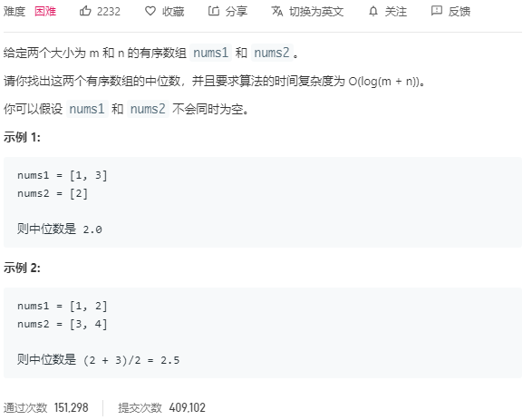

将两个数组合并到一起，排序，然后得到中位数。但是这样不符合时间复杂度要求$O(\log (m+n))$。

```c++
class Solution {
public:
    double findMedianSortedArrays(vector<int>& nums1, vector<int>& nums2) {
        vector<int> result(nums1);
               
        for (auto c : nums2)
            result.emplace_back(c);
            
        sort(result.begin(), result.end());
        int len = result.size();

        if (len % 2 == 0) {
            return  (double)(result[len / 2] + result[len / 2 - 1]) / 2;
        } else {
            return result[len / 2];
        }
    }
};
```

第二种方法：采用第k小的数。对于`nums1=[1,4,7,9]`和`nums2=[1,2,3,4,5,6,7,8]`两个数组而言，数组的总长度为4+8=12，我们要找的是第6个位置的数。我们可以每次排除`k/2=3`个数。`nums1[2]=7,nums2[2]=3`，7>3，所以我们可以将`nums2`3之前的数全部排除。因为在归并排序中，两个数组的第k/2个数可以近似看成中位数（如果两个数组完全一样的话），又因为都是升序数组，所以可以通过不断排除k/2之前的数来达到目的。

`nums2`排除后，剩下`[4,5,6,7,8]`，再和`nums1[3/2]=4`比较，发现`nums[1]`较小，所以排除`nums1[0]`，得到`nums1=[4,7,9]`，`nums2=[4,5,6,7,8]`，此时`k=1`，然后再比较一次，就得到了结果为5：

```c++
class Solution
```

## [11. 盛最多水的容器](https://leetcode-cn.com/problems/container-with-most-water/)

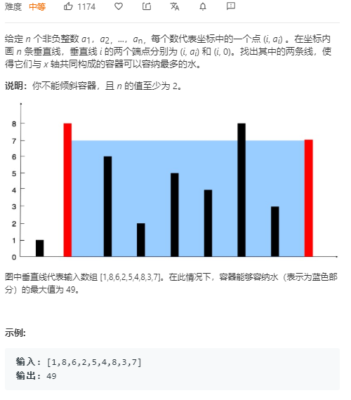

双指针法，开头一个结尾一个。盛水的量由两个数组元素的距离和较小的那个元素决定。所以直到两个指针相遇前，计算当前面积，如果比结果`max`大就更新，然后如果左边的较小，就移动左指针看看能不能找到更大的数来获得更大的面积；否则移动右指针。

```c++
class Solution {
public:
    int maxArea(vector<int>& height) {
        int max = 0;
        int left = 0;
        int right = height.size() - 1;
        int cur = 0;
        
        while (left < right) {
            cur = height[left] < height[right] ? (right - left) * height[left] : (right - left) * height[right];
            max = cur > max ? cur : max;
            if (height[left] < height[right]) 
                left++;
            else 
                right--;
        }
        return max;
    }
};
```

## [15. 三数之和](https://leetcode-cn.com/problems/3sum/)

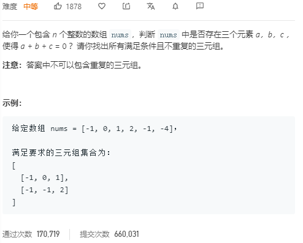

先对数组进行排序，这样在遍历到后面的为正的数时，肯定不会有三个数和为0，提升速度。 算法过程：

- 对数组排序，遍历数组
- 对当前元素后面剩余的数组设置两个指针，指向最大和最小的两个数，如果此时和为0，加入结果中。并且由于数组已经排序，后面可能会存在相同的元素，构成重复的三元组，所以要进行去重
- 如果和小于0，那么左指针右移；反之右指针左移

```c++
class Solution {
public:
    vector<vector<int>> threeSum(vector<int> & nums) {
        vector<vector<int>> result;
        int len = nums.size();
        
        // 长度小于3，直接返回0,0,0
        if (len < 3)
            return result;
        
        // 先排序，这样在后面二元组的查找中就可以简化成O(1)
        sort(nums.begin(), nums.end());
        
        // 遍历数组，对每个元素，从它往后的所有元素中求二元组的和为它的相反数。
        for (int i = 0; i < len; ++i) {
            // 如果当前的元素大于0，后面的所有元素也大于0，没有继续查找的必要
            if (nums[i] > 0)
                break;
            // 从i开始，设置前后两个指针，相向而行，查找指定元素
            int l = i + 1;
            int r = len - 1;

            while (l < r) {
                int sum = nums[i] + nums[l] + nums[r];
                // 如果三元素和为0，满足条件，保存当前三元组到结果
                // 同时，后面可能有多个相同的元素，要进行去重
                if (sum == 0) {
                    // vector<int> tmp {nums[i], nums[l], nums[r]};
                    result.emplace_back(vector<int>{nums[i], nums[l], nums[r]});
                    
                    while (l < r && nums[l] == nums[l+1])
                        ++l;
                    while (l < r && nums[r] == nums[r-1])
                        --r;
                    ++l;
                    --r;
                // 小于0，说明后面二元组太小，要让左指针向右
                } else if (sum < 0) {
                    ++l;
                // 大于0，说明后面二元组太大，要让右指针向左
                } else if (sum > 0) {
                    --r;
                }

            }
            // 由于i位置的元素也有可能和后面的元素重复，那么直接跳过这些元素。
            while (i < len - 2 && nums[i+1] == nums[i])
                ++i;

        }

        return result;
    }
};
```

## [16. 最接近的三数之和](https://leetcode-cn.com/problems/3sum-closest/)

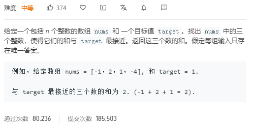

## [26. 删除排序数组中的重复项](https://leetcode-cn.com/problems/remove-duplicates-from-sorted-array/)

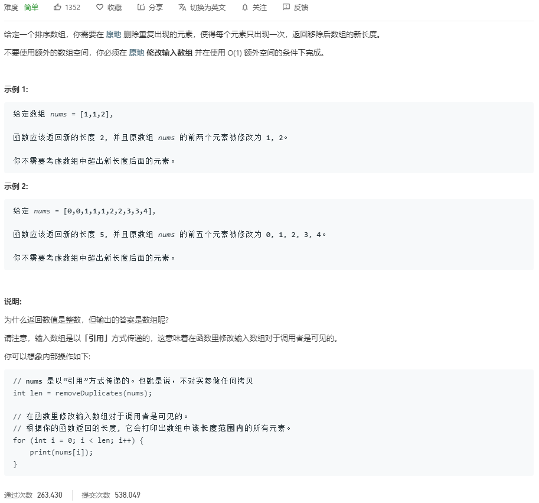

已排序的数组相同的数在一起，设置两个指针，在前的指针res记录数组长度，后面的指针i遇到相同的数就往后移，如果和res指向的元素不相同，就把它复制到res的位置：

```c++
class Solution {
public:
    int removeDuplicates(vector<int>& nums) {
        if (nums.empty())
            return 0;
        // 数组的最终长度
        int res = 0;
        for (int i = 0; i < nums.size(); ++i) {
            // 当前元素和遍历的元素不相等，长度就要增加
            if (nums[res] != nums[i])
                res++;
            // 遇到相同的数，把后面的数往前移
            nums[res] = nums[i];
        }
        return res + 1;
    }
};
```

## [27. 移除元素](https://leetcode-cn.com/problems/remove-element/)

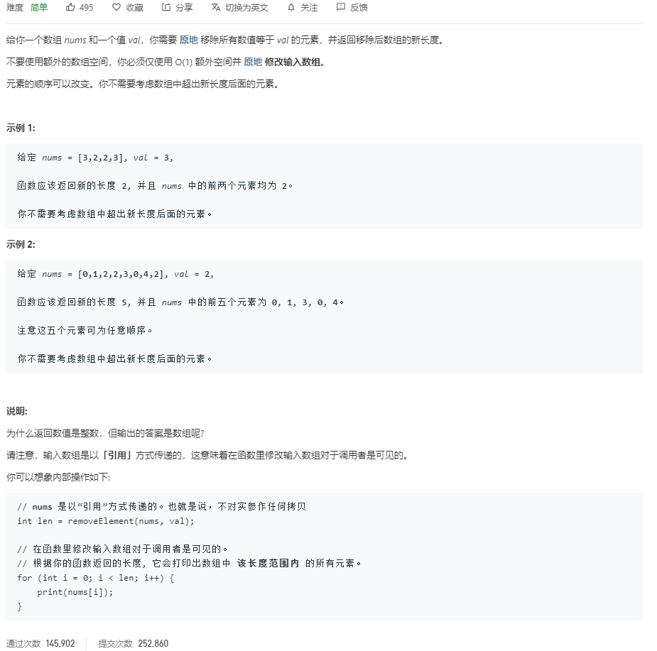

双指针法，令`res`表示删除`val`后的数组长度，`j`表示当前遍历元素，如果当前元素和`val`不同，那么就将其复制到`res`的位置，因为这是我们最后要保留的数组元素，相同的话就跳过：

```c++
class Solution {
public:
    int removeElement(vector<int>& nums, int val) {
        int res = 0;

        for (int i = 0; i < nums.size(); ++i) {
            if (nums[i] != val) {
                nums[res] = nums[i];
                res++;
            }
        }
        return res;
    }
};
```

## [31. 下一个排列](https://leetcode-cn.com/problems/next-permutation/)Mark

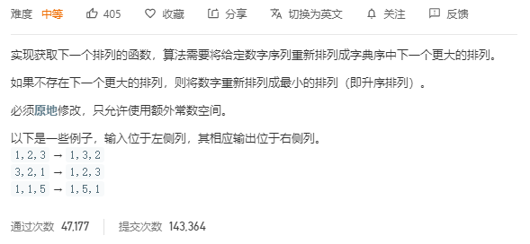

字典序的下一个数比当前数字大，而且是最小的增幅。例如123小于132，而且对于1，2，3这三个数组成的数字而言，132是大于123的最小数。为了满足这个需求，我们要从后向前找，找到一个尽可能小的数和左边的数组成增序序列，然后交换这两个数，最后为了保证增幅最小，还要将交换后的大数后面的序列组成增序。

例如123465，从后向前找到增序数4和5，然后交换它们的位置变成123564，然后将5后面的数变成增序123546.

算法过程如下：

- 从后向前查找，找到第一个相邻的升序序列`nums[i] < nums[j]`后，`(j, end)`一定是降序的
- 从`nums[j]-nums[end]`中找到第一个大于`nums[i]`的数`nums[k]`，交换`nums[i]`和`nums[k]`
- 这时`j`后面的数肯定都是降序了，逆置为升序即可

```c++
class Solution {
public:
    void nextPermutation(vector<int>& nums) {
        int len = nums.size();
        int i = len - 2, j = len - 1;
        int k = len - 1;
		// 从后向前找到第一个相邻的升序序列
        while (i >= 0 && nums[i] >= nums[j]) {
            i--;
            j--;
        }
		// 找到nums[j]后第一个大于nums[i]的数
        if (i >= 0) {
            while (nums[i] >= nums[k])
                k--;
            // 交换两数的位置
            swap(nums[i], nums[k]);
        }
		// 逆置比排序效率更高
        // sort(nums.begin() + j, nums.end());
        reverse(nums.begin() + j, nums.end());
    }
};
```

## [34. 在排序数组中查找元素的第一个和最后一个位置](https://leetcode-cn.com/problems/find-first-and-last-position-of-element-in-sorted-array/)

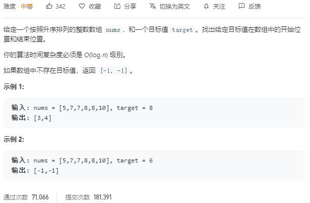

既然是$O(\log n)$的复杂度，肯定是二分法。

- 首先用二分法在数组中找到目标值的一个索引`index`
- 然后查找目标区域的左边界`left`，令`left = index - 1`，然后从`0`到`left`继续二分查找，直到`nums[left] < target`，此时`left+1`就是下界
- 然后查找右边界`right`，令`right = index + 1`，然后从`right`到`len - 1`二分查找，直到`nums[right] > target`，此时`right - 1`就是上界

```c++
class Solution {
public:
    vector<int> searchRange(vector<int>& nums, int target) {
        vector<int> res{-1, -1};
        int len = nums.size();
        // 首先找到一个索引
        int index = binarySearch(nums, 0, len - 1, target);

        if (index == -1)
            return res;
        // 从0到index-1查找左边界
        int left = index - 1;
        // 直到查找范围超出了target的区域才停止查找
        while (left >= 0 && nums[left] == target) {
            // left相当于index，要减一才能移动到下一个区域查找，否则无限循环
            left = binarySearch(nums, 0, left, target) - 1;
        }
		// 从index+1到len-1查找右边界
        int right = index + 1;
        while (right < len && nums[right] == target) {
            right = binarySearch(nums, right, len - 1, target) + 1;
        }
		// 保存结果
        res[0] = min(index, left + 1);
        res[1] = max(index, right - 1);

        return res;
    }

    int binarySearch(vector<int>& nums, int start, int end, int target) {
        while (start <= end) {
            int mid = (start + end) >> 1;
            if (nums[mid] == target)
                return mid;
            else if (nums[mid] > target)
                end = mid - 1;
            else
                start = mid + 1;
        }
        return -1;
    }
};
```


## [33. 搜索旋转排序数组](https://leetcode-cn.com/problems/search-in-rotated-sorted-array/)

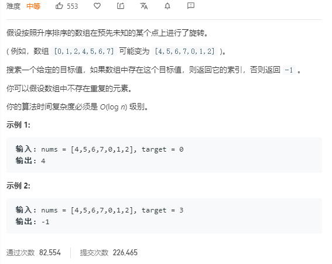

直接二分法，有几种情况：

- `nums[0] < nums[mid]`且`nums[0] <= target <= nums[mid]`，说明要找的目标值在前半段，令`right=mid`，继续二分；
- `nums[0] > nums[mid]`且`target <= nums[mid] < nums[0]`，说明`target`在旋转位置和`nums[mid]`之间，在前半部分继续寻找
- `nums[0] > nums[mid]`且`nums[mid] < nums[0] <= target`，说明`target`在0到旋转位置，取前半部分继续查找。
- 其他情况都在后半部分查找

所以只有在`nums[0] < nums[mid]`，`target < nums[mid]`，`nums[0] < target`都为真，或者只有一项为真的时候在前半段查找，其他情况都在后半段查找：

```c++
class Solution {
public:
    int search(vector<int>& nums, int target) {
        int left = 0;
        int right = nums.size() - 1;

        while (left < right) {
            int mid = (left + right) >> 1;
			// 三个条件有一个为真，那么就在前半段搜索，否则后半段
            if ((nums[0] <= nums[mid]) ^ (nums[0] <= target) ^ (target <= nums[mid]))
                right = mid;
            else
                left = mid + 1;
        }
        return left == right && nums[left] == target ? left : -1;
    }
};
```

## [39. 组合总和](https://leetcode-cn.com/problems/combination-sum/)

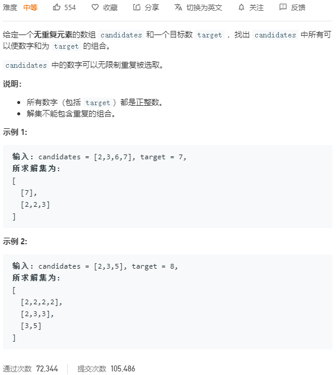

采用回溯再剪枝的方法，7减2等于5，然后看5怎么由候选数字构成；7减3等于4，看4怎么由候选数字构成等等。如下图所示，所有叶结点为0的路径就是我们要找的，但是有重复的路径，需要去重。

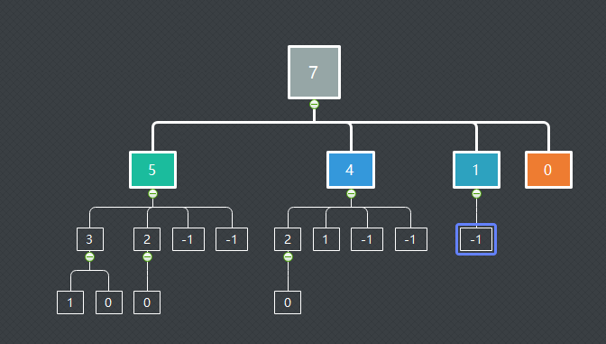

当`target>0`时递归，对`candidates`数组进行排序，然后以其中的每个数为起点向后遍历。这样可以方便去重，如果不进行排序，那么以当前数为开头的组合会和后面以其他数为开头的组合产生重复，例如`[2,2,3]`和`[3,2,2]`。排序后`[2,3,6,7]`，在从2开始搜索得到`[2,2,3]`后，从3开始就不会用到2，这样也就不会有重复存在，而且可以确保所有的组合都被遍历到。

```c++
class Solution {
public:
    vector<vector<int>> combinationSum(vector<int>& candidates, int target) {
        vector<vector<int>> res;
        vector<int> path;
        // 先排序
        sort(candidates.begin(), candidates.end());
        backtrack(candidates, path, res, 0, target);
        return res;
    }
	
    void backtrack(vector<int>& candidates, vector<int>& path, 
                   vector<vector<int>>& res, int start, int target) {
        // 递归终止条件
        if (target == 0) {
            res.emplace_back(path);
            return;
        }
		
        for (int i = start; 
             i < candidates.size() && target - candidates[start] >= 0; ++i) {
            // 搜索以当前数为开头的组合
            path.emplace_back(candidates[i]);
            backtrack(candidates, path, res, i, target - candidates[i]);
            // 回溯，进行下一次搜索
            path.pop_back();
        }
    }
};
```

## [40. 组合总和 II](https://leetcode-cn.com/problems/combination-sum-ii/)

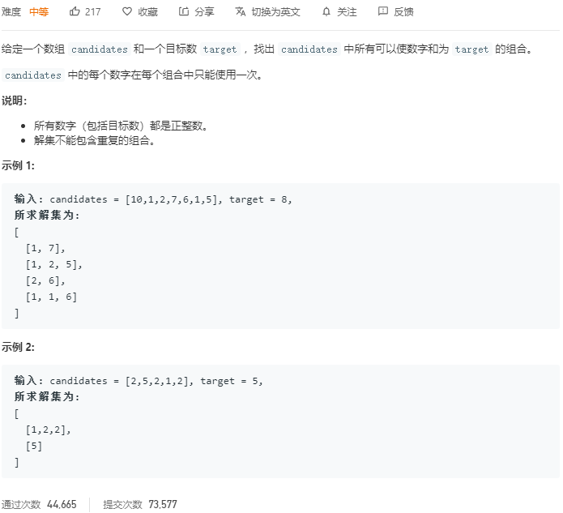

和39题类似，只不过这里`candidates`有重复元素，而且每个数只能在最后的组合中出现一次（重复的数不能超过上限）。

## [169. 多数元素](https://leetcode-cn.com/problems/majority-element/)

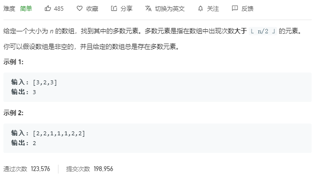

### 哈希方法：

使用哈希表记录每个元素出现的次数，然后再遍历一遍哈希表输出出现次数最多的元素。要注意可以一边生成hash一边输出最大值：

```c++
class Solution {
public:
    int majorityElement(vector<int>& nums) {
        int cnt = 0;
        int major = 0;
        unordered_map<int, int> mp;
        
        for (auto c : nums) {
            mp[c]++;			// 记录元素出现的次数
            if (mp[c] > cnt) {	// 更新最大出现次数和当前值
                cnt = mp[c];
                major = c;
            }
        }
        return major;
    }
};
```

时间复杂度：$O(n)$；空间复杂度：$O(n)$ 

### 排序：

将数组排序，输出位于数组1/2位置的元素，一定是众数：

```c++
class Solution {
public:
    int majorityElement(vector<int>& nums) {
        sort(nums.begin(), nums.end());
        return nums[nums.size() / 2];
    }
};
```

时间复杂度：$O(n\log n)$；空间复杂度：$O(1)$ 

### 分治法：

把数组分成两部分，如果一个数在原数组是众数，那么在其中一部分也是众数。

### Boyer-Moore投票法：

对于一个候选众数维护一个计数器，扫描整个数组，如果是候选众数，计数器加一，否则计数器减一，计数器为0的时候更换候选众数。输出众数的计数器一定大于0，因为众数出现的次数大于n/2。

```c++
class Solution {
public:
    int majorityElement(vector<int>& nums) {
        int candidate = 0;
        int cnt = 0;

        for (int c : nums) {
            if (c == candidate)		// 下一个元素和候选元素相同，计数器加一
                cnt++;
            else if (--cnt < 0) {	// 计数器减到0，更换候选数 
                candidate = c;
                cnt = 1;
            }
        }
        return candidate;			// 最后留下的一定是众数
    }
};
```


## [724. 寻找数组的中心索引](https://leetcode-cn.com/problems/find-pivot-index/)

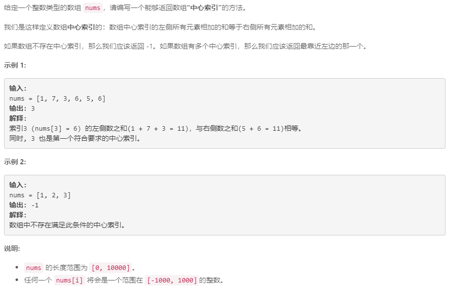

# 贪心算法


# 回溯

## [39. 组合总和](https://leetcode-cn.com/problems/combination-sum/)

已解答

## [40. 组合总和 II](https://leetcode-cn.com/problems/combination-sum-ii/)

已解答

## [60. 第k个排列](https://leetcode-cn.com/problems/permutation-sequence/)

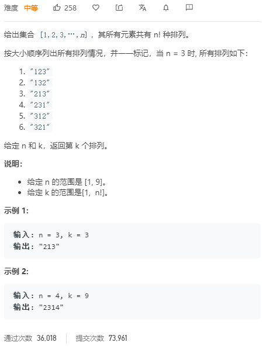


# 分治

# 递归

## 21.合并两个有序链表

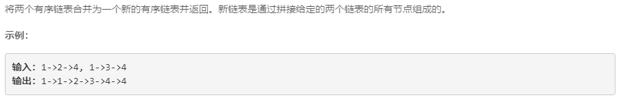

两种方法，首先是迭代，对两个链表不断比较大小，将较小的插入新链表中，最后将非空的链表接到后面。

时间：$O(n+m)$；空间：$O(1)$

```c++
class Solution {
public:
    ListNode* mergeTwoLists(ListNode* l1, ListNode* l2) {
        ListNode* head = new ListNode(-1);
		
        ListNode* p = head;
        while (l1 && l2) {
            if (l1->val <= l2->val) {
                p->next = l1;
                l1 = l1->next;
            } else {
                p->next = l2;
                l2 = l2->next;
            }
            p = p->next;
        }
        p->next = l1 ? l1 : l2;

        return head->next;
    }
};
```

递归的方法：原问题可以分解为合并只有一个结点的两个链表，那么只需要将一个链表插入另一个链表即可。递归终止条件就是两个链表其中一个为空。递归定义如下：
$$
\begin{align}
& l1[0]+merge(l1[1:], l2) \quad l1[0] < l2[0] \\
& l2[0]+merge(l1, l2[1:]) \quad Otherwise
\end{align}
$$
时间复杂度：$O(n+m)$；空间复杂度：$O(n+m)$

```c++
class Solution {
public:
    ListNode* mergeTwoLists(ListNode* l1, ListNode* l2) {
        if (l1 == nullptr)			// l1为空，将l2返回，也就是接到合并的链表后
            return l2;
        else if (l2 == nullptr)		// 相反
            return l1;

        else if (l1->val <= l2->val) {			// 将较小的结点插入链表
            l1->next = mergeTwoLists(l1->next, l2);
            return l1;
        } else {
            l2->next = mergeTwoLists(l1, l2->next);
            return l2;
        }
    }
};
```

## 24.两两交换链表节点

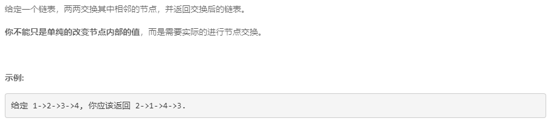

- 终止条件：`head=null`，或`head->next=null`
- 递归内容：交换两个节点
- 返回值是上一层递归调用完成交换的子链表

时间：$O(n)$；空间：$O(1)$

```c++
class Solution {
public:
    ListNode* swapPairs(ListNode* head) {
        if (head == null || head->next == null)		// 递归终止条件
            return head;
        ListNode* tmp = head->next;					// 交换两个节点
        head->next = swapPairs(tmp->next);			// 这里是上一层调用返回的位置
        tmp->next = head;
        return tmp;
    }
}
```

## 50. Pow(x, n)

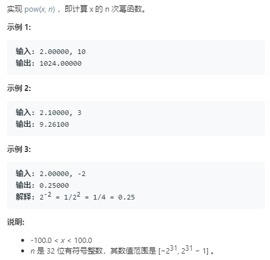

先考虑正数幂，简单的方法，设计一个递归函数，递归计算幂的结果：

```c++
double Pow(double x, int n) {
    if (n == 0)
        return 1.0;
    return x * Pow(x, n - 1);
}
```

但是这个方法会使栈增长超出限制，因为n的取值范围是32位有符号整数。所以可以采用一个将空间复杂度降低到$O(\log n)$的方法，使$n$呈指数降低：

```c++
double Pow(double x, long n) {
    if (n == 0)
        return 1.0;
    double res = Pow(x, n / 2);
    if (n % 2 == 0)
        return res * res;
    else
        return res * res * x;
}
```

对于$n$是负的情况，可以将$x$取倒数，然后将$n$变成整数就可以了：

```c++
class Solution {
public:
    double fastPow(double x, long long n) {
        if (n == 0)
            return 1.0;
        double res = fastPow(x, n / 2);
        if (n % 2 == 0)
            return res * res;
        else 
            return res * res * x;
    }
    
    double myPow(double x, int n) {
        long long N = n;
        
        if (N < 0) {
            x = 1.0 / x;
            N = -N;
        }
        return fastPow(x, N);
    }
};
```

## 70. 爬楼梯

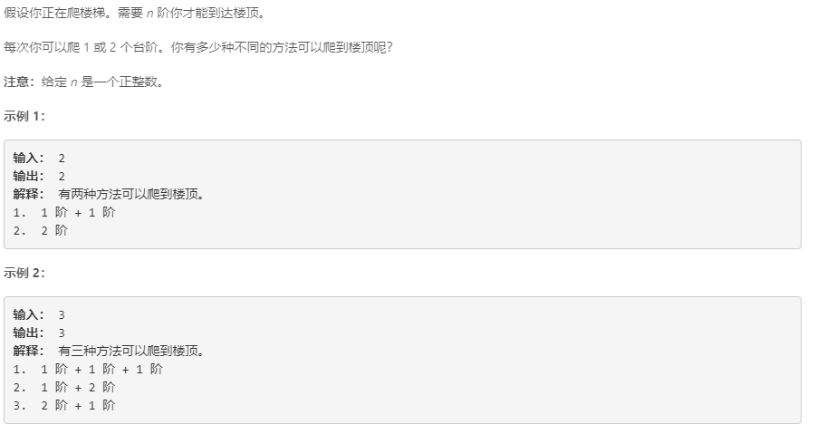

和斐波那契类似，递归或者动态规划解决.

- 递归。递归的终止条件是只剩一级台阶，直接一步上去；第$n$级台阶可以由第$n-1$级爬一步和$n-2$级爬两步得到，所以这就是两种方法，递归计算：

	```c++
	class Solution {
	public:
	     int climbStairs(int n) {
	         return climb_Re(0, n);				// 外部调用，0代表当前已经到第n级，不用再爬
	     }
	
	     int climb_Re(int m, int n) {			// m是爬的步长
	         if (n > 1) {
	             return climb_Re(1, n-1) + climb_Re(2, n-2);	// 两种方法到达第n级
	         }
	         else 
	             return 1;
	     }
	};
	```

- 动态规划：使用数组暂存计算结果，得到最终结果。

	```c++
	class Solution {
	public:
		int climbStairs(int n) {
	        int res;
	        if (n == 1) 
	            return 1;
	        int *dp = new int[n + 1];
	        dp[1] = 1;
	        dp[2] = 2;
	
	        for (int i = 3; i <= n; ++i) {
	            dp[i] = dp[i-1] + dp[i-2];
	        }
	        res = dp[n];
	        return res;
	    }
	}
	```

## 95. 不同的二叉搜索树II

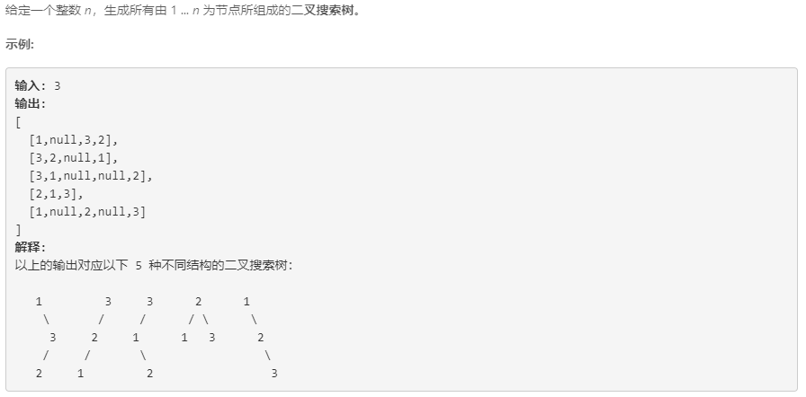

其实就是计算$n$的全排列个数，有多少种全排列就有多少种插入顺序，就有多少颗二叉树。

## 96.不同的二叉搜索树

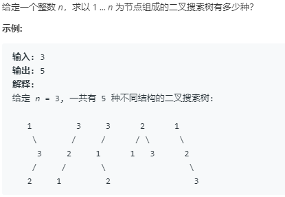

和上一题类似，只不过只需要输出二叉树的个数，其实就是卡特兰数：
$$
C_n=\frac{1}{n+1}C_{2n}^n
$$
卡特兰数的递推：
$$
C_0=1,\quad C_{n+1}=\frac{2(2n+1)}{n+2}C_n
$$

```c++
class Solution {
public:
    int numTrees(int n) {
        int c = 1;
        for (int i = 0; i < n; ++i) 
            c = c * 2 * (2 * i + 1) / (i + 2);
        return c;
    }
};
```

动态规划：

$n$关键字组成的序列中，以第$i$个关键字为根的二叉搜索树个数$f(i)$等于左半边（$1,...,i-1$）的个数乘以右半边（$i+1,...,n$）的个数。令$G(n)$为我们要的结果，也就是二叉搜索树的个数。那么状态转移公式为：
$$
f(i) = G(i-1)\times G(n-i)
$$
初始时，$G(0)=1,G(1)=1$.

```c++
class Solution {
public:
    int numTrees(int n) {
        vector<int> dp(n + 1);
        dp[0] = 1;
        dp[1] = 1;
        
        for (int i = 2; i <= n; ++i) {
            for (int j = 1; j <= i; ++j) 
                dp[i] += dp[j - 1] * dp[i - j];
        }
        return dp[n];
    }
};
```


## 104.二叉树最大深度

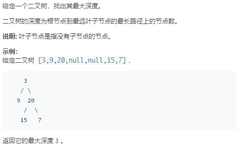

同样有递归和非递归两种方法。

- 递归：递归计算左右子树的高度，树的高度就等于子树高度加一。终止条件：`root == nullptr`，此时走到了叶结点，开始返回子树高度。递归内容递归计算左右子树的高度。最后返回较大者。

	```c++
	class Solution {
	public:
	    int maxDepth(TreeNode* root) {
	        
	        int hleft;
	        int hright;
	        
	        if (root == nullptr)
	            return 0;
	        else {
	            hleft = maxDepth(root->left);
	            hright = maxDepth(root->right);
	        }
	        
	        return max(hleft, hright) + 1;
	    }
	};
	```

- 非递归：层序遍历，每遍历完一层高度加1。层序遍历中，维护一个队列，队列中的元素就是当前层的结点。

	```c++
	class Solution {
	public:
		int maxDepth(TreeNode* root) {
	        if (root == nullptr) 
	            return 0;
	        
	        int high = 0;
	        queue<TreeNode*> qe;
	        qe.push(root);
	        
	        while (!qe.empty()) {			// 队列不空循环
	            high++;						// 进入了一个新的层，层数要加一
	            int level = qe.size();		// 队列中的元素是当前层的结点
	            for (int i = 0; i < level; ++i) {	// 遍历当前层
	                TreeNode* p = qe.front();
	                qe.pop();
	                if (p->left)
	                    qe.push(p->left);
	                if (p->right)
	                    qe.push(p->right);
	            }
	        }
	        return high;
	    }
	};
	```

- 迭代的方法：采用非递归的DFS方法，访问每个结点，然后更新最大深度值。也就是树的后序遍历的方法，当遍历到某个结点的时候，栈中存储的就是根结点到当前结点的路径，也就是当前结点所在的层，最大的层数就是树的高度。

	- 深度从1开始，因为算上了根结点。而且要记录从栈中返回的结点是从左边还是右边，如果是从右边返回，那么说明栈顶已经被访问过了，如果从左边说明栈顶还未被访问，要继续向右。当栈不空或者遍历指针不空时：
	- 如果遍历指针不空，那么一直往左，走到叶结点。
	- 走到叶结点后，如果栈顶结点有右孩子，且未被访问，那么继续往右。
	- 否则，记录栈高度，更新深度。暂存访问过的结点，出栈继续遍历。

	```c++
	class Solution {
	public:
	    int maxDepth(TreeNode* root) {
	        if (root == nullptr)
	            return 0;
	
	        int deep = 1;			// 上面已经判断了根结点为空，这里直接从1开始。
	        int maxDeep = 0;
	        stack<TreeNode*> st;
	        TreeNode* p = root;
	        TreeNode* r = nullptr;	// 记录出栈的结点是否被访问过。
	
	        while (!st.empty() || p) {
	            if (p) {			// 遍历指针不空，继续走到根结点
	                st.push(p);
	                p = p->left;
	            } else {
	                p = st.top();			// 判断栈顶是否北方问过
	                if (p->right && p->right != r) {
	                    p = p->right;
	                    st.push(p);
	                    p = p->left;
	                } else {				// 被访问过就要出栈计算栈高度
	                    deep = st.size();
	                    if (maxDeep < deep)
	                        maxDeep = deep;
	                    p = st.top();
	                    st.pop();
	                    r = p;
	                    p = nullptr;
	                }
	                
	            }
	        }
	        return maxDeep;
	    }
	};
	```

## 118. 杨辉三角

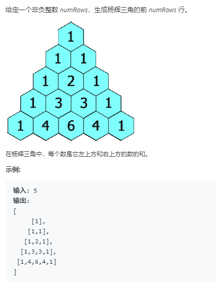

采用动态规划的方法，初始条件是前两行的元素，`res[0][0]=1, res[1][0]=res[1][1]=1`。状态是当前所处的行，决策是根据递推条件：
$$
res(i,j)=res(i-1,j-1)+res(i-1,j)
$$
代码：

```c++
class Solution {
public:
    vector<vector<int>> generate(int numRows) {
        vector<vector<int>> res(numRows);			// 初始化二维数组，大小为nusRows
        if (numRows == 0)
            return res;
        
        res[0].emplace_back(1);						// 确定初始条件
        
        for (int i = 1; i < numRows; ++i) {
            res[i].emplace_back(1);
            
            for (int j = 1; j < i; ++j) 
                // 迭代过程，也是动态规划中的决策方法
                res[i].emplace_back(res[i-1][j-1]+res[i-1][j]);
                
            res[i].emplace_back(1);
        }
        
        return res;
    }
};
```

## 119. 杨辉三角II

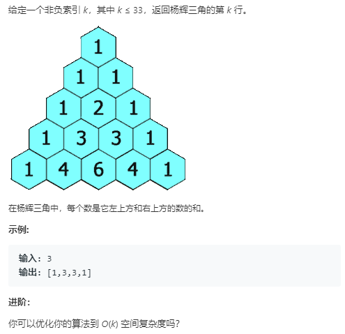

和上一题类似，要求直接输出指定的行，而且提出优化目标为$O(k)$的空间复杂度。简单的想法就和上面一样，直接计算所有的行，然后输出指定行。

另外一种做法是，直接初始化一个大小为指定数的数组。仔细观察杨辉三角可以发现，下一行的值其实就是当前行的值错位相加：
$$
\begin{bmatrix}
1,3,3,1,0 \\
0,1,3,3,1\\
\end{bmatrix}=1,4,6,4,1
$$
所以只要对每一行，递推到`rowIndex`，就可以得到指定行的值。

```c++
class Solution {
public:
    vector<int> getRow(int rowIndex) {
        vector<int> res(rowIndex+1);
        
        res[0] = 1;					// 初始条件
        for (int i = 1; i <= rowIndex; ++i) {
            for (int j = i; j > 0; --j)		// 这里只能从后往前，因为数组前面被填满了
                res[j] += res[j-1];
        }
        return res;
    }
};
```

## 206. 反转链表

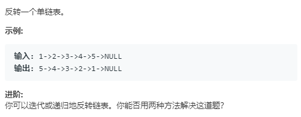

要求两种方法，迭代和递归。

首先是迭代的方法：

迭代的方法就比较朴素，设置两个指针指向链表的头结点和下一个结点，注意刚开始要将`pre->next = nullptr`置空，否则，会出现环。然后开始迭代，首先要暂存`cur`的后继防止断链，然后让`cur`指向`pre`，移动指针，进行下一次迭代。

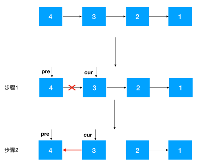

```c++
class Solution {
public:
    ListNode* reverseList(ListNode* head) {
        if (head == nullptr ||  head->next == nullptr)
            return head;						// 边界条件
        
        ListNode* pre = head;					// pre指向头结点
        ListNode* cur = head->next;				// cur指向第一个数据结点
        pre->next = nullptr;					// pre指针域置空，防止成环

        while (cur) {							
            ListNode* tmp = cur->next;			// 暂存后继结点，防止断链
            cur->next = pre;					// 当前结点指向前驱
            pre = cur;							// 移动指针进行迭代
            cur = tmp;
        }
        return pre;								// 返回的是pre，也就是最后头结点的位置
    }
};
```


递归的方法：

假设原链表如下：
$$
n_1\rightarrow n_2\rightarrow ...\rightarrow n_{k-1}\rightarrow n_k\rightarrow n_{k+1} \leftarrow ...\leftarrow n_m
$$
当前位于$n_k$的位置，因为反转链表最后表尾变成了表头，所以要从后往前反转，后面的已经反转完成。所以第一步要不断地递归到表尾，从表尾开始。第二步，将$n_{k+1}$指向$n_k$，即`nk->next->next = nk`；第三步，将$n_k$指针域置空，避免形成环。 最后返回新的头节点，便于进行下一次递归。

```c++
class Solution {
public:
    ListNode* reverseList(ListNode* head) {
        if (head == nullptr || head->next == nullptr)	// 递归终止条件
            return head;
        ListNode* tmp = reverseList(head->next);		// 从后往前开始反转
        head->next->next = head;						// 后面的节点指向前面的节点
        head->next = nullptr;							// 指针域置空避免成环

        return tmp;
    }
};
```

时间复杂度：$O(n)$，空间复杂度$O(n)$。

## 509. 斐波那契数

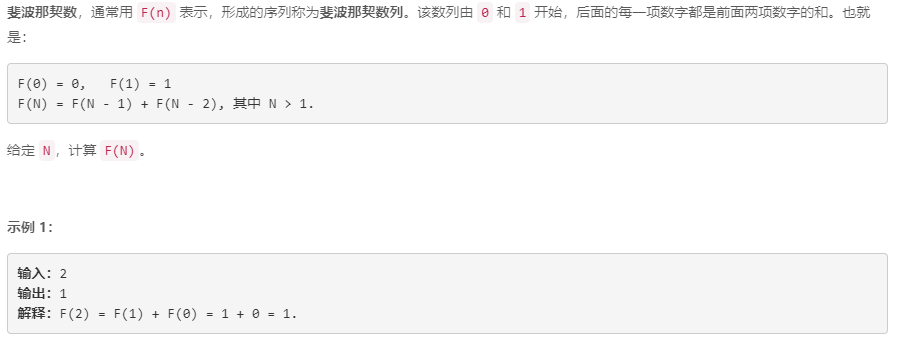

- 方法一：动态规划，用`dp`数组存储已经计算的数，然后迭代计算，其实就是递推的方法

	```c++
	class Solution {
	public:
	    int fib(int N) {
	        vector<int> dp;
	        
	        dp.emplace_back(0);
	        dp.emplace_back(1);
	        for (int i = 2; i <= N; ++i) {
	            dp.emplace_back(dp[i-1] + dp[i-2]);
	        }
	        
	        return dp[N];
	    }
	};
	```

- 方法二：递归。最简单的递归会产生大量的重复计算，可以使用记忆化的方法进行优化。递归的方法和动态规划（递推）类似：

	```c++
	class Solution {
	public:
	    vector<int> cache;						// 全局数组，存放计算结果
	
	    int fib(int N) {
	        int res;
	        if (N < 2) {						// 递归的终止条件
	            return N;
	        } else {							
	            res = fib(N-1) + fib(N-2);		// 递归计算
	        }
	        cache.emplace_back(res);			// 将结果放到数组中
	
	        return res;
	    }
	};
	```


## 779.第K个语法符号

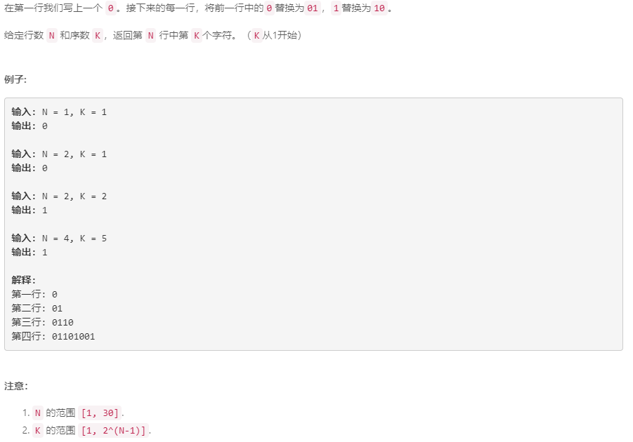

- 递归：初始条件，第一行为0，直接变成01；递归子问题， 当前行的前一半和上一行相同，所以如果位于前半段，直接返回上一行对应的位置。如果位于后半段，则和上一行对应位置相反。第3行0110，第四行后半段1001.

	```c++
	class Solution {
	public:
	    int kthGrammar(int N, int K) {
	        if (N == 1)
	            return 0;
	        else if (N == 2)				// 第二行，第一个是0，第二个是1
	            return K == 1 ? 0 : 1;
	        
	        int len = 1 << (N-2);			// 前一行的长度
	        if (K <= len)
	            return kthGrammar(N - 1, K);	// 前半段和上一行相同
	        else {
	            // 非0即1，直接用1减就可以取反
	            return 1 - kthGrammar(N - 1, K - len);	// 后半段和上一行相反
	        }
	    }
	};
	```

	时间：$O(n)$，空间$O(1)$ 

# 树

# 动态规划

## [5. 最长回文子串](https://leetcode-cn.com/problems/longest-palindromic-substring/)

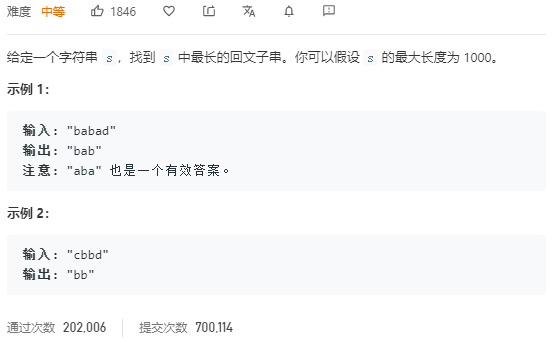

可以采用动态规划的解法。首先定义状态，本题中的状态就是当前子串是否为回文。所以可以定义一个二维数组`pm[i][j]`，表示从下标`i`开始到`j`的字符串是否是回文。然后定义状态转移方程，一个字符串是回文当且仅当`pm[i+1][j-1]`是回文且`s[i]== s[j]`。这里需要注意边界条件：

- 只有一个字符时肯定是回文
- 有两个字符时，只需要比较它们是否相等
- 三个字符时，比较首尾两个字符是否相等即可

后面两个可以合并成一个条件，只要比较`s[i],s[j]`是否相等即可判定：

```c++
class Solution {
public:
    string longestPalindrome(string s) {
        int len = s.length();
        int maxlen = 1;
        int start = 0;

        if (s.length() < 2)
            return s;
        // 二维数组初始化，采用静态数组速度快了2/3
        bool pm[len][len];
        for (int i = 0; i < len; ++i)
             pm[i][i] = true;
		
        for (int j = 1; j < len; ++j) {
            for (int i = 0; i < j; ++i) {
                if (s[i] == s[j]) {
                    if (j - i < 3)
                        pm[i][j] = true;
                    else
                        pm[i][j] = pm[i+1][j-1];
                } else
                    pm[i][j] = false;

                if (pm[i][j]) {
                    int curlen = j - i + 1;
                    if (curlen > maxlen) {
                        maxlen = curlen;
                        start = i;
                    }
                }
            }
            
        }
        return s.substr(start, maxlen);
    }
};
```

## [10. 正则表达式匹配](https://leetcode-cn.com/problems/regular-expression-matching/)

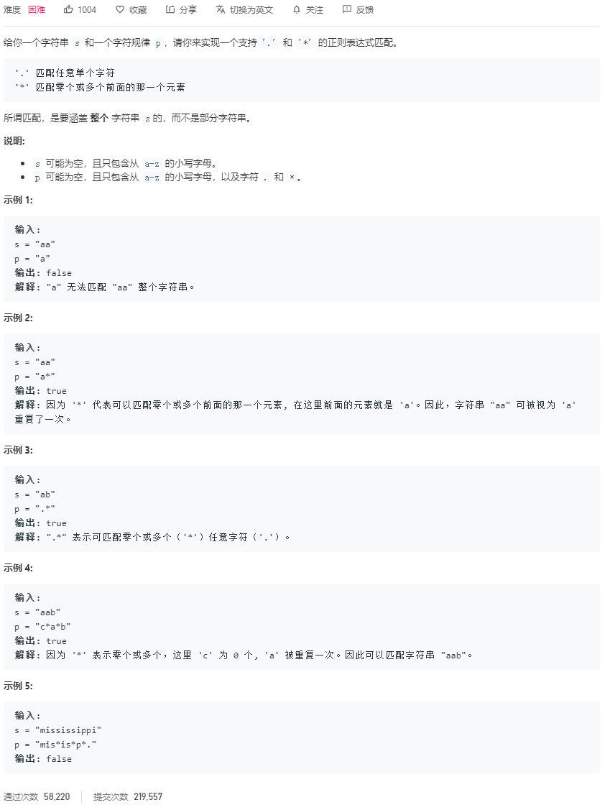


## [32. 最长有效括号](https://leetcode-cn.com/problems/longest-valid-parentheses/)

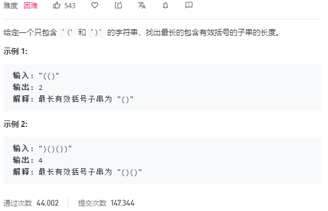

### 动态规划：

首先要定义状态。本题的状态是构成有效括号的最长字串，用`dp`数组表示，第`i`个元素就是在原字符串中以下标`i`结尾的字符串构成的最大有效括号长。

定义状态转移方程，这里因为要匹配括号，所以要两个字符一起检查，因为`dp[i-1]`是匹配完成的括号，加入一个字符不能构成有效匹配。而且如果当前位置是`(`，可以判断不能构成匹配，`dp[i]=0`。

`dp[i]`的有两种，一种是`s[i]=')', s[i-1]='('`，字符串形如“.....()”，这时`dp[i]=dp[i-2]+2`。另一种情况是，`s[i]=')', s[i-2]=')'`，字符串形如“.....))”，这时要检查前面的字符`s[i-dp[i-1]-1]='('`，如果成立那么`dp[i] = dp[i-1]+dp[i-dp[i-1]-2]+2`，

### 栈：


## [62. 不同路径](https://leetcode-cn.com/problems/unique-paths/)

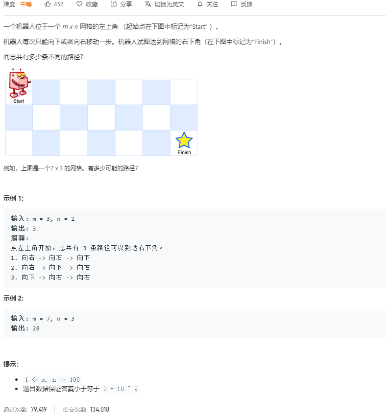

