[TOC]

## [面试题03. 数组中重复的数字](https://leetcode-cn.com/problems/shu-zu-zhong-zhong-fu-de-shu-zi-lcof/)

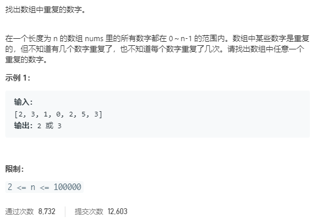

指定一个数组作为hash表，数组的索引代表数字，内容表示每个数字出现的次数，先统计一遍数字出现的次数，然后输出第一个内容不为0的值。

```c++
class Solution {
public:
    int findRepeatNumber(vector<int>& nums) {
        int len = nums.size();

        vector<int> mp(len);
        for (auto c : nums) 
            mp[c]++;
        
        int i;
        for (i = 0; i < len; i++) {
            if (mp[i] > 1)
                break;
        }
        return i;
    }
};
```

## [面试题04. 二维数组中的查找](https://leetcode-cn.com/problems/er-wei-shu-zu-zhong-de-cha-zhao-lcof/)

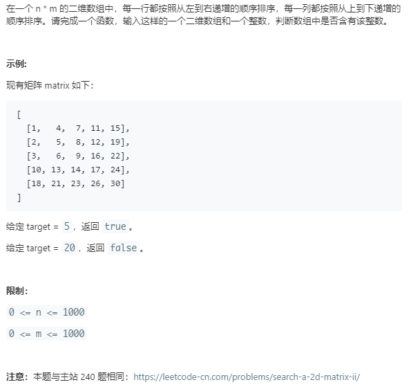

线性查找：从右端开始，如果当前数`nums`大于`target`，那么向左移动一列；如果当前数小于`target`，向下移动一行。

```c++
class Solution {
public:
    bool findNumberIn2DArray(vector<vector<int>>& matrix, int target) {
        if (matrix.size() == 0 || matrix[0].size() == 0)
            return false;
        
        int rows = matrix.size();
        int cols = matrix[0].size();

        int r = 0;
        int c = cols - 1;

        while (r < rows && c >= 0) {			// 循环终止条件是遍历完成整个数组
            int nums = matrix[r][c];
            if (nums == target)
                return true;
            else if (nums > target)
                c--;
            else
                r++;
        }
        return false;
    }
};
```

## [面试题05. 替换空格](https://leetcode-cn.com/problems/ti-huan-kong-ge-lcof/)

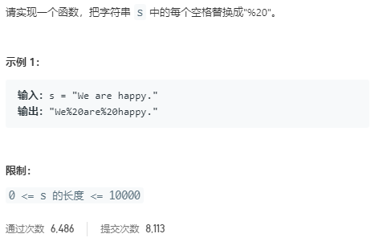

逐个判断原字符串字符是否为空格，如果是就加上'%20'，否则加上原字符：

```c++
class Solution {
public:
    string replaceSpace(string s) {
        string res;

        for (auto c : s) {
            if (c == ' ')
                res += "%20";
            else
                res += c;
        }
        return res;
    }
};
```

## [面试题06. 从尾到头打印链表](https://leetcode-cn.com/problems/cong-wei-dao-tou-da-yin-lian-biao-lcof/)


将链表值入栈，出栈入数组：

```c++
class Solution {
public:
    vector<int> reversePrint(ListNode* head) {

        stack<int> st;
        ListNode* p = head;
        while (p) {
            st.push(p->val);
            p = p->next;
        }

        vector<int> res;
        while (!st.empty()) {            
            res.emplace_back(st.top());
            st.pop();
        }
        return res;
    }
};
```

## [面试题07. 重建二叉树](https://leetcode-cn.com/problems/zhong-jian-er-cha-shu-lcof/)

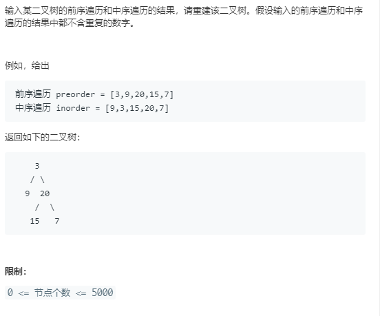

## [面试题09. 用两个栈实现队列](https://leetcode-cn.com/problems/yong-liang-ge-zhan-shi-xian-dui-lie-lcof/)

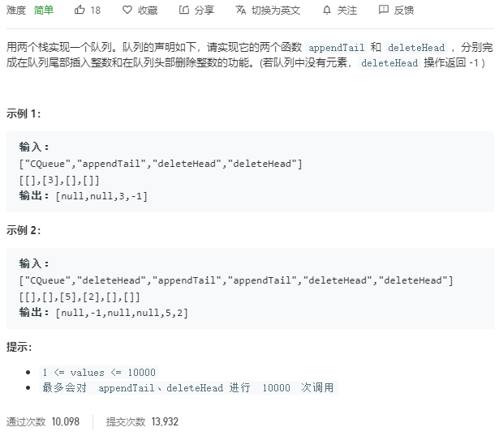

队列是先进先出的结构，栈是先进后出，首先是插入元素：

如果`stack1`不空，要把`stack1`中所有元素弹出到`stack2`中，然后将新元素入`stack1`；同时要保证在入队时`stack2`一定是空的，所以如果`stack2`不空，要将其中元素弹出到`stack1`中

```c++
class CQueue {
public:
    stack<int> st1;
    stack<int> st2;
    int size;
    CQueue() {
        size = 0;
    }
    
    void appendTail(int value) {
        // st1不空则先置空，然后加入新元素
        while (!st1.empty()) {
            st2.push(st1.top());
            st1.pop();
        }
        st1.push(value);
        size++;
        // 此时再将st2中的元素送回st1，保证顺序是先入先出
        while (!st2.empty()) {
            st1.push(st2.top());
            st2.pop();
        }
    }
    
    int deleteHead() {
        if (!st1.empty()) {
            int tmp = st1.top();
            st1.pop();
            size--;
            return tmp;
        } else 
            return -1;
    }
};

/**
 * Your CQueue object will be instantiated and called as such:
 * CQueue* obj = new CQueue();
 * obj->appendTail(value);
 * int param_2 = obj->deleteHead();
 */
```

## [面试题10- I. 斐波那契数列](https://leetcode-cn.com/problems/fei-bo-na-qi-shu-lie-lcof/)

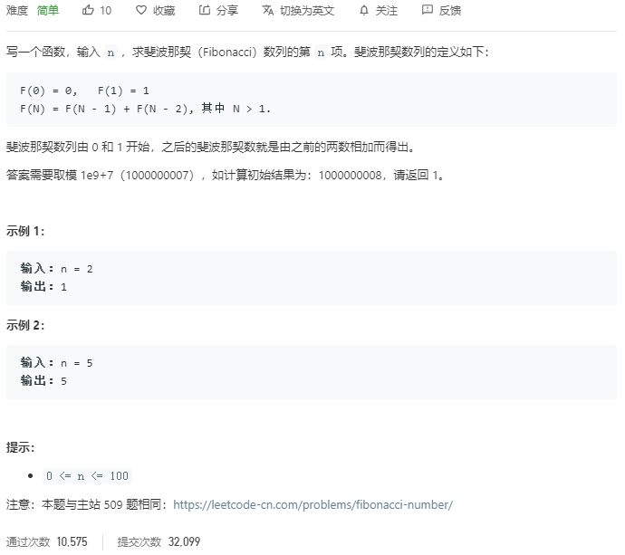

使用动态规划，初始状态是$f(0)$和$f(1)$，状态就是对应$n$的值，状态转移方程是$dp[i] = dp[i-1]+dp[i-2]$。

```c++
class Solution {
public:
    int fib(int n) {
        vector<int> dp(n+2);	// 至少两个元素，因为要赋值前两个
        dp[0] = 0;
        dp[1] = 1;

        for (int i = 2; i <= n; ++i) {
            dp[i] = (dp[i-1] + dp[i-2]) % 1000000007;
        }
        return dp[n];
    }
};
```

## [面试题10- II. 青蛙跳台阶问题](https://leetcode-cn.com/problems/qing-wa-tiao-tai-jie-wen-ti-lcof/)

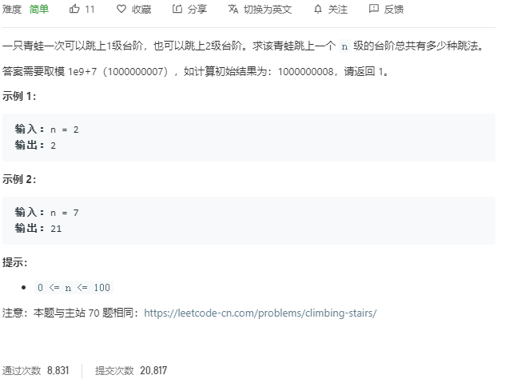

和上一个斐波那契类似，也是动态规划的方法。

- 初始状态：`n = 0`，不用跳；`n = 1`，有1种方法；`n = 2`，两种方法。

- 状态定义：将`n`级台阶的跳法定义为状态，当剩下一级台阶，前面有`dp[i-1]`种跳法；剩下2级台阶，前面有`dp[i-2]`种跳法。有状态转移方程：
  $$
  dp[i] = dp[i-1] + dp[i-2]
  $$

```c++
class Solution {
public:
    int numWays(int n) {
        vector<int> dp(n + 3);

        dp[0] = 1;
        dp[1] = 1;
        dp[2] = 2;

        for (int i = 3; i <= n; ++i) 
            dp[i] = (dp[i-1] + dp[i-2]) % 1000000007;

        return dp[n];
    }
};
```

和斐波那契的不同在于初始值。

## [面试题11. 旋转数组的最小数字](https://leetcode-cn.com/problems/xuan-zhuan-shu-zu-de-zui-xiao-shu-zi-lcof/)

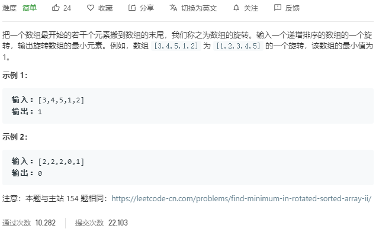

采用二分法，三个指针：`left, right, mid`。如果`nums[mid] > nums[right]`，说明旋转的中心点在后半段，最小值也在后半段，所以：`left = mid + 1`；如果`nums[mid] == nums[right]`，这样只能排除`nums[right]`，下一轮的搜索区间变成`[left, right - 1]`；如果`nums[mid] < nums[right]`，中心点在前半段，`right = mid`。

```c++
class Solution {
public:
    int minArray(vector<int>& numbers) {
        int len = numbers.size();
        if (len == 0)
            return 0;

        int left = 0;
        int right = len - 1;

        while (left < right) {
            int mid = (left + right) >> 1;
            if (numbers[mid] > numbers[right])
                left = mid + 1;
            else if (numbers[mid] == numbers[right])
                right--;
            else
                right = mid;
        }
        return numbers[left];
    }
};
```

## [面试题12. 矩阵中的路径](https://leetcode-cn.com/problems/ju-zhen-zhong-de-lu-jing-lcof/)

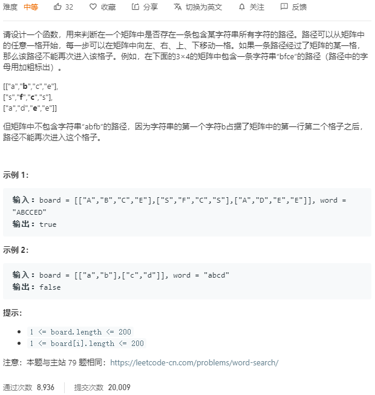

先找到一个可以开始搜索的位置，匹配的是`word[0]`，然后从当前位置开始深度优先搜索，深度优先搜索使用递归的方法：

- 递归内容：标记当前位置矩阵元素，将`board[i][j]`暂存，然后在上下左右四个方向递归访问。
- 终止条件：`word`全部匹配完成返回`true`，否则：
  - 到达边界位置
  - 当前矩阵元素不匹配
  - 当前矩阵元素已经在路径上

```c++
class Solution {
public:
    bool exist(vector<vector<char>>& board, string word) {
        // 从头开始搜索
        for (int i = 0; i < board.size(); ++i) {
            for (int j = 0; j < board[0].size(); ++j) {
                if (dfs(board, word, i, j, 0))
                    return true;
            }
        }
        return false;
    }
	// 深度优先搜索
    bool dfs(vector<vector<char>>& board, string word, int i, int j, int k) {
        // 返回false的终止条件
        if (i >= board.size() || j >= board[0].size() || i < 0 || j < 0 || board[i][j] != word[k])
            return false;
        // 返回true的终止条件
        if (k == word.length() - 1)
            return true;
        // 暂存当前矩阵元素，标记为'#'，代表访问过
        char tmp = board[i][j];
        board[i][j] = '#';
        // 四个方向继续搜索
        bool res = dfs(board, word, i+1, j, k+1) || dfs(board, word, i-1, j, k+1) ||
                   dfs(board, word, i, j+1, k+1) || dfs(board, word, i, j-1, k+1);
        board[i][j] = tmp;
        return res;
    }
};
```

## [面试题13. 机器人的运动范围](https://leetcode-cn.com/problems/ji-qi-ren-de-yun-dong-fan-wei-lcof/)

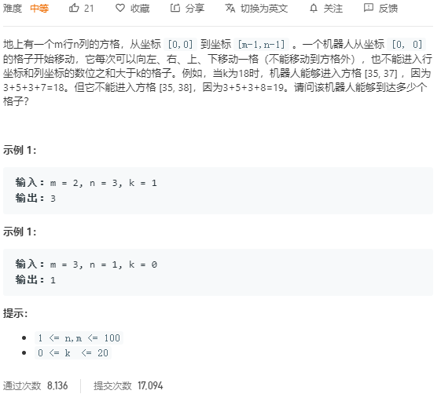

回溯算法，从当前位置开始递归搜索。

- 递归内容：对当前位置的上下左右进行搜索
- 终止条件：超出边界；行列数位之和大于k；当前位置已被访问

```c++
class Solution {
public:
    int movingCount(int m, int n, int k) {
        
		vector<vector<bool>> visited(m, vector<bool>(n));
     	return backtrack(visited, m, n, k, 0, 0);   
    }
    
    int backtrack(vector<vector<bool>>& visited, int m, int n, int k, int i, int j) {
        if (i >= m || j >= n || (i%10 + i/10 + j%10 + j/10) > k || visited[i][j])
            return 0;
        
        visited[i][j] = true;
        // 之前的格子都访问了，不用回去了
        return 1 + backtrack(visited, m, n, k, i+1, j) +backtrack(visited, m, n, k, i, j+1);
    }
};
```

## [面试题14- I. 剪绳子](https://leetcode-cn.com/problems/jian-sheng-zi-lcof/)

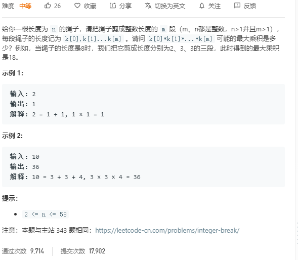

绳子长度为`n`，剪成长度为`l`的段，每段绳子的最大乘积。可以采用动态规划解决，令`dp[i]`表示长度为`i`的绳子能剪到的最大乘积，那么就有状态转移方程：
$$
dp[i] = \max (dp[i], dp[i-j] * j)
$$
之所以这样，是因为总共可以分两种情况，一种是不剪，那就是`dp[i]`；如果要剪，减的长度就是`j`，可以遍历`n-i`这些数来得到一个最大值。

```c++
class Solution {
public:
    int cuttingRope(int n) {
		vector<int> dp(n+1);
        dp[0] = 1;
  		// 外层循环遍历剪绳子的长度，从1开始到n/2，判断每次剪i长度的最大值
        for (int i = 1; i <= (n+1)/2; ++i) {
            // 这里是主体，每次更新长度的最大值
            for (int j = i; j <= n; ++j) {
  				dp[j] = max(dp[j], dp[j-i] * i);              
            }
        }
        return dp[n];
    }
};
```

## [面试题14- II. 剪绳子 II](https://leetcode-cn.com/problems/jian-sheng-zi-ii-lcof/)

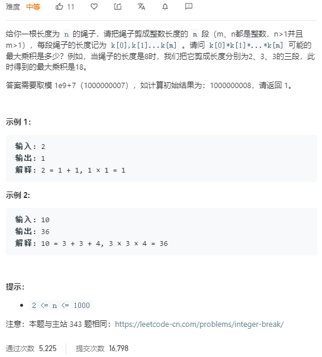

总结规律可以发现，`n`从1到6，可以得到`n`的最大不可分割的值是9（3*3），对于其他数，都可以由1到6的分割方法组合得到。例如10可以分成2x2x3x3=36，也就是4的分割和6的分割的乘积。

```c++
class Solution {
public:
    int cuttingRope(int n) {
		vector<long> dp(1001);
        dp[0] = 1;
        dp[1] = 1;
        dp[2] = 1;
        dp[3] = 2;
        dp[4] = 4;
        dp[5] = 6;
        dp[6] = 9;
  
        for (int i = 7; i <= n; ++i) {
            dp[i] = max(dp[i], dp[i-3] * 3) % 1000000007;
        }
        return dp[n];
    }
};
```

## [面试题15. 二进制中1的个数](https://leetcode-cn.com/problems/er-jin-zhi-zhong-1de-ge-shu-lcof/)

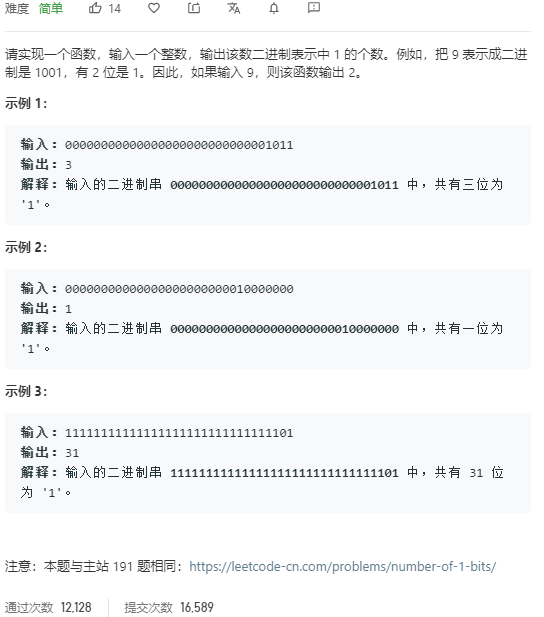

不断右移，如果是1，答案加1，否则不变。右移的操作可以通过除2实现，除2的结果余数如果是0，不加，否则就加一。

```c++
class Solution {
public:
    int hammingWeight(uint32_t n) {
        int res = 0;
        while (n > 0) {
            if (n % 2)
                res++;
            n = n / 2;
        }
        return res;
    }
};
```

## [面试题16. 数值的整数次方](https://leetcode-cn.com/problems/shu-zhi-de-zheng-shu-ci-fang-lcof/)

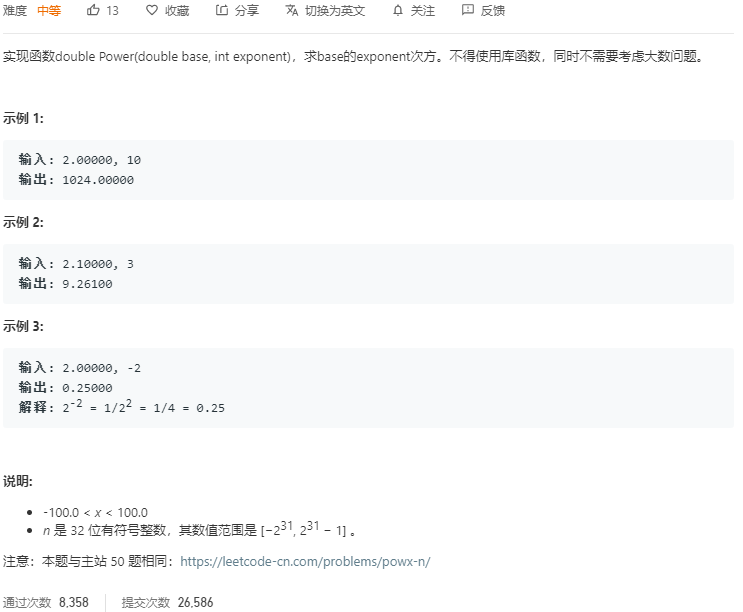

已知$x^n$，要求$x^{n+1}$，只需要计算$x^n \times x^n$即可，这样就可以用递归来解决了。负幂可以通过倒数转化成正幂计算。

- 终止条件：`n = 0`的时候，返回1；
- 递归内容：递归计算`pow(x, n / 2)`，如果`n`是偶数，那么$x^n=x^{n/2}\times x^{n/2}$；为奇数$x^n=x^{n/2}\times x^{n/2} \times x$.所以要分情况讨论一下：

```c++
class Solution {
public:
    double myPow(double x, int n) {
        if (n < 0) {
            x = 1.0 / x;
            n = -n;
        }
        return fastpow(x, n);
    }

    double fastpow(double x, int n) {
        if (n == 0)		// 递归的终止条件
            return 1.0;
       	// 分情况讨论，递归到n = 1或0的时候向上层开始返回
        double res = fastpow(x, n / 2);
        if (n % 2 == 0)
            return res * res;
        else
            return res * res * x;
    }
};
```

## [面试题17. 打印从1到最大的n位数](https://leetcode-cn.com/problems/da-yin-cong-1dao-zui-da-de-nwei-shu-lcof/)

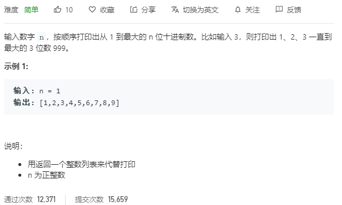

最直接的方法，将计算$10^n$，然后循环数组：

```c++
class Solution {
public:
    vector<int> printNumbers(int n) {
        vector<int> res;
        if (n == 0) return res;
        long long max = pow(10, n);
        for (long long i = 1; i < max; ++i)
            res.emplace_back(i);
        return res;
    }
};
```

## [面试题18. 删除链表的节点](https://leetcode-cn.com/problems/shan-chu-lian-biao-de-jie-dian-lcof/)

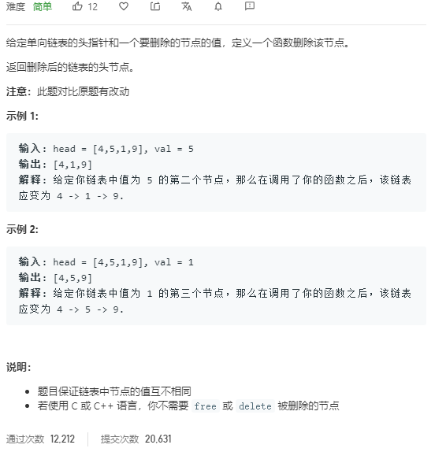

非常基础，直接遍历链表，找到对应值的结点，然后删除即可。

```c++
/**
 * Definition for singly-linked list.
 * struct ListNode {
 *     int val;
 *     ListNode *next;
 *     ListNode(int x) : val(x), next(NULL) {}
 * };
 */
class Solution {
public:
    ListNode* deleteNode(ListNode* head, int val) {
		if (head == nullptr)
            return nullptr;
        ListNode* p = head;
        // 处理头部
        if (head->val == val)
            return head->next;
        while (p) {
            if (p->next->val == val) {
                p->next = p->next->next;
                break;
            }
            p = p->next;
        }
        return head;
    }
};
```

## [面试题19. 正则表达式匹配](https://leetcode-cn.com/problems/zheng-ze-biao-da-shi-pi-pei-lcof/)

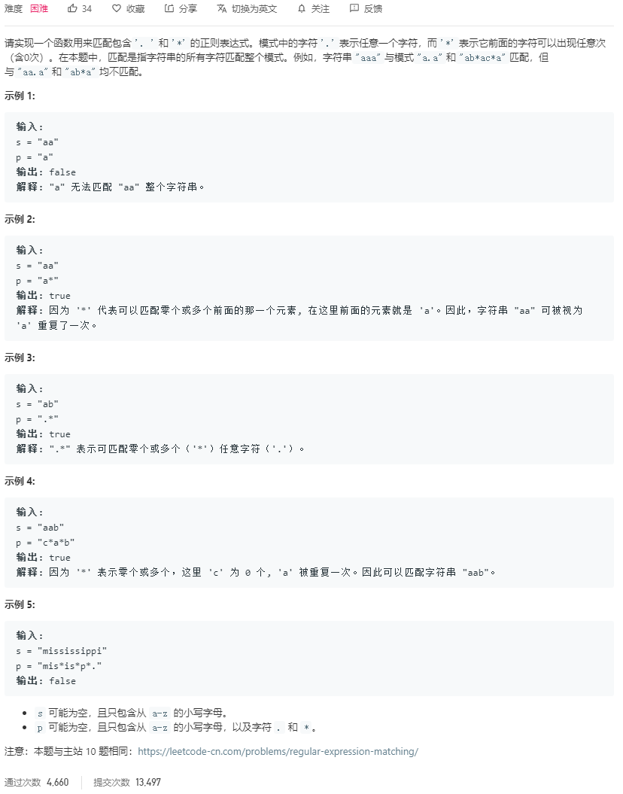

假设主串为A，模式串为B。从最末端开始匹配，假设A的长度是`n`，B的长度是`m`，按照B的最后一个字符，有三种情况：

- B的最后一个字符是正常字符，如果`A[n-1] == B[m-1]`，那么就看`A[n-2],B[m-2]`。否则就失配。
- B的最后一个字符是`.`，可以匹配任意字符，直接看`A[n-2], B[m-2]`。
- B的最后一个字符是`*`，`B[m-2] = c`可以被匹配0次或多次，B是`c*`
  - `A[n-1]`是0个`c`，那么要从`A[n-1]`和`B[m-3]`重新开始
  - `A[n-1]`是多个`c`中的最后一个，从`A[n-2]`和`B[m-1]`开始匹配

定义状态`dp[i][j]`，代表A的前`i`个字符和`B`的前`j`个字符是否匹配。

- 前面两种情况状态转移方程：`dp[i][j] = dp[i-1][j-1]`
- 对于第三种情况，分成两个：
  - `dp[i][j] = dp[i][j-2]`
  - `dp[i][j] = dp[i-1][j]`

初始条件：

- 空和空是匹配的：`dp[0][0] = true`
- 主串空，正则串不空，要进一步判断
- 主串不空，正则串空，一定不匹配：`dp[i][0] = false`

根据上面的思路写代码：

```c++
class Solution {
public:
    bool isMatch(string s, string p) {
		int slen = s.length();
        int plen = p.length();
        // 方便处理空串
        bool dp[slen+1][plen+1];
       
        for (int i = 0; i <= slen; ++i) {
            for (int j = 0; j <= plen; ++j) {
                if (j == 0) {
                    dp[i][j] = i == 0;
                } else {
                    // 是*和不是*
                    if (p[j-1] != '*') {
                        if (i > 0 && (s[i-1] == p[j-1] || p[j-1] == '.'))
                            dp[i][j] = dp[i-1][j-1];
                    } else {
                        if (j >= 2)
                            // |= 按位或
                            dp[i][j] |= dp[i][j-2];
                        if (i >= 1 && j >= 2 && (s[i-1] == p[i-2] || p[i-2] == '.'))
                            dp[i][j] |= dp[i-1][j];
                    }
                }
            }
        }
        return dp[slen][plen];
    }
};
```


## [面试题20. 表示数值的字符串](https://leetcode-cn.com/problems/biao-shi-shu-zhi-de-zi-fu-chuan-lcof/)

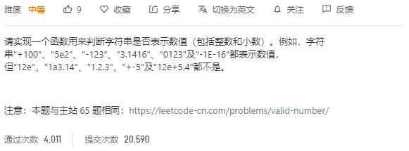

计数规则：

- 空格可以在首尾出现，不能在中间出现
- 根据`e`划分指数和底数
  - 指数不能是小数，可以有符号
  - 底数可以有符号，但是符号不能在中间
- 按照判断数字的规则判断指数和底数

查找`e`，将底数和指数分开判断。底数和指数判断的不同之处在于底数可以有一个`.`。

```c++
class Solution {
public:
    bool isNumber(string s) {
		int len = s.length();
        // 查找字符串a是否包含子串b,不是用strA.find(strB) > 0 而是 strA.find(strB) != string:npos
        int i = s.find_first_not_of(' ');
        int j = s.find_last_not_of(' ');
        if (i == string::npos) return false;
        s = s.substr(i, j-i+1);
        if (s.empty())	return false;
        
        i = s.find('e');
        if (i == 0) return false;
        
        if (i == string::npos) 
            return isBase(s);
        else {
            string exp = s.substr(i+1);
            string base = s.substr(0, i);
            return isExp(exp) && isBase(base);
        }           
    }
    
    // 判断指数
    bool isExp(string s) {
        int len = s.length();
        bool res = false;
        // 指数不能有'.'，所以只要是不在0-9范围的字符都非法
        for (int i = 0; i < len; ++i) {
            if (s[i] == '+' || s[i] == '-') {
                if (i != 0) return false;
            }
            else if (s[i] < '0' || s[i] > '9')
                return false;
            else 
                // 这里要再加一步判断，否则对于单字符的'e'和'.'会判断正确
            	res = true;
        }
        return res;
    }
    // 判断底数
    bool isBase(string s) {
        int len = s.length();
        bool flag = false;
        bool res = false;
        // 底数不能有除了'.'和数字之外的字符，而且'.'只能有一个
        for (int i = 0; i < len; ++i) {
            if (s[i] == '+' || s[i] == '-') {
                if (i != 0) return false;
            } else if (s[i] == '.') {
                if (flag) return false;
                flag = true;
            }
            else if (s[i] < '0' || s[i] > '9')
                return false;
            else res = true;
        }
        return res;
    }
};
```

## [面试题21. 调整数组顺序使奇数位于偶数前面](https://leetcode-cn.com/problems/diao-zheng-shu-zu-shun-xu-shi-qi-shu-wei-yu-ou-shu-qian-mian-lcof/)

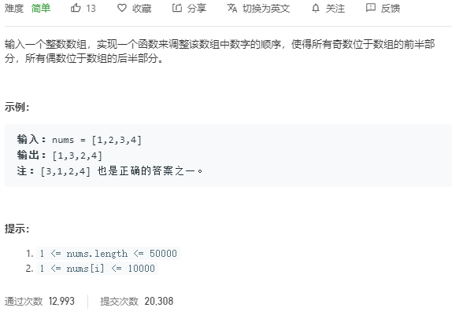

第一种是双指针法，借鉴了快速排序中的分区操作，类似于将比枢轴小的放在前面，比枢轴大的放在后面，这里将奇数放在前面，偶数放在后面。左指针向前，找到第一个偶数，右指针向后，找到第一个奇数，交换位置。如此进行直到相遇。

```c++
class Solution {
public:
    vector<int> exchange(vector<int>& nums) {
		int i = 0;
        int j = nums.size() - 1;
        while (i < j) {
            while (i < j && nums[i] % 2 == 1) ++i;
            while (i < j && nums[j] % 2 == 0) --j;
            if (i < j) swap(nums[i], nums[j]);
        }
        return nums;
    }
};
```

第二种方法是申请两个数组，一个存放奇数，一个存放偶数，然后将结果拼接到一起：

```c++
class Solution {
public:
    vector<int> exchange(vector<int>& nums) {
		vector<int> vec1;
        vector<int> vec2;
        
        for (int c : nums) {
            if (c % 2 == 0)
                vec1.emplace_back(c);
            else
                vec2.emplace_back(c);
        }
        vec2.insert(vec2.end(), vec1.begin(), vec1.end());
        return vec2;
    }
};
```

## [面试题22. 链表中倒数第k个节点](https://leetcode-cn.com/problems/lian-biao-zhong-dao-shu-di-kge-jie-dian-lcof/)

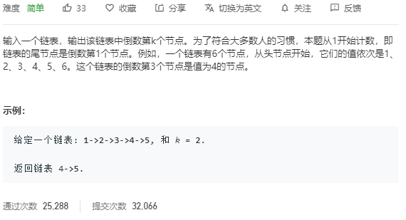

